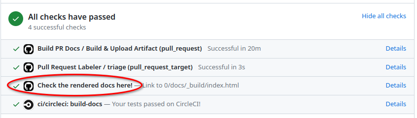
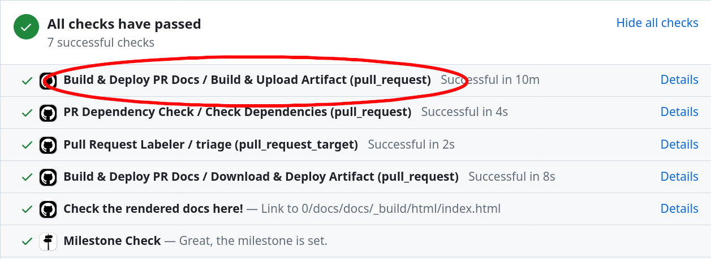
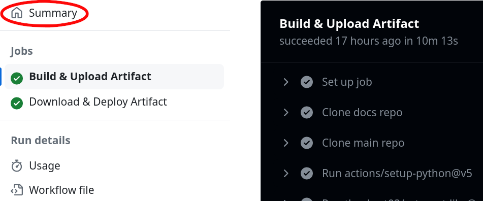
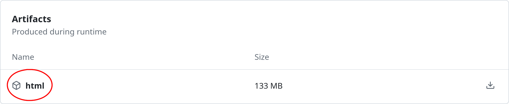

(contributing-docs)=
# Contributing Documentation

This guide will teach you how to contribute to napari's documentation.

To begin contributing, you will need:

- Some familiarity with [`git`](https://git-scm.com).
- A [GitHub](https://github.com) account.

Choose an approach to contributing:

1. [**Contributing without a local setup**](#contributing-to-the-napari-documentation-without-a-local-setup): This is a simpler approach that allows you
   to make small changes to the documentation without needing to set up a local
   environment. This approach is useful for quick edits or if you are not familiar
   with Git or the command line.
1. [**Contributing with a local setup**](#contributing-to-the-napari-documentation-with-a-local-setup): This is the recommended approach if you are
   making significant changes to the documentation, or if you want to preview your
   changes _before_ submitting them. This approach requires a local setup of the
   napari and docs repositories.

## Ask for guidance

If you'd like to contribute a brand new document to our usage section, it's
worth [opening an issue](https://github.com/napari/docs/issues/new/choose)
on our repository to discuss the content you'd like to see and get some
early feedback from the community. The napari team can also suggest what type of
document would be best suited, and whether there are already existing documents
that could be expanded to include your proposed content.

### Organization of the documentation

The napari documentation is built from multiple sources that are organized into repositories:
1. The main napari documentation is built from sources located at the
[napari/docs](https://github.com/napari/docs) repository on GitHub.
That repository is where all the narrative documentation (e.g. tutorials, how-to
guides, etc. on napari.org) pull requests should be made.
This narrative napari documentation is written in
[MyST markdown](https://myst-parser.readthedocs.io/en/latest/index.html),
a version of [commonmark](https://spec.commonmark.org/) Markdown
(see a [markdown cheatsheet](https://github.com/adam-p/markdown-here/wiki/Markdown-Cheatsheet))
with some additional features.
2. Some of the documentation about [plugins](plugins-index) resides in
the [napari/npe2](https://github.com/napari/npe2) repository
(e.g. the [contributions reference page](contributions-ref)) and should be modified there.
This is documentation is written with [Jinja](https://jinja.palletsprojects.com/en/3.1.x/).
3. The [examples gallery](gallery) is generated from Python source files and changes to the gallery should be made to the
[napari/napari](https://github.com/napari/napari) repository (see also
[the guide on adding examples to the gallery](add-examples)).
4. Changes to how [napari.org](https://napari.org/dev) appears site-wide are made to the
[napari-sphinx-theme](https://github.com/napari/napari-sphinx-theme).
5. The [API reference documentation](api) is autogenerated from the napari source code docstrings.
Docstrings are written in the [reStructuredText format](https://www.sphinx-doc.org/en/master/usage/restructuredtext/basics.html)
and any modifications to them should be submitted to the [napari/napari](https://github.com/napari/napari) repository.
6. Importantly, all of the dependencies for building the documentation are in the [the `pyproject.toml` of napari/napari](https://github.com/napari/napari/blob/main/pyproject.toml) under the optional dependencies `docs` and `gallery`.

### What types of documents can I contribute?

Go to the [`napari/docs`](https://github.com/napari/docs) repo to find examples of documents you might
want to contribute. The paths are listed in parentheses below.

- [**Explanations**](explanations) (in [`napari/docs/guides`](https://github.com/napari/docs/tree/main/docs/guides)):
  in depth content about napari architecture, development choices and some complex features
- [**Tutorials**](tutorials) (in [`napari/docs/tutorials`](https://github.com/napari/docs/tree/main/docs/tutorials)):
  detailed, reproducible step by step guides, usually combining multiple napari features to complete a potentially complex task
- [**How-tos**](how-tos) (in [`napari/docs/howtos`](https://github.com/napari/docs/tree/main/docs/howtos)):
  simple step by step guides demonstrating the use of common features
- [**Getting started**](getting-started) (in [`napari/docs/tutorials/fundamentals`](https://github.com/napari/docs/tree/main/docs/tutorials/fundamentals)):
  these documents are a mix of tutorials and how-tos covering the fundamentals of installing and working with napari for beginners

The [**Examples gallery**](gallery) sources are in the [main `napari/napari` repository](https://github.com/napari/napari/tree/main/examples)
and show code examples of how to use napari.

```{admonition} Plugin documentation
:class: tip

Some of the source files for the [Plugin documentation](plugins-index) are
autogenerated from sources in the [napari/npe2](https://github.com/napari/npe2)
repository. Any edits should be made in the `napari/npe2` repo, and not to the
copy you may have in the `napari/docs` folder. These files' names start with the
`_npe2_` prefix and are located under the `docs/plugins` folder. They will be
generated when the documentation is built and the
[`prep_docs.py`](https://github.com/napari/docs/blob/main/docs/_scripts/prep_docs.py)
script is run. See our
[Makefile](https://github.com/napari/docs/blob/main/Makefile) for more details.
```

```{admonition} Got materials for a workshop?
:class: tip

If you already have teaching materials e.g. recordings, slide decks or Jupyter notebooks
hosted somewhere, you can add links to these on our [napari workshops](workshops) page.
```

### Formats and templates

Our goal is that all tutorials and how-tos are easily downloadable and
executable by our users. This helps ensure that they are reproducible and makes
them easier to maintain. [Jupyter notebooks](https://jupyter.org/) are a great
option for our documents, because they allow you to easily combine code and well
formatted text in markdown and can be executed automatically. However, their
[raw JSON format](https://numpy.org/numpy-tutorials/content/pairing.html#background)
is not great for version control, so we use [MyST Markdown](https://myst-parser.readthedocs.io/en/latest/)
documents in our repository and on [napari.org](https://napari.org).

If you are amending existing documentation, you can do so in your preferred text
editor. If you wish to add a new tutorial or a how-to, we recommend you use our
[template](docs-template). Inside the template you'll find handy tips for
taking screenshots of the viewer, hiding code cells, using style guides and what
to include in the required prerequisites section.

To use the template, make a copy of `docs/developers/documentation/docs_template.md`
and rename it to match your content. You can edit the template directly in
Jupyter notebook, or in your preferred text editor.

```{admonition} Already have a notebook?
:class: tip

If you have an existing `.ipynb` Jupyter notebook that you'd like to contribute, you can convert it to MyST markdown and then edit the `.md` file to prepare it for contributing. For the conversion, you can install the [`jupytext` package](https://jupytext.readthedocs.io/en/latest/). Run `jupytext your-notebook.ipynb --to myst` to create a new MyST version of your file,
`your-notebook.md`. Edit this file to include the relevant sections from the docs template.
```

(contributing-without-local-setup)=
## Contributing to the napari documentation without a local setup

If you would like to see new documentation added to napari or want to see changes to existing documentation, but are not clear on these instructions or don't have the time to write it yourself, you can [open an issue](https://github.com/napari/docs/issues/new/choose).

If you are adding new documentation or modifying existing documentation and would prefer a simpler workflow than the local setup guide described below,
you can use the GitHub web interface to open your pull request
by either [uploading file(s) from your computer](https://docs.github.com/en/repositories/working-with-files/managing-files/adding-a-file-to-a-repository),
[creating and editing a new file](https://docs.github.com/en/repositories/working-with-files/managing-files/creating-new-files)
or [editing an existing file](https://docs.github.com/en/repositories/working-with-files/managing-files/editing-files)
on the [napari/docs](https://github.com/napari/docs) GitHub repository.
It's best if you first [fork](https://docs.github.com/en/pull-requests/collaborating-with-pull-requests/working-with-forks/fork-a-repo) the [napari/docs](https://github.com/napari/docs) repository to your own GitHub account, create a [feature branch](https://docs.github.com/en/pull-requests/collaborating-with-pull-requests/proposing-changes-to-your-work-with-pull-requests/creating-and-deleting-branches-within-your-repository#creating-a-branch), upload/create/edit files through the GitHub web interface, and then [open a pull request from your fork](https://docs.github.com/en/pull-requests/collaborating-with-pull-requests/proposing-changes-to-your-work-with-pull-requests/creating-a-pull-request-from-a-fork) back to [napari-docs](https://github.com/napari/docs).

When you submit your PR, CI will kick off several jobs, including generation of a preview of 
the documentation. By default, CI will use the `slimfast` build ("make target"), which
doesn't build any content from outside the `docs` repository or run any `docs` notebook cells.
This is great for seeing the copy and formatting. If you want to preview other elements,
you can trigger more complete builds by commenting on the PR with:
```
@napari-bot make <target>
```
where `<target>` can be:
- `html` : a full build, just like napari.org live
- `html-noplot` : a full build, but without the gallery examples from `napari/napari`
- `docs` : only the content from `napari/docs`, with notebook code cells executed
- `slimfast` : the default, only the content from `napari/docs`, without code cell execution
- `slimgallery` : `slimfast`, but also builds the gallery examples from `napari/napari` 

For more information about these targets see the ["building locally"](build_docs_locally) section 
of the documentation, including the part on [specialized builds](#building-what-you-need).  

Once the jobs complete you will also be able to [preview the documentation](doc_view_ci) by
using the `Check the rendered docs here!` action at the bottom of your PR, which will go to a 
preview website on [CircleCI](https://circleci.com/). Alternatively, you can download a zip file 
of [the build artifact](#download-documentation-artifact) and open the html files directly in your browser. For a build triggered by a comment, use
the "Triggered Docs Artifact Build" link.

If needed, a member of the maintenance team will help with updating the [napari.org](https://napari.org/dev) 
table of contents where necessary (by placing a reference to your new file in [docs/_toc.yml](update-toc))
and making sure your documentation has built correctly.

## Contributing to the napari documentation with a local setup

(prerequisites)=
### 0. Prerequisites

#### Fork and clone the napari and docs repositories

You should first [fork](https://docs.github.com/en/get-started/quickstart/fork-a-repo)
and then clone both the [napari/napari](https://github.com/napari/napari) and the [napari/docs](https://github.com/napari/docs) repositories to your
machine. To clone these repositories, you can follow any of the options in the [GitHub guide to cloning](https://docs.github.com/en/repositories/creating-and-managing-repositories/cloning-a-repository) (if you run into issues refer to [the troubleshooting guide](https://docs.github.com/en/repositories/creating-and-managing-repositories/troubleshooting-cloning-errors)).
We recommend installing the [GitHub CLI](https://docs.github.com/en/github-cli/github-cli/about-github-cli) as it is easy to set up repository access permissions from the GitHub CLI and it comes with additional upside, such as the ability to checkout pull requests.
After installing the `GitHub CLI` you can run:

```bash
gh repo clone <your-username>/napari
gh repo clone <your-username>/docs napari-docs
```

````{note}
To reduce confusion and possible conflicts, the `docs` fork is being cloned into
a local repository folder named `napari-docs`. Alternately, you could also
rename the repository when forking `napari/docs` to `napari-docs` and then clone it via `gh repo clone <your-username>/napari-docs`.
````

```{note}
The napari documentation is built using `make` which does not work on paths which contain spaces.
It is important that you clone the `napari/docs` repository to a path that does not contain spaces.
For example, `C:\Users\myusername\Documents\GitHub\napari-docs` is a valid path, but \
`C:\Users\my username\Documents\GitHub\napari-docs` is not.
```

#### Set up a developer installation of napari for docs building

Because the API reference documentation (autogenerated from the napari code docstrings), the example gallery, and the documentation dependencies are sourced from the `napari/napari` repository, before you can build the documentation locally you will need to install from the `napari/napari` repository.

First, navigate to your local clone of the `napari/napari` repository:

```bash
cd napari
```

You will need:

- a clean virtual environment (e.g. `conda`)  with Python {{ python_version_range }}—remember to activate it!;
- a from-source, editable installation of napari with the optional `docs` dependencies and a Qt backend. From the `napari/napari` repository directory run, for example:

  ```bash
  python -m pip install -e ".[pyqt]" --group docs
  ```
  This will use the default Qt backend. For other options, see [the napari installation guide](../../../tutorials/fundamentals/installation.md#choosing-a-different-qt-backend).

  ````{note}
  You can combine the documentation dependencies with [a development installation of napari](dev-installation) by selecting the Qt extra and both dependency groups, e.g. installing with `.[pyqt]` and adding `--group dev --group docs`.
  ````

Once the installation is complete, you can proceed to the directory where you cloned the `napari/docs` repository:

```bash
cd ../napari-docs
```

Here you will be able to build the documentation, allowing you to preview your document locally as it would appear on `napari.org`.

(contributing-docs-step-one)=

### 1. Write your documentation

Depending on the type of contribution you are making, you may be able to skip
some steps:

* If you are amending an existing document you can skip straight
  to [3. Preview your document](#3-preview-your-document)
* For all other documentation changes, follow the steps below.

```{admonition} How to check for broken links
:class: tip

If you have modified lots of document links, you can check that they all work by running `make linkcheck-files` in the `napari/docs` folder. However, this can take a long time to run, so if you have only modified links in a single document, you can run:

```bash
make linkcheck-files FILES=path/to/your/document.md
```

(update-toc)=
### 2. Update the table of contents (TOC)

If you are adding a new documentation file, you will need to add your document
to the correct folder based on its content (see the [list above](#organization-of-the-documentation)
for common locations), and update `docs/_toc.yml`.

If you're adding a document
to an existing group, simply add a new `- file:` entry in the appropriate spot. For example, if I wanted to add
a `progress_bars.md` how to guide, I would place it in `docs/howtos` and update `_toc.yml` as below:

```yaml
- file: howtos/index
subtrees:
- titlesonly: True
entries:
- file: howtos/layers/index
subtrees:
- titlesonly: True
    entries:
    - file: howtos/layers/image
    - file: howtos/layers/labels
    - file: howtos/layers/points
    - file: howtos/layers/shapes
    - file: howtos/layers/surface
    - file: howtos/layers/tracks
    - file: howtos/layers/vectors
- file: howtos/connecting_events
- file: howtos/napari_imageJ
- file: howtos/docker
- file: howtos/perfmon
- file: howtos/progress_bars # added
```

To create a new subheading, you need a `subtrees` entry. For example, if I wanted to add `geo_tutorial1.md` and `geo_tutorial2.md`
to a new `geosciences` subheading in tutorials, I would place my documents in a new folder `docs/tutorials/geosciences`,
together with an `index.md` that describes what these tutorials would be about, and then update `_toc.yml` as below:

```yaml
- file: tutorials/index
subtrees:
- entries:
    - file: tutorials/annotation/index
    subtrees:
    - entries:
        - file: tutorials/annotation/annotate_points
    - file: tutorials/processing/index
    subtrees:
    - entries:
        - file: tutorials/processing/dask
    - file: tutorials/segmentation/index
    subtrees:
    - entries:
        - file: tutorials/segmentation/annotate_segmentation
    - file: tutorials/tracking/index
    subtrees:
    - entries:
        - file: tutorials/tracking/cell_tracking
    - file: tutorials/geosciences/index                 # added
    subtrees:                                           # added
    - entries:                                          # added
        - file: tutorials/geosciences/geo_tutorial1     # added
        - file: tutorials/geosciences/geo_tutorial2     # added
```

### 3. Preview your document

If your documentation change includes code, it is important that you ensure
the code is working and executable. This is why you will need to have a
development installation of napari installed. [Examples](gallery)
are automatically executed when the documentation is built and code problems can
also be caught when previewing the built documentation.

There are two ways you can build and preview the documentation website as it would
appear on [napari.org](https://napari.org):

* [building locally](build_docs_locally) - this requires more setup but will allow you
  to more quickly check if your changes render correctly.
* [view documentation in a GitHub pull request](doc_view_ci) - this requires no
  setup but you will have to push each change as a commit to your pull request and wait
  for the continuous integration workflow to finish building the documentation.

```{tip}
To see the markdown document structure and content change in real-time without building, you can use a MyST markdown preview tool like [VScode](https://code.visualstudio.com/) with the [MyST extension](https://marketplace.visualstudio.com/items?itemName=ExecutableBookProject.myst-highlight) or [MyST live preview](https://myst-parser.readthedocs.io/en/latest/live-preview.html#). This can also help you to spot any markdown formatting errors that may have occurred. However, this MyST markdown preview will have some differences to the final built html documentation due to autogeneration, so it is still important to build and preview the documentation before submitting your pull request.
```

(build_docs_locally)=
#### 3.1. Building locally

To build the documentation locally we use the 
[`make` tool](https://en.wikipedia.org/wiki/Make_(software)) to execute 
[`sphinx`](https://www.sphinx-doc.org/en/master/) builds, as defined in the
`Makefile` at the root of the `docs` repository.

Once the build is completed rendered HTML will be placed in `docs/_build/html`. 
Find `index.html` in this folder and drag it into a browser to preview the 
website with your new document.

You can also run this Python one-liner to deploy a quick local server on
[http://localhost:8000](http://localhost:8000):

```shell
$ python3 -m http.server --directory docs/_build/html
```

:::{note}
The entire build process pulls together files from multiple sources and can be
time consuming, with a full build taking upwards of 20 minutes. Additionally, 
building the examples gallery, as well as executing notebook cells will 
repeatedly launch `napari`, resulting in flashing windows. 

As a result, there are several partial-build options available in addition to 
a full build that only build certain parts of the full documentation build. 
Depending on what you want to contribute, **you may never need to run the full 
build locally**. For example, maybe you don't want to build the examples gallery 
or you only want to edit copy and not run the notebook cells or only want to 
edit a single napari example. See [Building what you need](#building-what-you-need)
for details.
:::

##### Running a full build

To run a full documentation build from scratch, matching what is deployed 
at [napari.org](https://napari.org), run:

```bash
make html
```
from the root of your local clone of the `napari/docs` repository (assuming you've installed
napari with the [docs prerequisites](prerequisites)). Note this can take upwards of 20 minutes
and will repeatedly pop up napari viewers as examples and notebook cells are executed.

If the changes you have made to documentation don't involve the gallery of napari examples,
which are in the `examples` directory in the `napari` repository, you can speed up this 
build by running:

```bash
make html-noplot
```

This will skip the gallery build, which involves launching up napari and rendering 
all the examples, but it will still build all of the other content, including the
[UI architecture diagrams](ui-sections), [events reference](events-reference), and
[preferences](napari-preferences), which are generated from sources in the `napari`
repository. This will also run all notebook cells.

````{note}
The `make html` command above assumes you have a local clone of the
[`napari/napari`](https://github.com/napari/napari) repo at the same level as
the `napari/docs` clone. If that's not the case, you can specify the location of
the examples gallery folder by executing

```bash
make html GALLERY_PATH=<path-to-examples-folder>
```

The `GALLERY_PATH` option must be given relative to the `docs` folder. If your
folder structure is

```
├── napari-docs
│   └── docs
├── napari
│   ├── binder
│   ├── examples
│   ├── napari
│   ├── napari_builtins
│   ├── resources
│   └── tools
```

Then the command would be
```bash
make html GALLERY_PATH=../../napari/examples
```

````
(live-builds)=
````{admonition} Update documentation on file change
:class: tip
We've provided several build variants with `-live` that will use
[sphinx-autobuild](https://github.com/sphinx-doc/sphinx-autobuild).
When using these `make` variants, when you save a file, re-builds 
of the changed file will be triggered automatically and will be faster,
because not everything will be built from scratch. Further, a browser preview 
will open up automatically at `http://127.0.0.1`, no need for further action! 
Edit the documents at will, and the browser will auto-reload.
Once you are done with the live previews, you can exit via <kbd>Ctrl</kbd>+<kbd>C</kbd>
on your terminal.

For example, if you are not editing the gallery examples in the napari repository, 
but otherwise want a full build, then you can use:

```bash
make html-noplot-live
```
The first run will be a full build (without the gallery) so a number of napari 
instances will pop up, but then when re-building on save only edited files will
be rebuilt.

For faster reloads, you can try:
```bash
make html-live SPHINXOPTS="-j4"
```
Note: using `-j4` will parallelize the build over 4 cores and can result in crashes.

````

````{admonition} Headless GUI builds
:class: tip

If you are running a full build, you can run it in a "headless GUI"
mode, which will prevent napari windows from popping up during the build.

1. If you are using **X11** as your display server and you have
   [xvfb](https://www.x.org/releases/X11R7.6/doc/man/man1/Xvfb.1.xhtml)
   installed on your system, you can use the `docs-xvfb` command:

   ```bash
   make docs-xvfb
   ```

   This will prevent all but the first napari window from being shown during the docs
   build.

2. If you are using **Wayland** as your display server, and you have `xwfb-run` installed
   on your system (part of the [xwayland-run utilities](https://gitlab.freedesktop.org/ofourdan/xwayland-runcan),
   you can use the `docs-xwfb` command:

   ```bash
   make docs-xwfb
   ```

   Note that you may have to install the `xwayland-run` package manually so that it
   uses the correct Python environment you are using to build the docs. You can do that
   by cloning the sources from [the xwayland-run GitLab repository](https://gitlab.freedesktop.org/ofourdan/xwayland-run) and running:

   ```bash
   meson setup -Dcompositor=weston --prefix=/path/to/env/ -Dpython.install_env=prefix . build
   meson install -C build
   ```
````

(building-what-you-need)=
##### Building what you need

````{dropdown} napari/docs and notebooks
**If you only want to edit materials in the `docs` repository, including
notebook code cell outputs (e.g. any of the tutorials), but you don't need any
of the sources in `napari/napari` built**, then you can use the `docs` build variant. Run:

```bash
make docs
```
or 
```bash
make docs-live
```
Note that this will still execute the `docs` repository notebook code cells, 
resulting in napari windows popping up repeatedly. The [`-live`
variant](live-builds) will open a browser preview and auto-rebuild any pages you edit.
````

````{dropdown} napari/docs only
**If you you only want to edit copy in the `docs` repository and don't need any
of the sources in `napari/napari` built nor the notebook cell outputs**, then you can use one
of the `slim` builds. Run:

```bash
make slim
```
or
```bash
make slimfast
```
or
```bash
make slimfast-live
```
These will not build any of the external content (such as the gallery) and will
not execute code cells. `slimfast` will run the build in parallel, which can be
significantly faster on multi-core machines (under a minute), while `slimfast-live`
will open a browser preview and auto-rebuild any pages you edit. 
See [the `-live` builds note](live-builds).
````

````{dropdown} napari/docs and napari gallery of examples
**If you are working on the napari examples and want to build the whole examples
gallery, but not other external content nor the `docs` notebook cell outputs**, 
then you can use:

```bash
make slimgallery
```
or
```bash
make slimgallery-live
```
These builds will build the documentation with the entire gallery. The [`-live`
variant](live-builds) will will open a browser preview and auto-rebuild any pages you edit.
````

````{dropdown} napari/docs and a single example in the gallery
**If you want to work on a single example Python script in the napari repository
`examples` directory**, you can build the documentation with just a chosen example by
specifying it by name. For example, to build the `vortex.py` example, run:

```bash
make slimgallery-vortex
```
or
```bash
make slimgallery-live-vortex
```
This will only execute and build the single chosen example. The [`-live`
variant](live-builds) will open a browser preview and auto-rebuild the single example or
any other `docs` pages on edit, but it will not run any other code cells.
````

##### Additional utilities in the Makefile

To clean up (delete) generated content, including auto-generated `.rst` and `.md` files,
as well as the `html` files, you can use:

```bash
make clean
```

Running this is a good idea if you have not built the documentation in a long
time and there may have been significant changes to the `docs` repository, e.g.
changes to the table of contents or layout.

To clean up the files generated for the examples gallery, you can use:

```bash
make clean-gallery
```
Running this is a good idea if you have not built the documentation in a long
time and there may have been significant changes to the `napari` examples.

To generate the source files from the napari repository, including the
[UI architecture diagrams](ui-sections), [events reference](events-reference), and
[preferences](napari-preferences), you can run:

```bash
make prep-docs
```
Note that this is can take upwards of 10 minutes! Run this if you are interested
in building the external resources or editing the scripts that generate them in
`docs/docs/_scripts`. In most cases `make prep-stubs` will suffice, which will 
generate place-holder stub files for the external content.

(doc_view_ci)=
#### 3.2. View in GitHub Pull Request

Alternatively, when you submit your pull request, the
[napari/docs](https://github.com/napari/docs) repository
continuous integration includes a GitHub action that builds the documentation
and saves the artifact for you to preview or download.
Note you will need to [](docs_submit_pull_request) first.
You can then view it in one of two ways:

* preview on your browser via [CircleCI](https://circleci.com/) in just one click -
  this is the easiest method but in rare cases it may not match the documentation that
  is actually deployed to [napari.org](https://napari.org).
* download the built documentation artifact and view it locally - this is more
  complicated, but the built docs will always match what is deployed to
  [napari.org](https://napari.org).

When you submit a pull request to the [napari/napari](https://github.com/napari/napari)
repository, its continuous integration will only build the docs in CircleCI. Thus
you will only be able to preview the documentation on CircleCI.

##### Preview on CircleCI

Simply click on **Details** next to the `Check the rendered docs here!` at the bottom
of your pull request:



(download-documentation-artifact)=
##### Download documentation artifact

1. Click on **Details** next to
   `Build & Deploy PR Docs / Build & Upload Artifact (pull_request)`:



2. Click on **Summary** on the top left corner:



3. Scroll down to **Artifacts** and click on **html** to download the built documentation:



4. Extract the compressed archive and open the `html/index.html` file on your preferred browser.
   You can also use Python's `http.server` module to open a local server on
   [http://localhost:8000](http://localhost:8000):

```shell
$ cd ~/Downloads/html  # `cd` to the path where you extracted the 'html' artifact
$ python3 -m http.server
```

(docs_submit_pull_request)=
### 4. Submit your pull request

Once you have written and previewed your document, it's time to open a pull request to [napari's docs repository](https://github.com/napari/docs) and contribute it to our codebase.

If you are simply contributing one file (e.g., a tutorial or how-to page) you
can use the [GitHub web interface to open your pull request](https://docs.github.com/en/repositories/working-with-files/managing-files/adding-a-file-to-a-repository). Ensure your
document is added to the correct folder based on its content (see the
[list above](#organization-of-the-documentation) for common locations).

To open a pull request via git and the command line, follow [this guide](https://www.digitalocean.com/community/tutorials/how-to-create-a-pull-request-on-github).
You can also reach out to us on [zulip](https://napari.zulipchat.com/#narrow/stream/212875-general) for assistance!

Not sure where to place your document or update `_toc.yml`? Make a best guess and open the pull request - the napari team will
help you edit your document and find the right spot!

## Building the documentation on Windows

```{note}
It is very important that you clone the `napari/docs` repository to a path that does not contain spaces.
For example, `C:\Users\myusername\Documents\GitHub\napari-docs` is a valid path, but \
`C:\Users\my username\Documents\GitHub\napari-docs` is not.
If you clone the napari-docs repository to a directory following the default Windows path naming convention, e.g. \
`C:\Users\my username\Documents\GitHub\napari-docs` (note the space), and run the `make` commands to build the napari docs, it may remove unintended files from your computer as it will essentially run the command `rm -rf C:\Users`.
This is because the napari documentation is built using `make` which does not work on paths which contain spaces.
```

The documentation build requires some Linux specific commands, so some extra steps are required to build the documentation on Windows. There are multiple tools for this, but [Git Bash](https://gitforwindows.org/) or [Windows Subsystem for Linux (WSL)](https://learn.microsoft.com/en-us/windows/wsl/install) are recommended.

### Git Bash

First, you will need to install `make` on Windows:

1. Install Chocolatey (a Windows package manager) by following the instructions [here](https://chocolatey.org/install).
2. Install `make` with `choco install make`.

Alternatively, you can download the latest `make` binary without guile from [ezwinports](https://sourceforge.net/projects/ezwinports/) and [add it to your PATH](https://learn.microsoft.com/en-us/previous-versions/office/developer/sharepoint-2010/ee537574(v=office.14)#to-add-a-path-to-the-path-environment-variable).

Then install Git Bash and build the documentation:

1. Install [Git Bash](https://gitforwindows.org/) (you should already have this if you use `git` on Windows).
2. Activate your virtual environment in Git Bash.
    - Conda environment: To have your conda environment available in Git Bash, launch Git Bash, then run `conda init bash` from anaconda prompt and restart Git Bash. The conda environment can then be activated from Git Bash with `conda activate <env_name>`.
    - Virtualenv: To have your virtualenv available in Git Bash, launch Git Bash, then run `source <path_to_virtualenv>/Scripts/activate`.
3. From Git Bash, `cd` to the napari docs repository and run `make html` or other `make` commands to build the documentation.

```{tip}
If you use Git Bash a lot, you may want to set conda to not initialize on bash by default to speed up the launch process. This can be done with `conda config --set auto_activate_base false`. You can then activate conda in Git Bash with `conda activate base`.
```

````{note}
If you are using an IDE, it is likely that it will not use Git Bash by default. You may need to configure your IDE to use Git Bash as the default terminal for the napari docs. For example, in VS Code, you can set the default terminal to Git Bash for the napari docs repository by adding the following to your workspace settings:

```json
"terminal.integrated.defaultProfile.windows": "Git Bash"
```

````

### Windows Subsystem for Linux (WSL)

Alternatively, you can install WSL, which will allow you to run a Linux environment directly on Windows (without any virtual machines, etc.). You need to have Windows 10 version 2004 and higher or Windows 11. Then you can run scripts and command line utilities, as well as python and napari from for example Ubuntu on your Windows machine.

1. Install the [Windows Subsystem for Linux](https://learn.microsoft.com/en-us/windows/wsl/install) and [choose a linux distribution](https://learn.microsoft.com/en-us/windows/wsl/install#change-the-default-linux-distribution-installed).
We will use Ubuntu for this guide since it is the default WSL distribution, easy to install, and works well with [WSLg](https://github.com/microsoft/wslg). The default method to perform this installation is to run `wsl --install -d Ubuntu` from command prompt as an administrator but you can refer to the [guide](https://learn.microsoft.com/en-us/windows/wsl/install) for other installation methods.
2. Restart your computer. On restart, you will be prompted to create a user account for WSL. This account is separate from your Windows account, but you can use the same username and password if you wish.
3. [Open up the Ubuntu distribution](https://learn.microsoft.com/en-us/windows/wsl/install#ways-to-run-multiple-linux-distributions-with-wsl) via the `Ubuntu` command and run `sudo apt update && sudo apt upgrade` to update the distribution.
4. Install a napari development environment in Ubuntu following the [contributor guide](dev-installation) and activate the virtual environment that napari was installed into.
5. Install some common QT packages and OpenGL `sudo apt install -y libdbus-1-3 libxkbcommon-x11-0 libxcb-icccm4 libxcb-image0 libxcb-keysyms1 libxcb-randr0 libxcb-render-util0 libxcb-xinerama0 libxcb-xinput0 libxcb-xfixes0 mesa-utils libglu1-mesa-dev freeglut3-dev mesa-common-dev '^libxcb.*-dev' libx11-xcb-dev libxrender-dev libxi-dev libxkbcommon-dev libxkbcommon-x11-dev`.
6. You can test that all of this OpenGL setup is working by running `glxgears` from the Ubuntu terminal. You should see a window with some gears spinning.
7. `sudo apt install fontconfig`.
8. `pip install pyqt5-tools`.
9. Fork the napari docs repository and clone it to the same parent folder as the napari repository (see [](prerequisites)). Then navigate to the napari docs folder via `cd napari-docs`.
10. Install `make` with `sudo apt install make`.
11. Run `make html` or other `make` commands to build the documentation.

````{admonition} Route graphical output to Windows
:class: tip

By default, the graphical interface to `glxgears` or `napari` from WSL should be visible on Windows via `WSLg` without any configuration.
However, if you are getting errors running `glxgears` or can't see the interface to graphical applications, then you may need to route the graphical output to Windows. To do this:

1. Install an Xserver for Windows, [Vcxsrv](https://sourceforge.net/projects/vcxsrv/). When launching it, choose the options as default, except tick "disable access control".
2. Export environment variables (you will need to do this for every new shell you open, unless you add them to your `.bashrc`):

    ```bash
    mkdir ~/temp

    export DISPLAY=$(awk '/nameserver / {print $2; exit}' /etc/resolv.conf 2>/dev/null):0
    export LIBGL_ALWAYS_INDIRECT=0
    export XDG_RUNTIME_DIR=~/temp
    export RUNLEVEL=3
    ```
3. Run `glxgears` from the Ubuntu terminal. You should see a window with some gears spinning.

````

(add-examples)=
## Adding examples to the [Gallery](gallery)

All of the examples in the [examples Gallery](gallery) are Python scripts that
live under [the `examples` folder of the napari repository](https://github.com/napari/napari/tree/main/examples).
Because of how this gallery is built, every such Python script needs a docstring
containing at least a title (following the `.rst` format of docstrings in
Python) and one or more _tags_. This ensures the example will be shown in the
correct place in the table of contents for the gallery (see, for example, the
[](tagoverview) page.)

Here's an example of what that means. The example file
[add_image.py](https://github.com/napari/napari/blob/main/examples/add_image.py)
contains the following:

```python
"""
Add image
=========

Display one image using the :func:`view_image` API.

.. tags:: visualization-basic
"""

from skimage import data
import napari

# create the viewer with an image
viewer = napari.view_image(data.astronaut(), rgb=True)

if __name__ == '__main__':
    napari.run()
```

The equals signs under "Add image" mark this as the example title. The text
below is a short description of the example, and the tags are assigned by the
use of the `.. tags::` directive. In this case, the only tag associated with
this example is `visualization-basic`. Multiple tags can be separated with a
comma.

Note that the examples are `.py` source files, and any outputs and images will
be autogenerated when the documentation site is built.

````{note}
If you are running any of these examples in an interactive environment (e.g. a Jupyter notebook or
IPython console), the block

```
if __name__ == '__main__':
    napari.run()
```

is not necessary—you can copy-paste the code above it. However, it is required when running examples as scripts, using for example `python add_image.py`.
Because our example gallery is built from Python scripts, you need to ensure this
block is present in all contributed examples.
````

Finally, you can find the current example dependencies in [the `pyproject.toml` of napari/napari](https://github.com/napari/napari/blob/main/pyproject.toml) under the optional dependency `gallery`. If you add an example with a new dependency, be sure to include it here such that your example can be properly tested and built into the documentation.

### Cross-referencing Gallery examples

If you want to generate links to Gallery examples from anywhere in the docs, then the cross-referencing format you use will depend on the format of the doc you are writing. Note that the gallery examples live in `/gallery` despite being in `napari/examples` because [`docs/docs/conf.py`](https://github.com/napari/docs/blob/main/docs/conf.py) specifies that examples are built into the `gallery` directory. The [Sphinx cross-reference namespace](https://sphinx-gallery.github.io/stable/advanced.html#know-your-gallery-files) is generated with the `sphx_glr` prefix, then path separators are converted to underscores, for example `/gallery/add_image.py` becomes `_gallery_add_image.py` to get the end result `sphx_glr_gallery_add_image.py`. 

- For `.md` files (myst, used in the majority of docs), use the `{ref}` directive. ``{ref}`sphx_glr_gallery_add_image.py` `` displays as: {ref}`sphx_glr_gallery_add_image.py`
- For `.py` files (rst, used in the example gallery), cross-reference with the `:ref:` directive: `` :ref:`sphx_glr_gallery_example.py` ``.
