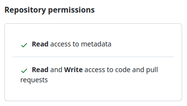

(napari-maintenance)=

# Maintenance

This document describes maintenance tasks that need to be performed from time to time. Its purpose is to avoid relying on personal memory alone, and it should be updated regularly.

## Refreshing tokens for the auto upgrade of test constraints and vendored packages.

Because of the security GitHub policy, the commits and pull requests created by an action that uses default `GITHUB_TOKEN`
will not trigger another action's runs. The possible workaround for this is to close and then reopen the pull request.
But this requires additional actions by core devs.

To get automatically running workflows, we need to create a personal access token (PAT) and add it to the repository secrets.
For security reasons, it is recommended to create a [fine-grained token](https://docs.github.com/en/authentication/keeping-your-account-and-data-secure/creating-a-personal-access-token#creating-a-fine-grained-personal-access-token). It allows us to provide only the required permissions.

The token should have a one-year expiration date. After that, it needs to be refreshed.

The token should be named `GHA_TOKEN` and the required permissions are:

 * **read** to repository metadata
 * **read and write** to pull requests
 * **read and write** to code

 

 At the moment of writing this document, there is a difference in names between the summary of the token and the list of permissions.
 The **code** permission is called **Contents** in the Edit view of the token.

## Refreshing the token

To create a new token, go to the personal settings page and select _Developer settings_ at the bottom of the left menu. On the visible screen, expand the _Personal access tokens_ section and click the _Fine-grained token_ link.

Then click the _Generate new token_ button in the upper right corner.

Fill the form:

1. Set expiration to custom and then select the proper date
2. Select **napari** to be the resource owner
3. Select _Only selected repositories_ and then select **napari/napari** repository

4. Select the required permissions for repository metadata, pull requests, and code (contents)

5. Click the _Generate token_ button
6. Copy token
7. Go to the napari repository settings
8. Expand the _Secrets and variables_ section and select _Actions_
9. Click the edit button for the `GHA_TOKEN` secret

10. Paste a new token to the value field

To validate if the token is working, you can run the "Upgrade test constraints" workflow manually. Ensure that there will be some packages to update.