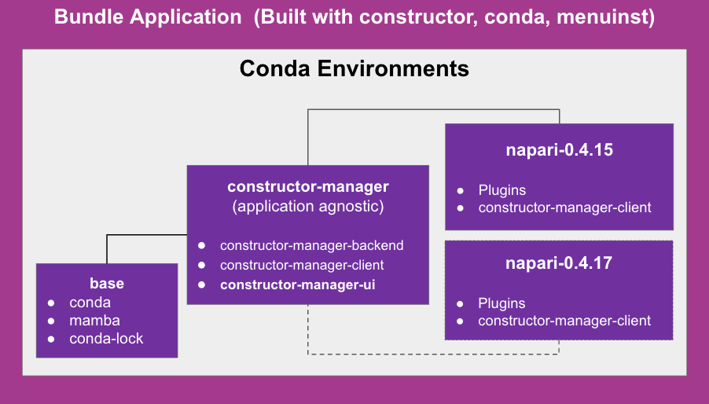
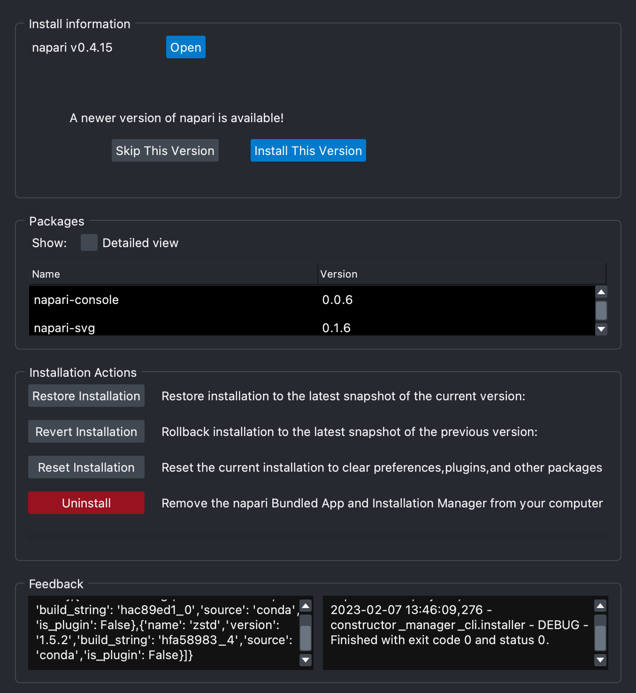

(napari-packaging)=

# Packaging

Once a release is cut, napari is distributed in two main ways:

* Packages: both to PyPI and conda-forge.
* Installers: bundles that include napari plus its runtime dependencies in a step-by-step
  executable.

## Packages

Despite its numerous dependencies, `napari` itself is a simple Python project that can be packaged
in a straight-forward way.

Creating and submitting the packages to PyPI (the repository you query when you do `pip install`)
is handled in the [`.github/workflows/make_release.yml`][2] workflow. Creation is
handled with `make dist` (as specified in our [`Makefile`][3]) and submission is done using the
[official PyPA GitHub Action][4]. This workflow will also create a GitHub Release.

Once the Python package makes it to PyPI, it will be picked by the `conda-forge` bots, which will
automatically submit a PR to the [`napari-feedstock`][1] repository within a few hours. This is all
automated by the `conda-forge` infrastructure (see [previous examples][16]), so we only need to
check that the metadata in the recipe has been adjusted for the new release. Pay special attention
to the runtime dependencies and version strings!

> We keep a copy of the feedstock's recipe in the `napari/packaging` repo, which is updated manually
> whenever a change to `setup.cfg` is detected. Check the file `conda-recipe/meta.yaml` and make
> sure its `outputs` are synced to the `napari-feedstock` copy.

Once the conda-forge CI is passing and the PR is approved and merged, the final packages will be
built on the default branch and uploaded to the `conda-forge` channel. Due to the staging steps and
CDN synchronization delays, the conda packages can take up to 1h to be available after the
merge.

### Nightly packages

We also build nightly packages off `main` and publish them to the `napari/label/nightly` channel.
These are the same packages that are used in the `constructor` installers (see below), so their CI
is specified in `.github/workflows/make_bundle_conda.yml`.

To do it in a `conda-forge` compatible way, we actually _clone_ `napari-feedstock` and patch the
source instructions so the code is retrieved from the repository branch directly. The version is
also patched to match the `setuptools-scm` string. After [rerendering][8] the feedstock, we run
`conda-build` in the same way `conda-forge` would do and upload the resulting tarballs to our
[Anaconda.org channel][17].

Additionally, the tarballs are also passed as artifacts to the next stage in the pipeline: building
the `constructor` installers (more below).

## Installers

Once the packages have been built and uploaded to their corresponding repositories, we can bundle
them along with their dependencies in a single executable that end users can run to install napari
on their systems, with no prior knowledge of `pip`, `conda`, virtual environments or anything.

A software installer is usually expected to fulfill these requirements:

* It will install the application so it can be run immediately after.
* It will provide a convenient way of opening the application, like a shortcut or a menu entry.
* It will allow the user to uninstall the application, leaving no artifacts behind.

Right now, we are using two ways of generating the installers:

* With `briefcase`, which takes PyPI packages.
* With `constructor`, which takes `conda` packages.

`conda` packages offer several advantages when it comes to bundling dependencies, since it makes
very few assumptions about the underlying system installation. As a result, `constructor` bundles
include libraries that might be missing in the target system and hence should provide a more robust
user experience.

### Briefcase-based installers

[`briefcase`][5] based installers are marked for deprecation so we will not discuss them here.
If you are curious, you can check `bundle.py` and `.github/workflows/make_bundle.yml` for
details.

### Constructor-based installers

We use `constructor` to build the `napari` installers through the
`.github/workflows/make_bundle_conda.yml` workflow, which only specifies the triggers used to call
the actual workflow implementation under the `napari/packaging` repository. This repository stores
all the logic and files needed to create the nightly `conda` packages and the `constructor`
installers.

[`constructor`][6] allows you to build cross-platform installers out of `conda` packages. It
supports the following installer types:

* On Linux, a shell-based installer is generated. Users can execute it with `bash installer.sh`.
* On macOS, you can generate both PKG and shell-based installers. PKG files are graphical installers
  native to macOS, and that's the method we use with napari.
* On Windows, a graphical installer based on NSIS is generated.

The configuration is done through a `construct.yaml` file, documented [here][7]. We generate one on
the fly in the `build_installers.py` script found in `napari/packaging`.
Roughly, we will build this configuration file:

```yaml
# os-agnostic configuration
name: napari
version: "0.0.1"  # this is the _internal_ version of the installer infrastructure
company: Napari
license: EULA.md
channels:
  # - local  # only in certain situations, like nightly installers where we build napari locally
  - napari/label/bundle_tools  # temporary location of our forks of the constructor stack
  - conda-forge
specs: # specs for the 'base'  environment
  - python   # pinned to the version of the running interpreter, configured in the CI
  - conda    # we add these to manage different napari versions
  - mamba    # we add these to manage different napari versions
  - pip      # we add these to manage different napari versions
extra_envs:
  napari-0.4.16: # this is the environment that will actually contain the napari packages
    specs:
      - napari=0.4.16=*pyside*
      - napari-menu=0.4.16
      - python   # pinned to a specific version, configured by CI
      - conda    # needed for the plugin manager
      - mamba    # needed for the plugin manager
      - pip      # needed for the plugin manager
menu_packages:
  - napari-menu  # don't create shortcuts for anything else in the environment

# linux-specific config
default_prefix: $HOME/napari-0.0.1  # default installation path

# macos-specific config
default_location_pkg : Library # first component of the default path under ~/
pkg_name: napari-0.0.1  # second component of the default path
installer_type: pkg  # otherwise, defaults to sh (Linux-like)
welcome_image: resources/napari_1227x600.png  # bg image with the napari logo on bottom-left corner
welcome_file: resources/osx_pkg_welcome.rtf  # rendered text in the first screen
conclusion_text: ""  # set to an empty string to revert constructor customizations back to system's
readme_text: ""  # set to an empty string to revert constructor customizations back to system's
signing_identity_name: "Apple Developer ID: ..."  # Name of our installer signing certicate

# windows-specific config
welcome_image: resources/napari_164x314.png  # logo image for the first screen
header_image:  resources/napari_150x57.png  # logo image (top left) for the rest of the installer
icon_image: napari/resources/icon.ico  # favicon for the taskbar and title bar
default_prefix: '%USERPROFILE%/napari-0.0.1'  # default location for user installs
default_prefix_domain_user: '%LOCALAPPDATA%/napari-0.0.1'  # default location for network installs
default_prefix_all_users: '%ALLUSERSPROFILE%/napari-0.0.1'  # default location for admin installs
signing_certificate: certificate.pfx  # path to signing certificate
```

The main OS-agnostic keys are:

* `channels`: where the packages will be downloaded from. We mainly rely on conda-forge for this,
  where `napari` is published. However, we also have `napari/label/bundle_tools`, where we store
  our `constructor` stack forks (more on this later). In nightly installers, we locally build our
  own development packages for `conda` without resorting to `conda-forge`. To make use of those
  (which are eventually published to `napari/label/nightly`), we unpack the GitHub Actions artifact
  in a specific location that `constructor` recognizes as a _local_ channel once indexed.
* `extra_envs> napari-$VERSION`: the environment that will actually contain the napari installation.
  In this key, you will find `specs`, which lists the conda packages to be installed in that
  environment. Constructor will perform a conda solve here to retrieve the needed dependencies.
* `menu_packages`: restrict which packages can create shortcuts. We only want the shortcuts provided
  by `napari-menu`, and not any that could come from the (many) dependencies of napari.

Then, depending on the operating systems and the installer format, we customize the configuration
a bit more.

#### Default installation path

This depends on each OS. Our general strategy is to put the general installation under
`~/<hidden>/napari-<INSTALLER-VERSION>`, which will eventually contain the napari installations under
`envs/`, with environments named as `napari-<VERSION>`. However, there are several constrains we
need to take into account to make this happen:

* On Windows, users can choose between an "Only me" and "All users" installation. This changes what
  we understand by "user directory". This is further complicated by the existence of "domain users",
  which are not guaranteed to have a user directory per se.
* On macOS, the PKG installer does not offer a lot of flexibility for this configuration. We will
  put it under `~/Library/napari-<INSTALLER-VERSION>`, by default.

This means that if you install `napari=0.4.16` using the installer, the actual `napari` executable
can be found, by default, on the following locations:

* Linux: `~/.local/napari-0.0.1/envs/napari-0.4.16/bin/napari`
* MacOS: `~/Library/napari-0.0.1/envs/napari-0.4.16/bin/napari`
* Windows: `~/napari-0.0.1/envs/napari-0.4.16/Library/bin/napari`

#### Branding

Graphical installers can be customized with logos and icons. These images are stored under the
`resources/` directory (outside of the source), with the exception of the square logos/icons (which
are stored under `napari/resources/` so the shortcuts can find them after the installation).

Some of the steps are also configured to display a custom text, like the license or the welcome
screen on macOS.

#### Signing

In order to avoid security warnings on the target platform, we need to sign the generated installer.

On macOS, once Apple's _Installer Certificate_ has been installed to a keychain and unlocked
for its use, you can have `constructor` handle the signing via `productsign` automatically.
However, this is not enough for a warning-free installation, since its contents need to be
_notarized_ and _stapled_ too. For this reason, `constructor` has been modified to also
`codesign` the bundled `_conda.exe` (the binary provided by conda-standalone, see below) with
the _Application Certificate_. Otherwise, notarization fails. After that, two actions take care
of notarizing and stapling the resulting PKG.

On Windows, any Microsoft-blessed certificate will do. Our `constructor` fork allows us to specify
a path to a PFX certificate and then have the Windows SDK `signtool` add the signature. Note that
`signtool` is not installed by default on Windows (but it is on GitHub Actions).

---

More details about our packaging infrastructure can be found in the [NAP-2 document][nap-2].

#### Details of our `constructor` stack fork

> Note: All these changes have been sent upstream. See progress in [this issue][18].

Many of the features here listed were not available on `constructor` when we started working on it.
We have added them to the relevant parts of the stack as needed, but that has resulted in a lot of
moving pieces being juggled to make this work. Let's begin by enumerating the stack components:

1. `constructor` is the command-line tool that _builds_ the installer. It depends on `conda` to
   solve the `specs` request. It also requires a copy of `conda-standalone` (a PyInstaller-frozen
   version of `conda`) to be present at build time so it can be bundled in the installer. This
   is needed because that `conda-standalone` copy will handle the extraction, linking and
   shortcut creation when the user runs the installer on their machine.
2. `conda-standalone` is a frozen version of `conda`. Among its dependencies, we can find
   `menuinst`, which handles the creation of shortcuts and menu entries.
3. `menuinst` was only used on Windows before our work, so we basically rewrote it to handle
   cross-platform shortcuts.
4. `conda` interfaces with `menuinst` to delegate the shortcut creation. Since this was only enabled
   on Windows, we needed to unlock the other platforms and rewrite the parts that assumed Windows
   only behaviour. Surprise, this involved custom solver behaviour too!

Since `menuinst` is frozen together with `conda` for `conda-standalone`, every little change in any
of those requires a rebuild of `conda-standalone` so `constructor` can find the new version during
the installer creation. As a result, we needed to fork _and repackage_ all four components!

Notice the repackaging needs. It's not enough to fork and patch the code. We also need to create
the conda packages and put them in a channel so the downstream dependencies can pick them when they
are rebuilt. This repackaging is done through a separate `conda-forge` clone that only handles our
forks. It is configured to use GitHub Actions (instead of Azure) and upload to the `napari` channel
(instead of `conda-forge`).

For example, if a patch is introduced in `menuinst`, the following needs to happen before it makes
it to the final napari installer:

1. Write and test the patch. Make sure it passes its own CI.
2. Make sure `conda` still works with the new changes. It needs to call `menuinst` after all.
3. Create the `menuinst` package and upload it to Anaconda.org.
4. Rebuild and upload `conda-standalone` so it picks the new `menuinst` version.
5. Trigger the napari CI to build the new installer.

Very fun! So where do all these packages live?

| Package            | Fork                                            | Feedstock                                          |
|--------------------|-------------------------------------------------|----------------------------------------------------|
| `constructor`      | [jaimergp/constructor @ `menuinst+branding`][9] | [jaimergp-forge/constructor-feedstock][12]         |
| `conda-standalone` | _N/A_                                           | [conda-forge/conda-standalone-feedstock PR#21][13] |
| `conda`            | [jaimergp/conda @ `cep-menuinst`][10]           | [jaimergp-forge/conda-feedstock][14]               |
| `menuinst`         | [jaimergp/menuinst @ `cep`][11]                 | [jaimergp-forge/menuinst-feedstock][15]            |

Most of the forks live in `jaimergp`'s account, under a non-default branch. They are published
through the `jaimergp-forge` every time a commit to `master` is made. Versions are arbitrary here,
but they are set to be greater than the latest official version, and the `build` number is
incremented for every rebuild.

The only exception is `conda-standalone`. It doesn't have its own repository or fork because it's
basically a repackaged `conda` with some patches. Those patches live in the feedstock only. The
other difference is that the feedstock does not live in `jaimergp-forge`, but just as draft PR in
the `conda-forge` original feedstock. This is because, for some reason, if `conda-standalone` is
built on GitHub Actions machines, the Windows version will fail with `_ssl` errors which do not
appear in Azure. For this reason, the CI is run as normal on `conda-forge`, and then the artifacts
are retrieved from the Azure UI and manually uploaded to the `napari` channel. Fun again!

_Eventually_ all these complexities will be gone because all of our changes will have been merged
upstream. For now, this not the case. Speaking of which, what are our changes? Below you can find
a high-level list of the main changes introduced in the stack.

##### Changes in `menuinst`

* Add cross-platform specification for shortcut configuration
* Enable support on Windows, Linux and macOS
* Re-engineer environment activation
* Maintain backwards compatibility with Windows
* Simplify API
* Remove CLI

##### Changes in `conda`

* Add API support for menuinst v2
* Enable code paths for non-Windows Platforms
* Fix shortcut removal logic
* Add `--shortcuts-only` flag to support `menu_packages` constructor key natively

##### Changes in `conda-standalone`

* Unvendor menuinst patches
* Do not vendor constructor NSIS scripts
* Adapt `conda constructor` entry point for the new menuinst API

##### Changes in `constructor`

* Use `--shortcuts-only`
* Add branding options for macOS PKG installers
* Always leave `_conda.exe` in the install location
* Do not offer options for conda init or PATH manipulations (these should be Anaconda specific)
* Add signing for Windows
* Add notarization for macOS PKG

#### `constructor-manager` stack for handling updates and recovery

Constructor installers come with a `constructor-manager` stack that allows users to perform
"updates in place", recover from a broken installation, rollback to a previous version or restore
point and finally uninstall the entire application. The constructor manager stack is application
agnostic in that it can be used for any othe application using the updated constructor stack
to build and distribute installers that may or may not handle additional plugins.



This stack is composed of three main packages [19]:

* `constructor-manager-backend`: Provides a simplified command line interface on top of
  `conda`, `mamba` and `conda-lock` to query for updates and perform the actual installation,
  reset or uninstallation of the application.
* `constructor-manager-client`: Provides a Python API to interact with the backend and
  perform the same operations as the CLI.
* `constructor-manager-ui`: Provides a Qt-based UI to interact with the backend via the client
  to perform the same operations as the CLI. Additonal shortcuts will be created to access
  this application on the different operating systems. It can also be opened from within
  `napari` in the `Help` menu.

The constructor based installers will contain 3 main environments when created:

* A `base` environment which will contain:
  * `conda`: package and environment manager)
  * `mamba`: conda "replacement" for performing faster solves, transactions and downloads.
  * `conda-lock`: create locked and reproducible environments.
* A `constructor-manager` environment which will contain:
  * `constructor-manager-backend` [napari/packaging#34](https://github.com/napari/packaging/pull/34)
  * `constructor-manager-client` [napari/packaging#46](https://github.com/napari/packaging/pull/46)
  * `constructor-manager-ui` [napari/packaging#63](https://github.com/napari/packaging/pull/63)
* An application environment, using the conventions `<package-name>-<version>`, for the example image above, `napari-0.4.15`

##### `constructor-manager-backend`

This package is in charge of providing a CLI utility that will work under the hood with `conda`,
`mamba` and `conda-lock` (living in the `base` environment) to provide the following
functionalities in the creation of bundle applications:

The backend can be called using the CLI program `constructor-manager` and the following actions are
available

* `check-updates`: Query for new updates available for the managed application by providing one
  or more anaconda.org channels. By default we query the `conda-forge` channel located at [anaconda.org](https://anaconda.org/conda-forge/)
* `update`: update a current application to a new version of it. This process will create a new
  conda environment following the convention `<package-name>-<new-version>`, create new menu
  shortcuts (using the menuinst branch https://github.com/conda/menuinst/tree/cep-devel/menuinst),
  create a new restore point (using conda-lock), remove the old environment and the corresponding
  shortcuts for the old versions of the managed application.
* `revert`: this will revert the current application to the previously installed version on the
  computer if a restore point is found. This will follow a similar process of creating a new
  conda environment with the convention `<package-name>-<old-version>`.
* `restore`: similar to revert but restore to a previously found state of the current version.
  This command could become a single one by providing the specific restore file (which is created
  by conda lock)
* `lock-environment`: create a lock file of the current state of the application environment.
  This can be called by the client applications (using constructor-manager-client) to check for
  changes in the environment. If no changes are detected, no lock is created.
* `uninstall`: to be implemented.
* `get-status`: get information on a currently running update/restore/revert in progress.

Some of these commands can be run in parallel others create a lock to prevent multiple instances
of an update/restore/revert process.

More information on the [README](https://github.com/goanpeca/packaging/blob/constructor-updater/constructor-manager-cli/README.md) of the package.

##### `constructor-manager-client`

This package which in its present form is a `qtpy` (worker and signal) based library providing an
API to call the `constructor-manager-backend`. It provides a python library to run workers and
query information on the different processes managed by the constructor manager.

The library is imported with

```python
from constructor_manager_client import api
```

* `check_updates`: Query for new updates available for the managed application by providing one
  or more anaconda.org channels. By default we query the `conda-forge` channel located at [anaconda.org](https://anaconda.org/conda-forge/).
* `update`: update a current application to a new version of it. This process will create a new
  conda environment following the convention `<package-name>-<new-version>`, create new menu
  shortcuts (using the menuinst branch https://github.com/conda/menuinst/tree/cep-devel/menuinst),
  create a new restore point (using conda-lock), remove the old environment and the corresponding
  shortcuts for the old versions of the managed application.
* `revert`: this will revert the current application to the previously installed version on the
  computer if a restore point is found. This will follow a similar process of creating a new conda
  environment with the convention `<package-name>-<old-version>`.
* `restore`: similar to revert but restore to a previously found state of the current version.
  This command could become a single one by providing the specific restore file (which is created
  by conda lock).
* `lock_environment`: create a lock file of the current state of the application environment.
  This can be called by the client applications (using constructor-manager-client) to check
  for changes in the environment. If no changes are detected, no lock is created.
* `uninstall`: to be implemented
* `get_status`: get information on a currently running update/restore/revert in progress.
* `open_application`: open a give application created with `conda` and `menuinst` un a cross
  platform way

Some of these commands can be run in parallel others create a lock to prevent multiple instances
of an update/restore/revert process.

This library is meant to be used in the application environment by the applications themselves so
they can query the information to know about new updates and either trigger them directly in a
detached process (to be implemented in a following version) or to open the `constructor-manager-ui`
to handle those actions directly.

More information on the [README](https://github.com/goanpeca/packaging/blob/constructor-cli/constructor-manager/README.md) of the package.

##### `constructor-manager-ui`

which in its present form is a pyqt/pyside based application. It provides a graphical interface
to run the different actions to manage an application built with `constructor`

The ui is called from the command line interface with `constructor-manager-ui <package-name>`.
Since the application will be called using standard application calls created by menuinst,
arguments will be passed with configuration files handled by `constructor-manager-client` calls.



<!-- hyperlinks -->

[1]: https://github.com/conda-forge/napari-feedstock
[2]: https://github.com/napari/napari/blob/main/.github/workflows/make_release.yml
[3]: https://github.com/napari/napari/blob/main/Makefile#L20
[4]: https://github.com/pypa/gh-action-pypi-publish
[5]: https://github.com/beeware/briefcase
[6]: https://github.com/conda/constructor
[7]: https://github.com/conda/constructor/blob/main/CONSTRUCT.md
[8]: https://conda-forge.org/docs/maintainer/updating_pkgs.html#rerendering-feedstocks
[9]: https://github.com/jaimergp/constructor/tree/menuinst+branding
[10]: https://github.com/jaimergp/conda/tree/cep-menuinst
[11]: https://github.com/jaimergp/menuinst/tree/cep
[12]: https://github.com/jaimergp-forge/constructor-feedstock
[13]: https://github.com/conda-forge/conda-standalone-feedstock
[14]: https://github.com/jaimergp-forge/conda-feedstock
[15]: https://github.com/jaimergp-forge/menuinst-feedstock
[16]: https://github.com/conda-forge/napari-feedstock/pulls?q=is%3Apr+sort%3Aupdated-desc+is%3Aclosed
[17]: https://anaconda.org/napari
[18]: https://github.com/napari/packaging/issues/15
[19]: https://github.com/napari/packaging
[nap-2]: https://napari.org/dev/naps/2-conda-based-packaging.html
