---
jupytext:
  formats: ipynb,md:myst
  text_representation:
    extension: .md
    format_name: myst
    format_version: 0.13
    jupytext_version: 1.11.5
kernelspec:
  display_name: Python 3 (ipykernel)
  language: python
  name: python3
---

(napari-installation)=

# Install napari

This guide will teach you how to do a clean install of **napari** and launch the viewer.

If you're already familiar with Python, napari can be installed from PyPI or conda-forge using your favorite virtual environment and package manager. Otherwise, keep reading for instructions on how to install napari as a Python package.

```{tip}
If you just want to get started quickly with napari as an app, check out our [napari app installation instructions](#installation_bundle_conda).
```

(install-python-package)=

## Install as Python package (recommended)

This installation method allows you to use napari from Python to programmatically
interact with the app. It is the best way to install napari and make full use of
all its features.

```{note}
If you want to contribute code back into napari, you should follow the [development installation instructions in the contributing guide](dev-installation) instead.
```

It requires:

- [Python {{ python_version_range }}](https://www.python.org/downloads/)
- the ability to install python packages via [pip](https://pypi.org/project/pip/) OR [conda-forge](https://conda-forge.org/docs/user/introduction.html)

You may also want:

- an environment manager like [conda](https://docs.conda.io/projects/conda/en/stable/user-guide/getting-started.html) or
  [venv](https://docs.python.org/3/library/venv.html) **(Highly recommended)**

```{note}
New to Python or uncertain about conda, pip, and virtual environments?
Here are some resources we recommend:

- [Talley Lambert's "Getting started running Python" slides](https://hms-iac.github.io/bobiac/content/02_getting_started_with_python/getting_started_with_python.html#slides)
- [Scientific Python: Getting started with Python for science](https://lectures.scientific-python.org/intro/index.html)
- [Detailed comparison of Python environment management tools](https://www.nijho.lt/post/python-environments/)
```

Python package distributions of napari can be installed via `pip`, `conda-forge`, or from source.

```{important}
While not strictly required, it is highly recommended to install
napari into a clean virtual environment using an environment manager like
[conda](https://docs.conda.io/projects/conda/en/latest/user-guide/tasks/manage-environments.html) or
[venv](https://docs.python.org/3/library/venv.html).

This should be set up *before* you install napari. For example, setting with
up a Python {{ python_version }} environment with `conda`:

{{ conda_create_env }}
```

Choose one of the options below to install napari as a Python package.

``````{tab-set}

`````{tab-item} From conda-forge using conda

If you prefer to manage packages with conda, napari is available on the
conda-forge channel. We also recommend this path for users of arm64 macOS machines
([Apple Silicon](https://support.apple.com/en-us/116943), meaning a processor with a name like "M1"). You can install it with:

```sh
conda install -c conda-forge napari pyqt
```

You can then upgrade to a new version of napari using:

```sh
conda update napari
```

If you want to install napari with PySide6 as the backend you need to install it using

```sh
conda install -c conda-forge napari pyside6
```

````{note}
In some cases, `conda`'s default solver can struggle to find out which packages need to be
installed for napari. If it takes too long or you get the wrong version of napari
(see below), consider:
1. Overriding your default channels to use only `conda-forge` by adding
`--override-channels` and specifying the napari and Python versions explicitly.
For example, use {{ python_version_code }} to get Python {{ python_version }} and
{{ napari_conda_version }} to specify the napari version as {{ napari_version }},
the current release.

2. Switching to the new, faster [`libmamba` solver](https://conda.github.io/conda-libmamba-solver/libmamba-vs-classic/),
by updating your `conda` (`libmamba` is the default solver from conda 23.10 onwards):
```
conda update -n base conda
```
````

`````

`````{tab-item} From PyPI using pip

napari can be installed from PyPI on most macOS, Linux, and Windows systems with Python
{{ python_version_range }} using pip:

```sh
python -m pip install "napari[all]"
```

You can then upgrade napari to a new version using:

```sh
python -m pip install "napari[all]" --upgrade
```

*(See [Choosing a different Qt backend](#choosing-a-different-qt-backend) below for an explanation of the `[all]`
notation.)*

*(See [Using constraints file](#using-constraints-files) for help installing older versions of napari)*

`````

`````{tab-item} From the main branch on Github

To install the latest version with yet to be released features from Github you can use pip:

```sh
python -m pip install "git+https://github.com/napari/napari.git#egg=napari[all]"
```

`````

``````

### Checking it worked

After installation you should be able to launch napari from the command line by
simply running

```sh
napari
```

An empty napari viewer should appear as follows:

```{code-cell} ipython3
---
tags: [remove-input]
---
import napari
from napari.utils import nbscreenshot


viewer = napari.Viewer()

nbscreenshot(viewer, alt_text="Screenshot of an empty napari viewer, right after launching.")
```

```{note}
On some platforms, particularly macOS and Windows, there may be a ~30 second
delay before the viewer appears on first launch. This is expected and subsequent
launches should be quick. However, anti-malware and other security software
measures may further delay launches—even after the first launch.
```

You can check the napari version, to ensure it's what you expect, for example
the current release {{ napari_version }}, using the command: `napari --version` .

### Advanced installation options

(choosing-qt-backend)=

#### Choosing a different Qt backend

napari needs a library called [Qt](https://www.qt.io/) to run its user interface
(UI). In Python, there are three alternative libraries to run this, called
[PyQt5](https://www.riverbankcomputing.com/software/pyqt/download) for Qt5, [PyQt6](https://www.riverbankcomputing.com/software/pyqt/download) and
[PySide6](https://doc.qt.io/qtforpython-6/) for Qt6. By default, we don't choose for you,
and simply running `python -m pip install napari` will not install either. You *might*
already have one of them installed in your environment, thanks to other
scientific packages such as Spyder or matplotlib. If neither is available,
running napari will result in an error message asking you to install one of
them.

Running `python -m pip install "napari[all]"` will install the default framework, which is currently
PyQt5--but this could change in the future.

To install napari with a specific framework, you can use:

```sh
python -m pip install "napari[pyqt6, optional]"    # for PyQt6

# OR
python -m pip install "napari[pyside6, optional]"  # for PySide6
```

By including `optional` you will install everything that `napari[all]` includes, but with the Qt backend of your choice.

```{note}
If you switch backends, it's a good idea to `pip uninstall` the one
you're not using.
```

```{note}
As PySide2 is not maintained, and we dropped support for it in napari 0.7.0. PyQt5 is still supported, as there is no PyQt6 on conda-forge yet.
```

#### Using constraints files

Since napari 0.4.18, we store constraints files with information about each exact dependency version against which napari was tested.
This could be useful if you need to install napari as a package from PyPI, and prevents creating environments where napari does not start or work properly.

The constraints files are stored in the napari repository under `resources/constraints/constraints_py3.10.txt`. To find
constraints for specific releases, go under the link `https://github.com/napari/napari/tree/{tag}/resources/constraints`
replacing `{tag}` with the desired napari version.

```sh
pip install napari[backend_selection] -c path/to/constraints/file
```

For example, if you would like to install napari with PyQt6 on python 3.10:

```sh
pip install napari[pyqt6, optional] -c constraints_py3.10.txt
```

(installation_bundle_conda)=

## Install as an application

napari can be installed as a bundled app on [MacOS](#macos-bundle), [Windows](#windows-bundle), and [Linux](#linux-bundle) with a simple one click download and guided installation process. This installation method is best if you mainly want to use napari as a standalone GUI app. However, certain plugins may not be supported.

```{note}
* If you want to use napari within a Python project, please follow the [Python package installation guide](installation.md#install-as-python-package-recommended).
* If you want to contribute code back into napari, please follow the [development installation instructions in the contributing guide](napari-contributing).
```

Click the tile below to jump to the installation instructions for your operating system.

````{grid}

```{grid-item-card} macOS
:link: macos-bundle
:link-type: ref
```

```{grid-item-card} Windows
:link: windows-bundle
:link-type: ref
```

```{grid-item-card} Linux
:link: linux-bundle
:link-type: ref
```

````

```{note}
If you are interested in an earlier version of the napari app, you may access those files by scrolling below the latest release on the [napari GitHub release page](https://github.com/napari/napari/releases). Each release (0.4.15 and above) will have an "Assets" section with the installers for Windows, macOS, and Linux.
```

(macos-bundle)=

### macOS

Download the napari app ({{ napari_version }}) for your platform:

```{admonition} macOS Apple Silicon (arm64)
---
class: admonition
---
{{ '# [Download from GitHub](https://github.com/napari/napari/releases/download/vNAPARI_VER/napari-NAPARI_VER-macOS-arm64.pkg)'.replace('NAPARI_VER', napari_version) }}
```

```{admonition} macOS Intel (x86)
---
class: admonition
---
{{ '# [Download from GitHub](https://github.com/napari/napari/releases/download/vNAPARI_VER/napari-NAPARI_VER-macOS-x86_64.pkg)'.replace('NAPARI_VER', napari_version) }}
```

Once you have downloaded the appropriate macOS package file, you will have a file with a name like `napari-0.5.0-macOS-x86_64.pkg`, but the version number will be {{ napari_version }}.
Double click this file to open the installer.

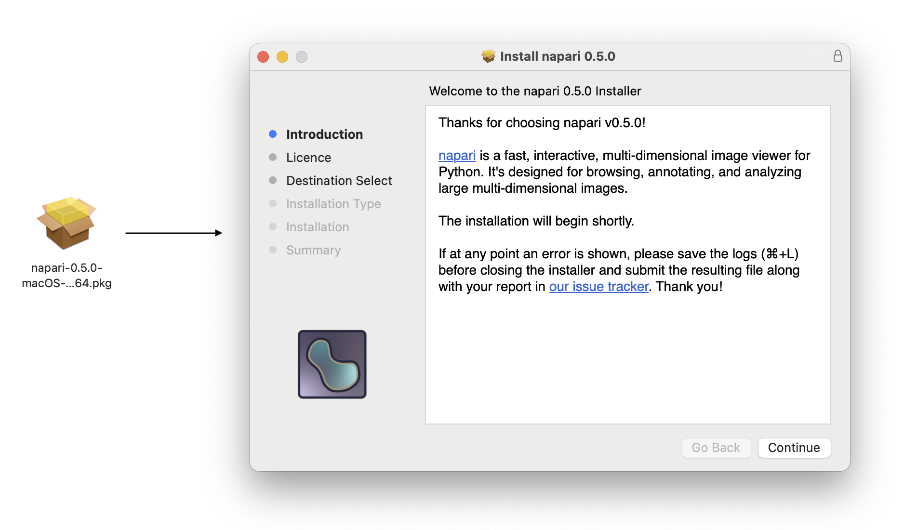

Click 'Continue' to open the Software License Agreement.

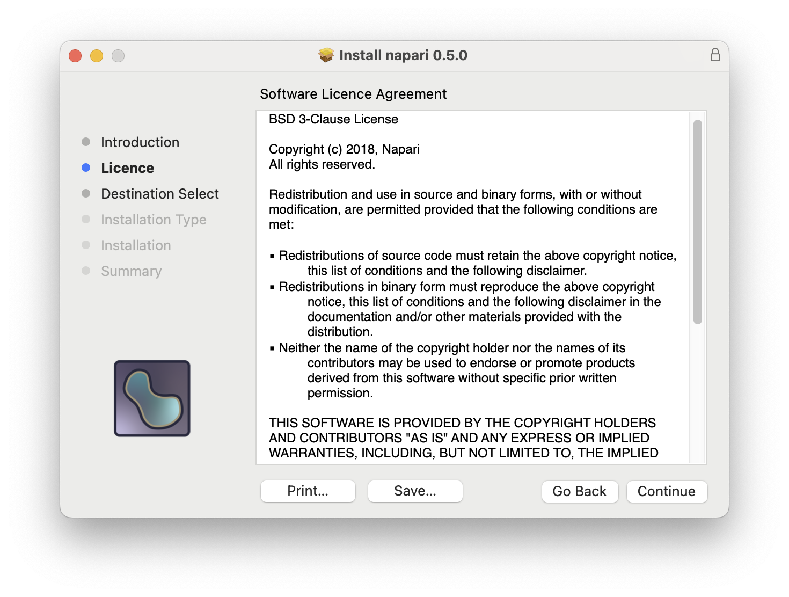

After reading this agreement, click 'Continue' to be prompted to agree to the Software License Agreement in order to proceed with installation.

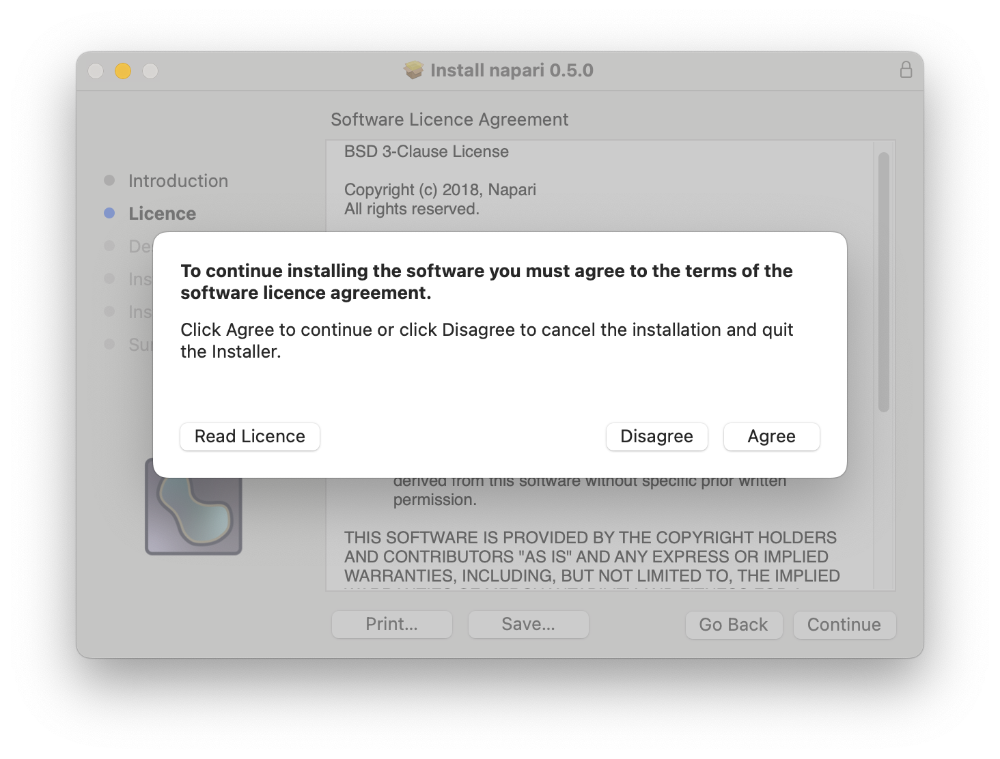

Click on 'Agree'. On the following page, you will be shown how much space the installation will use and can begin the standard installation by clicking 'Install.'

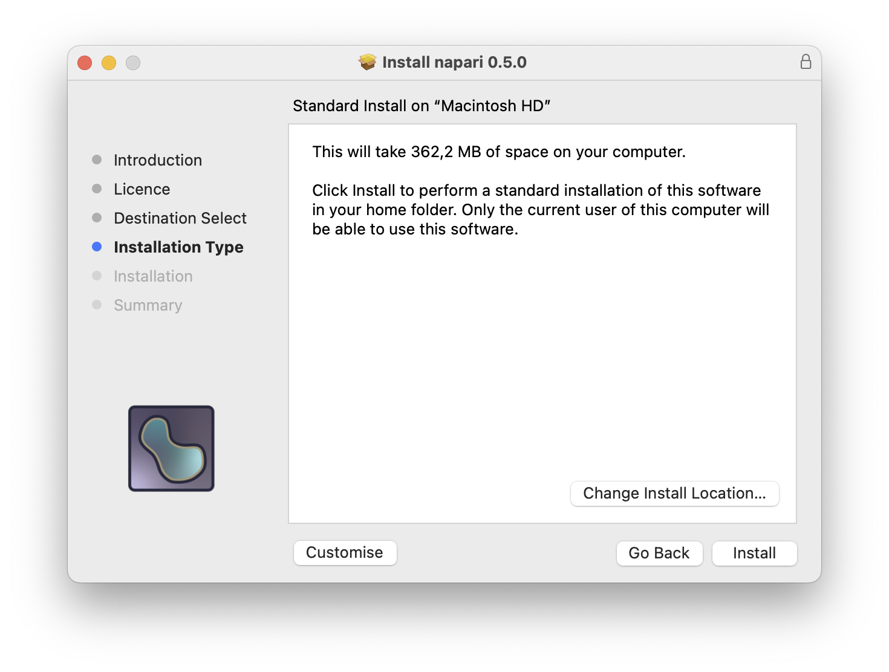

However, if you would like to change the default location for the installation, you may specify a different location by clicking 'Change Install Location…' and following the subsequent prompts before starting the installation.

You can also optionally click on 'Customize' to disable or enable some aspects of the installation process.

The installation progress can be monitored on the following window. Some notifications will appear in the top right corner of your display with further details.

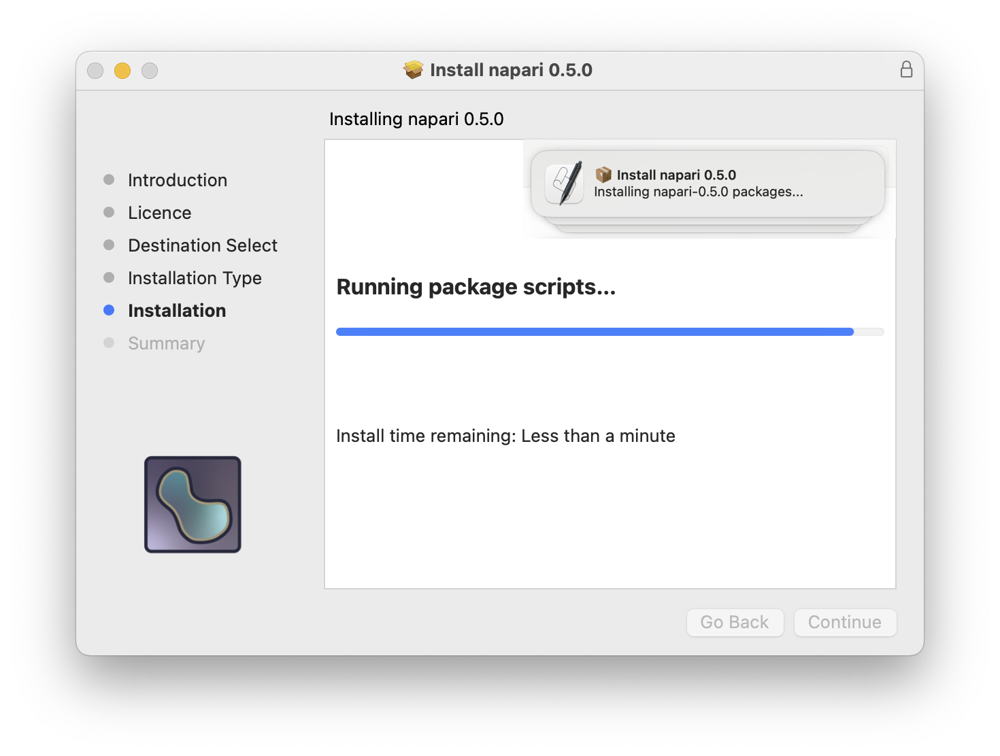

```{note}
If an error occurred during the installation, do not close the installer immediately. Before doing so, please inspect the logs by clicking on Window > Installer log or pressing {kbd}`⌘+L`. In the Detail Level dropdown, choose 'Show All Logs' and click on Save to keep a copy of the contents in a text file. This will be useful if you want to [submit an issue](https://github.com/napari/napari/issues/new/choose).
```

After finishing with no errors, a new page with the text "The installation was successful" will appear, as shown below.

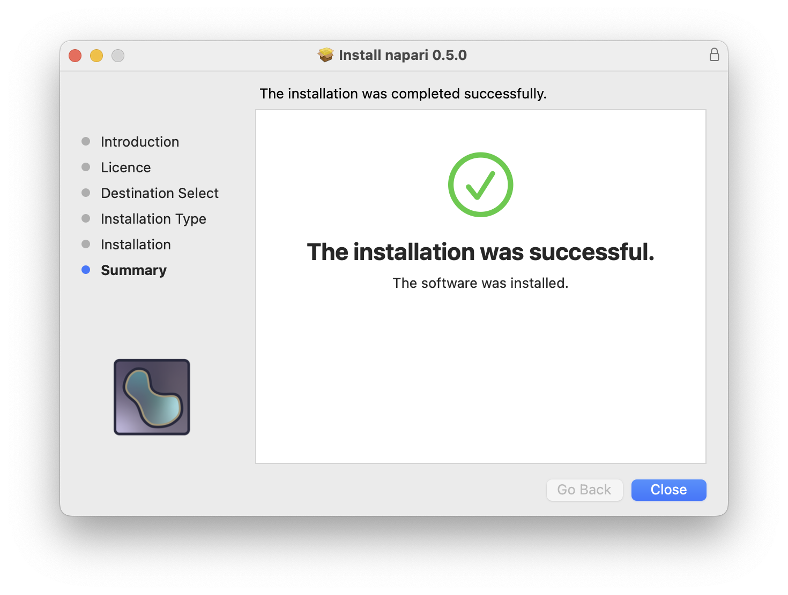

Click Close to finish. You can now get started using napari like any macOS application! You can use Launchpad to open it or find it using the Finder, under 🏠 [User directory] > Applications.

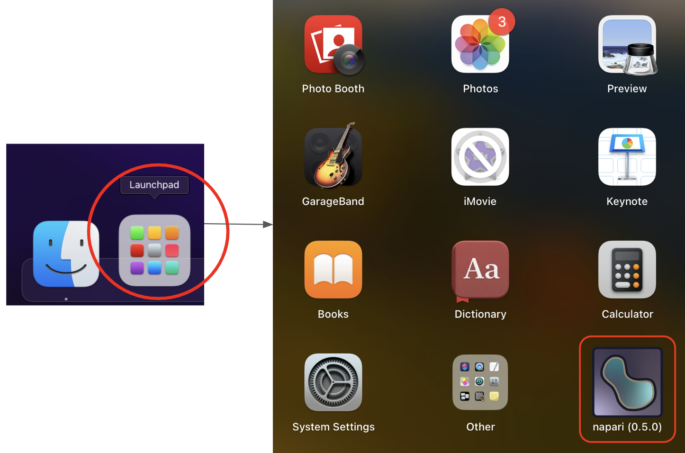

napari comes installed with sample images from scikit-image. Use the dropdown menu File > Open Sample > napari to open a sample image, or open one of your own images using File > Open or dragging and dropping your image onto the canvas.

Next check out our [tutorial on the viewer](viewer-tutorial) or explore any of the pages under the [Usage tab](usage).

(windows-bundle)=

### Windows

Download the napari app ({{ napari_version }}) for your platform:

```{admonition} Windows (x86_64)
---
class: admonition
---
{{ '# [Download from GitHub](https://github.com/napari/napari/releases/download/vNAPARI_VER/napari-NAPARI_VER-Windows-x86_64.exe)'.replace('NAPARI_VER', napari_version) }}
```

Once you have downloaded the Windows executable file, you will have a file with a name like `napari-0.5.0-Windows-x86_64.exe`, but the version number will be {{ napari_version }}.
Double click this file to open the napari Setup.

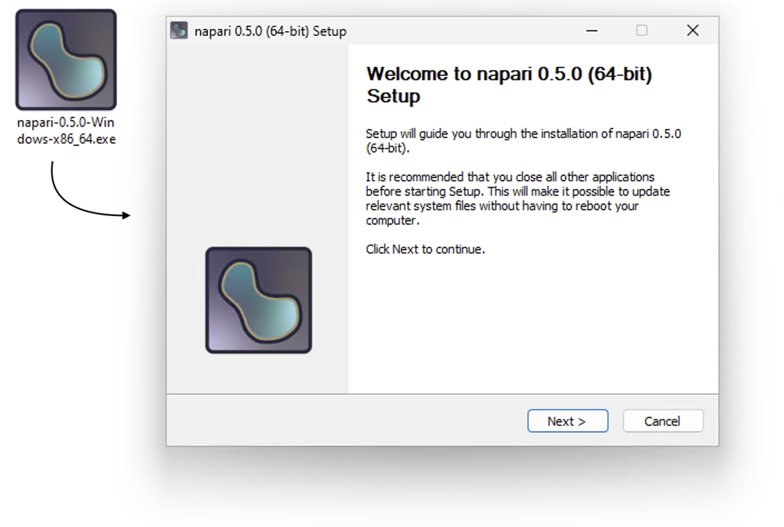

Click Next to continue and go to the License page. Read the contents and, if you agree, continue by clicking 'I Agree'.

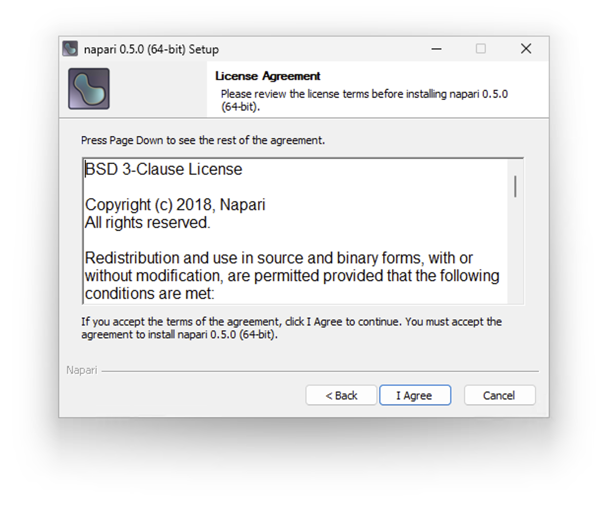

The recommended installation method is to install napari just for the current user ("Just Me"):

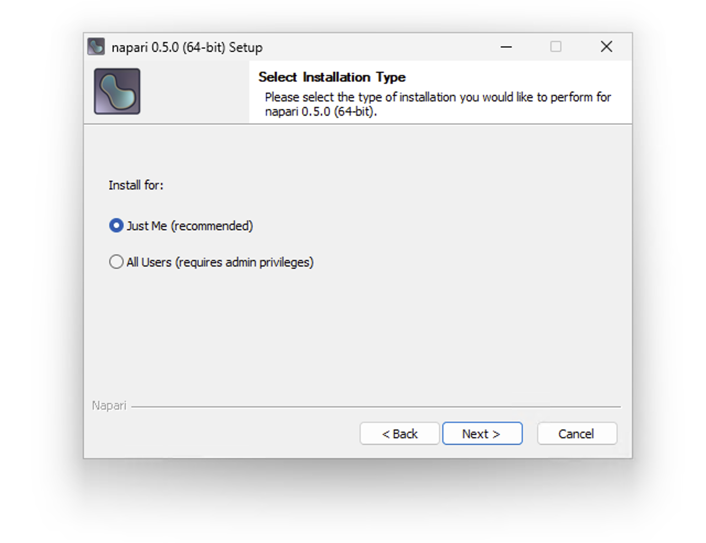

On the next page you will be shown how much space will be used by the installation and the default destination folder, which can be changed by using the 'Browse' button. Click 'Next' to continue.


On the next page, click 'Install' to start the installation process. Installation progress can be monitored on the following page. By clicking on 'Show details', you can obtain more information on the ongoing tasks. You can right-click on this new text area to copy the contents to the clipboard if needed.


Once installation is complete, you will see the page below. Click 'Finish' to close the installation wizard.

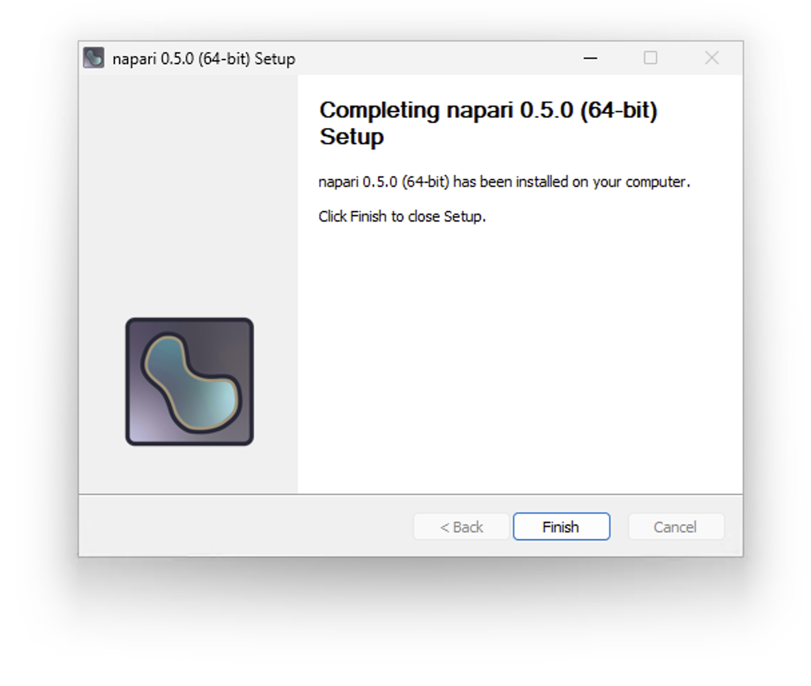

You can now get started using napari! A shortcut to launch napari can be found in the Windows Start menu.

napari comes installed with sample images from scikit-image. Use the dropdown menu File > Open Sample > napari to open a sample image, or open one of your own images using File > Open or dragging and dropping your image onto the canvas.

Next check out our [tutorial on the viewer](viewer-tutorial) or explore any of the pages under the [Usage tab](usage).

(linux-bundle)=

### Linux

Download the napari app ({{ napari_version }}) for your platform:

```{admonition} Linux (x86_64)
---
class: admonition
---
{{ '# [Download from GitHub](https://github.com/napari/napari/releases/download/vNAPARI_VER/napari-NAPARI_VER-Linux-x86_64.sh)'.replace('NAPARI_VER', napari_version) }}
```

Once you have downloaded the Linux SH file, you will have a file with a name like `napari-0.5.0-Linux-x86_64.sh`, but the version number will be {{ napari_version }}.
Open a new terminal window, navigate to the downloads folder (usually `cd ~/Downloads`) and run the command `bash napari-*-Linux-x86_64.sh`.

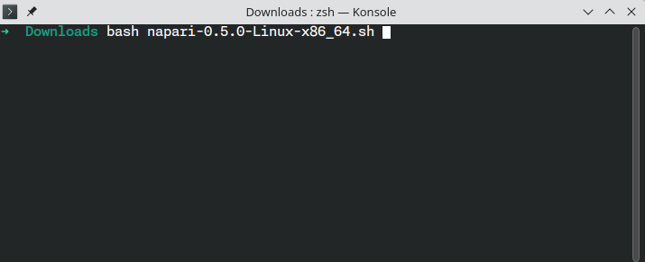

Press {kbd}`Enter` to display the License Agreement.

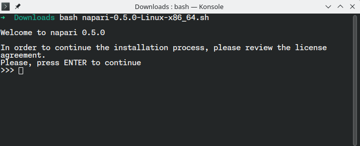

Read through the agreement shown below. You must agree to the terms by typing out `yes` and pressing {kbd}`Enter` to continue.

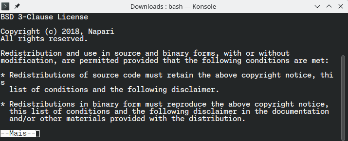

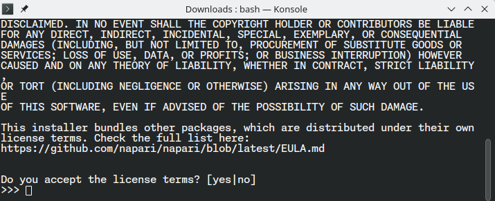

Next you will be shown the default location for the installation. You may confirm this location by pressing {kbd}`Enter`. Alternatively, specify a different location by typing out its absolute path. If it does not exist, it will be created. The terminal will then begin the installation process.

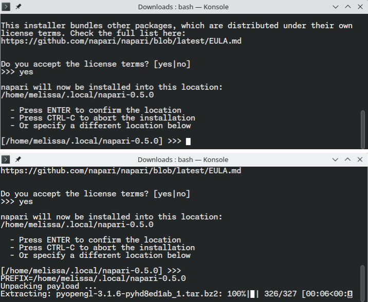

If the installation is successful, the terminal will display a message with the text 'Installation finished'.

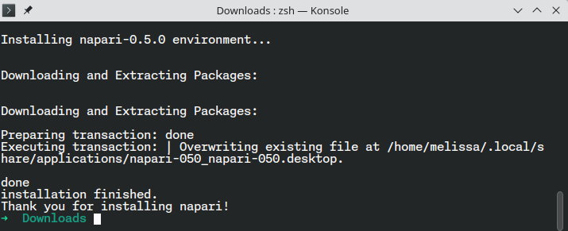

You can now get started using napari! A shortcut to launch napari should appear on your desktop or application menu. Under some Linux desktop environments, you can also search for 'napari' using the desktop search bar.

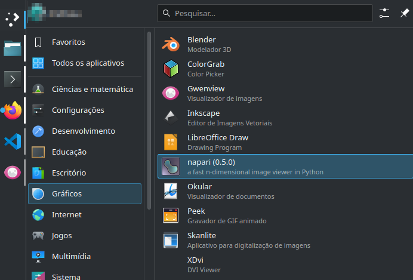

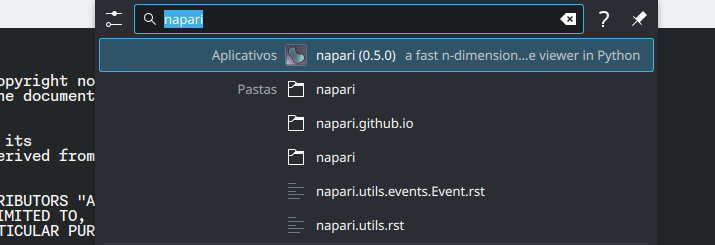

napari comes installed with sample images from scikit-image. Use the dropdown menu File > Open Sample > napari to open a sample image, or open one of your own images using File > Open or dragging and dropping your image onto the canvas.

Next check out our [tutorial on the viewer](viewer-tutorial) or explore any of the pages under the [Usage tab](usage).

## Plugins

napari's functionality can be extended through the use of plugins. Plugins can be installed as Python packages via pip or conda, or directly from within napari using the [napari plugin manager](https://napari.org/napari-plugin-manager/).

To explore existing plugins, visit the [napari hub](https://napari-hub.org/). For more details, check out our documentation on [finding and installing plugins](https://napari.org/stable/plugins/start_using_plugins/finding_and_installing_plugins.html#finding-and-installing-plugins).

## Next steps

- To start learning how to use napari, checkout our [getting started](launch) tutorial
- If you are interested in contributing to napari, please check our [contributing guidelines](napari-contributing)
- If you are running into issues or bugs, please open a [new issue](https://github.com/napari/napari/issues/new/choose)
  on our [issue tracker](https://github.com/napari/napari/issues)
- If you want help using napari, we are a community partner on the [imagesc
  forum](https://forum.image.sc/tag/napari) and all usage support requests should
  be posted on the forum with the tag `napari`. We look forward to interacting
  with you there!
