---
jupytext:
  formats: ipynb,md:myst
  text_representation:
    extension: .md
    format_name: myst
    format_version: 0.13
    jupytext_version: 1.11.5
kernelspec:
  display_name: Python 3 (ipykernel)
  language: python
  name: python3
---

(napari-installation)=

# Install napari

`````{grid} 1 2 2 2

````{grid-item-card} Install with Python
:link: install-python-package
:link-type: ref
:class-card: homepage-card-accent

Install napari in a Python environment for the most customizable experience.
````

````{grid-item-card} Download napari app
:link: installation_bundle_conda
:link-type: ref
:class-card: homepage-card-accent

A standalone installer for when you want napari without setting up Python first.
````
`````

If you want to contribute code back into napari, you should follow the [development installation instructions in the contributing guide](dev-installation) instead.

(install-python-package)=

## Install as Python package

This installation method allows you to use napari from Python to programmatically
interact with the app. It is the best way to install napari and make full use of
all its features. Python package distributions of napari can be installed via `pip`, `conda-forge`, or from source.

It requires:

- [Python {{ python_version_range }}](https://www.python.org/downloads/)
- the ability to install python packages via [pip](https://pypi.org/project/pip/) OR [conda-forge](https://conda-forge.org/docs/user/introduction.html)

You may also want:

- an environment manager like [conda](https://docs.conda.io/projects/conda/en/stable/user-guide/getting-started.html) or
  [venv](https://docs.python.org/3/library/venv.html) **(Highly recommended)**

```{admonition} New to Python?
:class: note
New to Python or uncertain about conda, pip, and virtual environments?
Here are some resources we recommend:

- [Scientific Python: Getting started with Python for science](https://lectures.scientific-python.org/intro/index.html)
- [Detailed comparison of Python environment management tools](https://www.nijho.lt/post/python-environments/)
```

```{admonition} A clean environment is recommended
While not strictly required, it is highly recommended to install
napari into a clean virtual environment using an environment manager like
[conda](https://docs.conda.io/projects/conda/en/latest/user-guide/tasks/manage-environments.html) or
[venv](https://docs.python.org/3/library/venv.html).

This should be set up *before* you install napari. For example, setting with
up a Python {{ python_version }} environment with `conda`:

{{ conda_create_env }}
```

Choose one of the options below to install napari as a Python package.

``````{tab-set}

`````{tab-item} From conda-forge using conda

If you prefer to manage packages with conda, napari is available on the
conda-forge channel. We also recommend this path for users of arm64 macOS machines
([Apple Silicon](https://support.apple.com/en-us/116943), meaning a processor with a name like "M1"). You can install it with:

```sh
conda install -c conda-forge napari pyqt
```

You can then upgrade to a new version of napari using:

```sh
conda update napari
```

If you want to install napari with PySide6 as the backend you need to install it using

```sh
conda install -c conda-forge napari pyside6
```

````{note}
In some cases, `conda`'s default solver can struggle to find out which packages need to be
installed for napari. If it takes too long or you get the wrong version of napari
(see below), consider:
1. Overriding your default channels to use only `conda-forge` by adding
`--override-channels` and specifying the napari and Python versions explicitly.
For example, use {{ python_version_code }} to get Python {{ python_version }} and
{{ napari_conda_version }} to specify the napari version as {{ napari_version }},
the current release.

2. Switching to the new, faster [`libmamba` solver](https://conda.github.io/conda-libmamba-solver/libmamba-vs-classic/),
by updating your `conda` (`libmamba` is the default solver from conda 23.10 onwards):
```
conda update -n base conda
```
````

`````

`````{tab-item} From PyPI using pip

napari can be installed from PyPI on most macOS, Linux, and Windows systems with Python
{{ python_version_range }} using pip:

```sh
python -m pip install "napari[all]"
```

You can then upgrade napari to a new version using:

```sh
python -m pip install "napari[all]" --upgrade
```

*(See [Choosing a different Qt backend](#choosing-a-different-qt-backend) below for an explanation of the `[all]`
notation.)*

*(See [Using constraints file](#using-constraints-files) for help installing older versions of napari)*

`````

`````{tab-item} From the main branch on Github

To install the latest version with yet to be released features from Github you can use pip:

```sh
python -m pip install "git+https://github.com/napari/napari.git#egg=napari[all]"
```

`````

``````

### Checking it worked

After installation you should be able to launch napari from the command line by
running

```sh
napari
```

An empty napari viewer should appear as follows:

```{code-cell} ipython3
---
tags: [remove-input]
---
import napari
from napari.utils import nbscreenshot


viewer = napari.Viewer()

nbscreenshot(viewer, alt_text="Screenshot of an empty napari viewer, right after launching.")
```

```{note}
On some platforms, particularly macOS and Windows, there may be a ~30 second
delay before the viewer appears on first launch. This is expected and subsequent
launches should be quick. However, anti-malware and other security software
measures may further delay launches—even after the first launch.
```

You can check the napari version, to ensure it's what you expect, for example
the current release {{ napari_version }}, using the command: `napari --version` .

### Advanced installation options

(choosing-qt-backend)=

#### Choosing a different Qt backend

napari needs a library called [Qt](https://www.qt.io/) to run its user interface
(UI). In Python, there are two primary alternative libraries to run this:
[PyQt6](https://www.riverbankcomputing.com/software/pyqt/download) and
[PySide6](https://doc.qt.io/qtforpython-6/) for Qt6. There is also an older option,
[PyQt5](https://www.riverbankcomputing.com/software/pyqt/download) for Qt5.
By default, we don't choose for you —
simply running `python -m pip install napari` will not install either. You may
already have one installed in your environment through other
scientific packages such as Spyder or matplotlib. If neither is available,
running napari will result in an error message asking you to install one.

Running `python -m pip install "napari[all]"` will install the default framework, which is currently
PyQt6--but this could change in the future.

To install napari with a specific framework, you can use:

```sh
python -m pip install "napari[pyqt6, optional]"    # for PyQt6

# OR
python -m pip install "napari[pyside6, optional]"  # for PySide6
```

By including `optional` you will install everything that `napari[all]` includes, but with the Qt backend of your choice.

```{note}
If you switch backends, it's a good idea to `pip uninstall` the one
you're not using.
```

```{admonition} Pyside2 is no longer supported
:class: warning
PySide2 is no longer maintained, so we dropped support for it in napari 0.7.0. PyQt5 remains supported, but we recommend the Qt6 backends.
```

#### Using constraints files

Since napari 0.4.18, we store constraints files with information about each exact dependency version against which napari was tested.
This could be useful if you need to install napari as a package from PyPI, and prevents creating environments where napari does not start or work properly.

The constraints files are stored in the napari repository under `resources/constraints/constraints_py3.10.txt`. To find
constraints for specific releases, go under the link `https://github.com/napari/napari/tree/{tag}/resources/constraints`
replacing `{tag}` with the desired napari version.

```sh
pip install napari[backend_selection] -c path/to/constraints/file
```

For example, if you would like to install napari with PyQt6 on python 3.10:

```sh
pip install napari[pyqt6, optional] -c constraints_py3.10.txt
```

(installation_bundle_conda)=

## Install as an application

napari can be installed as a standalone application on macOS, Windows, and Linux — no Python knowledge required. This is the simplest way to get started and works best if you want to use napari as a standalone GUI app. Note that some plugins may not be available without a full Python environment.

Select your platform below to download napari {{ bundle_version }} directly:

````{grid} 1 2 2 4
:gutter: 2

```{grid-item-card} Windows
:text-align: center

{{ '[Download (.exe)](https://github.com/napari/napari/releases/download/vREL/napari-REL-Windows-x86_64.exe)'.replace('REL', bundle_version) }}
+++
{ref}`Installation steps <windows-bundle>`
```

```{grid-item-card} macOS Apple Silicon (ARM)
:text-align: center

{{ '[Download (.pkg)](https://github.com/napari/napari/releases/download/vREL/napari-REL-macOS-arm64.pkg)'.replace('REL', bundle_version) }}
+++
{ref}`Installation steps <macos-bundle>`
```

```{grid-item-card} macOS Intel (x86_64)
:text-align: center

{{ '[Download (.pkg)](https://github.com/napari/napari/releases/download/vREL/napari-REL-macOS-x86_64.pkg)'.replace('REL', bundle_version) }}
+++
{ref}`Installation steps <macos-bundle>`
```

```{grid-item-card} Linux
:text-align: center

{{ '[Download (.sh)](https://github.com/napari/napari/releases/download/vREL/napari-REL-Linux-x86_64.sh)'.replace('REL', bundle_version) }}
+++
{ref}`Installation steps <linux-bundle>`
```

````

For pre-release versions or earlier stable versions of the napari app,
scroll below the latest release on the [napari GitHub releases page](https://github.com/napari/napari/releases).
Each release (0.4.15 and above) includes installers for all platforms under the "Assets" section.

(windows-bundle)=

### Windows

Download from GitHub: {{ '[napari-REL-Windows-x86_64.exe](https://github.com/napari/napari/releases/download/vREL/napari-REL-Windows-x86_64.exe)'.replace('REL', bundle_version) }}

Double-click the downloaded `.exe` file to begin setup.

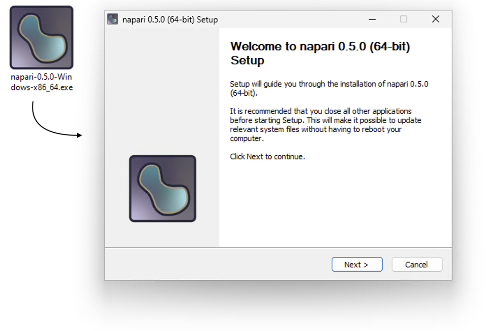

Click **Next** to proceed to the License Agreement. Read the license and click **I Agree** to continue.

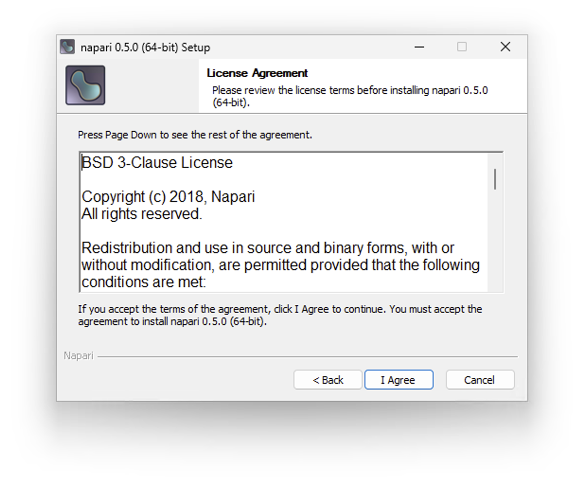

When prompted for an installation type, choose **Just Me** (recommended — no administrator privileges required):

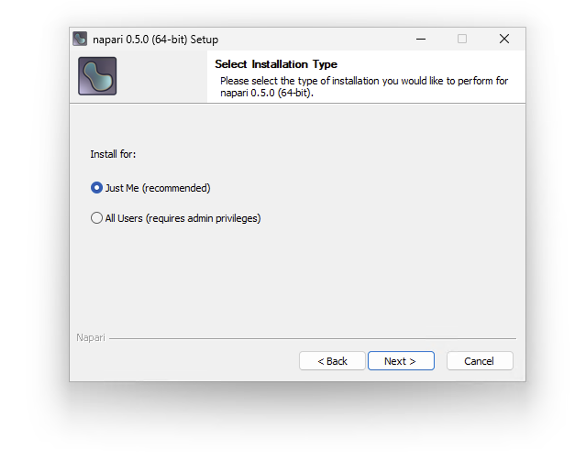

Confirm the installation location (or click **Browse** to change it) and click **Next**.


Click **Install** to begin. Click **Show details** to monitor progress.


Once complete, click **Finish** to close the installer.

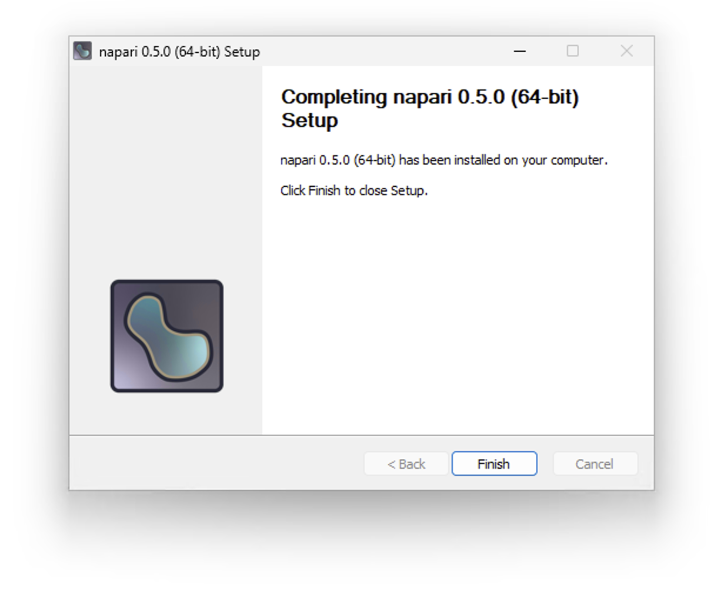

napari is now installed. Launch it from the **Windows Start menu**.

napari includes sample images from scikit-image. Use **File > Open Sample > napari** to open one, or use **File > Open** (or drag and drop files onto the viewer) to open your own images.

Next, check out our [tutorial on the viewer](viewer-tutorial) or explore the [Usage tab](usage).

(macos-bundle)=

### macOS

Download the installer for your Mac. If you are unsure which version to choose,
check "About this Mac" from the Apple menu or check the
[official Apple documentation](https://support.apple.com/en-us/116943)
to identify if your machine is Apple Silicon (ARM).

- {{ '[napari-REL-macOS-arm64.pkg](https://github.com/napari/napari/releases/download/vREL/napari-REL-macOS-arm64.pkg)'.replace('REL', bundle_version) }} — Apple Silicon (ARM)
- {{ '[napari-REL-macOS-x86_64.pkg](https://github.com/napari/napari/releases/download/vREL/napari-REL-macOS-x86_64.pkg)'.replace('REL', bundle_version) }} — Intel

Double-click the downloaded `.pkg` file to launch the Installer.

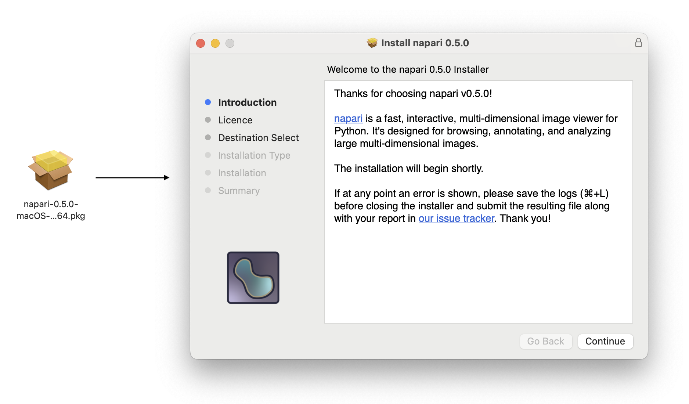

Click **Continue** to open the Software License Agreement.

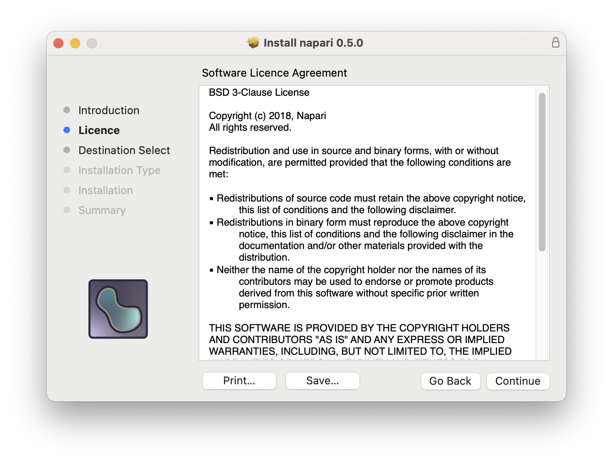

Read the agreement and click **Continue** again. You will be prompted to agree before installation can proceed.

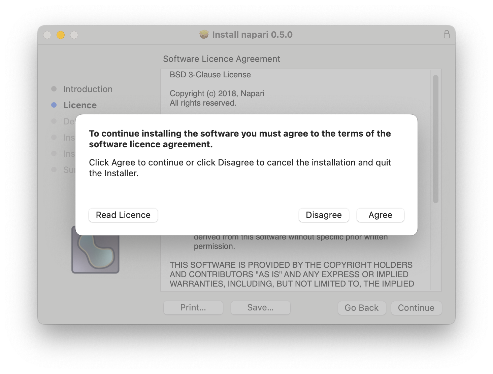

Click **Agree**. On the next page, review the disk space required and click **Install** to begin the standard installation.

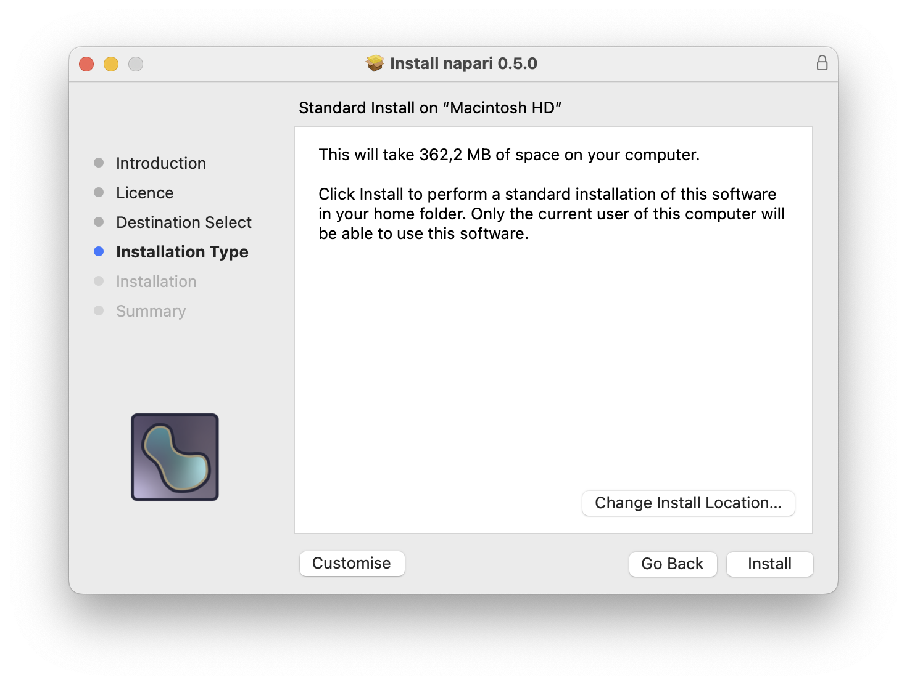

To install to a different location, click **Change Install Location…** before proceeding. You can also click **Customize** to adjust optional installation components.

Installation progress is shown in the next window, with status notifications appearing in the top-right corner of your display.

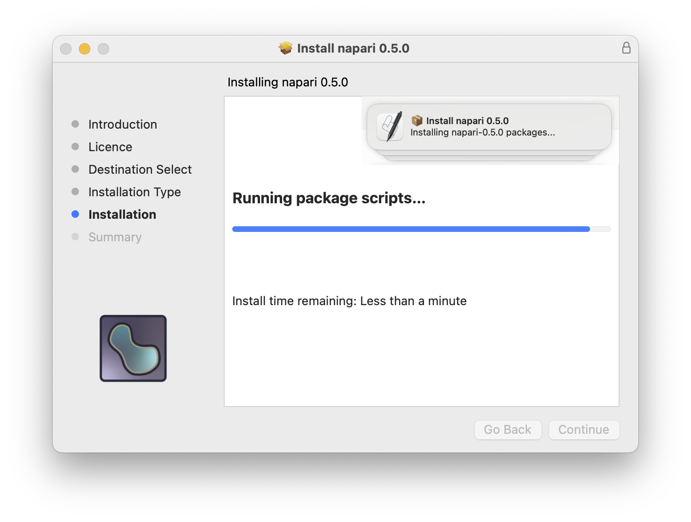

```{note}
If an error occurs during installation, do not close the installer immediately. Inspect the log via **Window > Installer log** (or {kbd}`⌘+L`), set the Detail Level to **Show All Logs**, and save a copy. Include this log if you [submit an issue](https://github.com/napari/napari/issues/new/choose).
```

When installation finishes successfully, you will see **"The installation was successful"**:

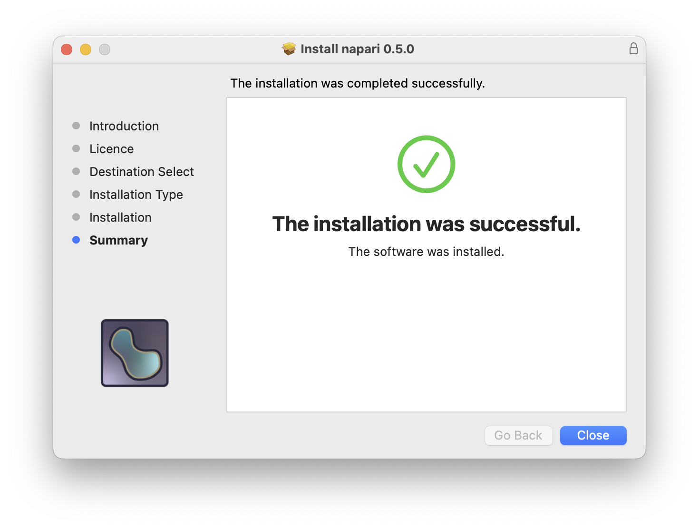

Click **Close**. napari is now installed and can be launched from Launchpad or found in Finder under 🏠 [User directory] > Applications.

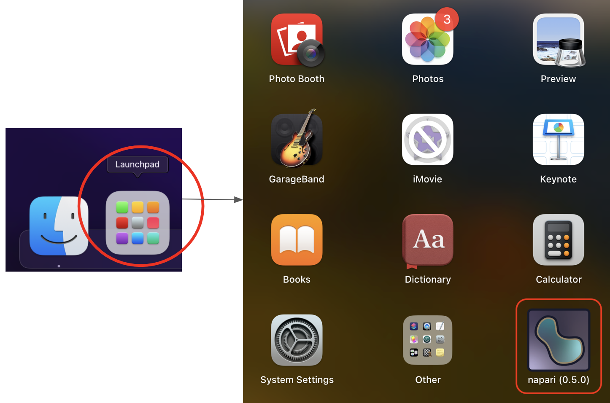

napari includes sample images from scikit-image. Use **File > Open Sample > napari** to open one, or use **File > Open** (or drag and drop files onto the viewer) to open your own images.

Next, check out our [tutorial on the viewer](viewer-tutorial) or explore the [Usage tab](usage).

(linux-bundle)=

### Linux

Download from GitHub: {{ '[napari-REL-Linux-x86_64.sh](https://github.com/napari/napari/releases/download/vREL/napari-REL-Linux-x86_64.sh)'.replace('REL', bundle_version) }}

Open a terminal, navigate to your downloads folder (`cd ~/Downloads`), and run:

```sh
bash napari-REL-Linux-x86_64.sh  # replace REL with the release version, e.g. 0.7.0
```

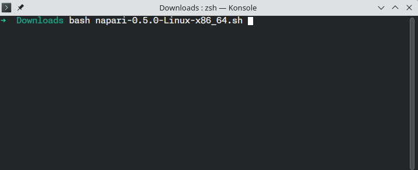

Press {kbd}`Enter` to display the License Agreement.

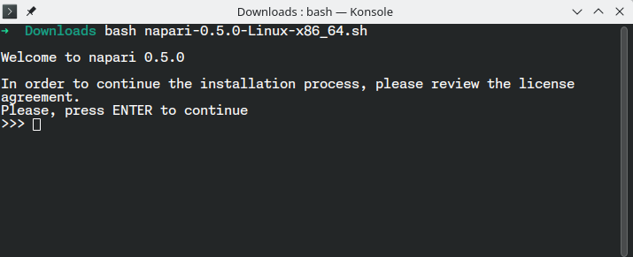

Read through the agreement. Type `yes` and press {kbd}`Enter` to accept and continue.

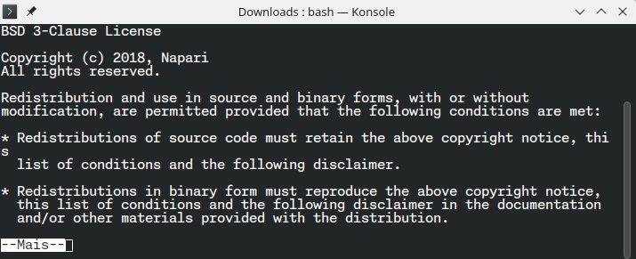

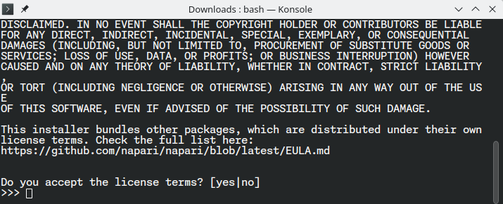

You will be shown the default installation location. Press {kbd}`Enter` to confirm, or type an absolute path to use a different location. The installation will then begin automatically.

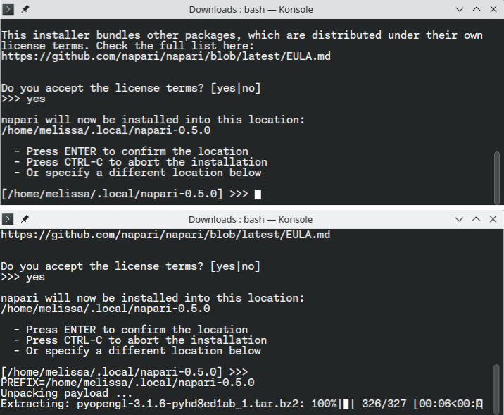

When complete, the terminal will display **"installation finished. Thank you for installing napari!"**.

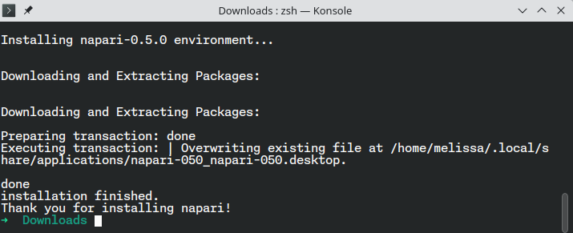

napari is now installed. A launcher shortcut should appear in your desktop application menu; under some desktop environments you can also search for "napari" using the search bar.

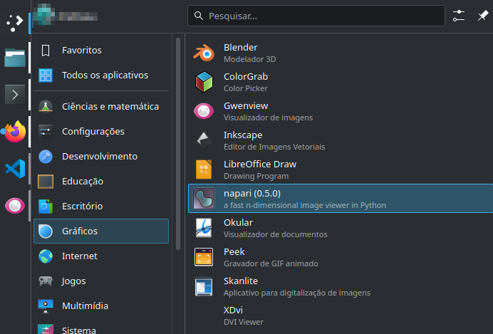

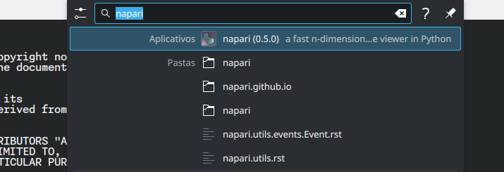

napari includes sample images from scikit-image. Use **File > Open Sample > napari** to open one, or use **File > Open** (or drag and drop files onto the viewer) to open your own images.

Next, check out our [tutorial on the viewer](viewer-tutorial) or explore the [Usage tab](usage).

## Plugins

napari's functionality can be extended through the use of plugins. Plugins can be installed as Python packages via pip or conda, or directly from within napari using the [napari plugin manager](https://napari.org/napari-plugin-manager/).

To explore existing plugins, visit the [napari hub](https://napari-hub.org/). For more details, check out our documentation on [finding and installing plugins](https://napari.org/stable/plugins/start_using_plugins/finding_and_installing_plugins.html#finding-and-installing-plugins).

## Next steps

- To start learning how to use napari, checkout our [getting started](launch) tutorial
- If you are interested in contributing to napari, please check our [contributing guidelines](napari-contributing)
- If you are running into issues or bugs, please open a [new issue](https://github.com/napari/napari/issues/new/choose)
  on our [issue tracker](https://github.com/napari/napari/issues)
- If you want help using napari, we are a community partner on the [imagesc
  forum](https://forum.image.sc/tag/napari) and all usage support requests should
  be posted on the forum with the tag `napari`. We look forward to interacting
  with you there!
