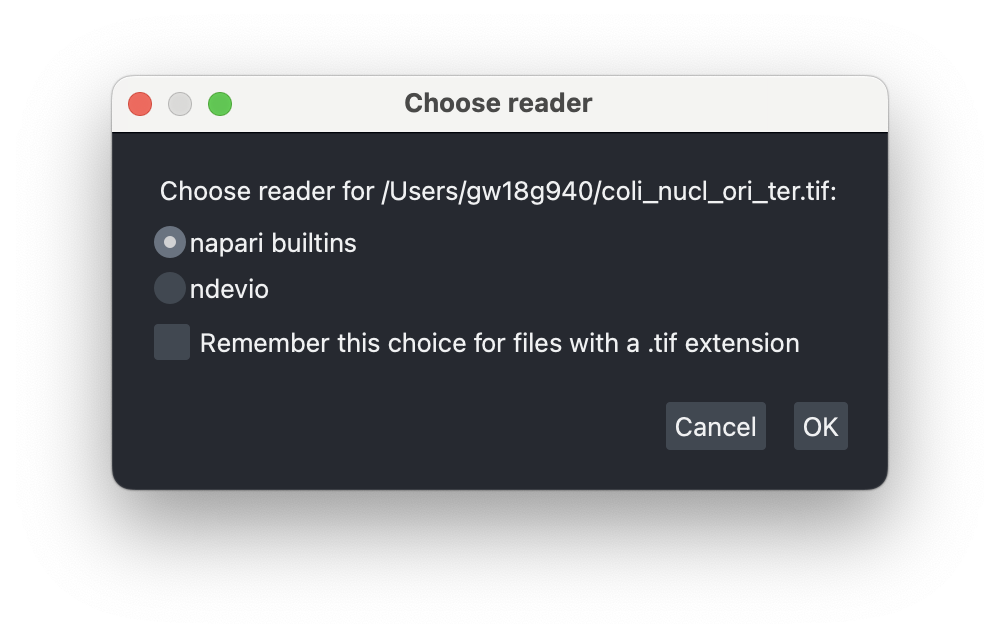
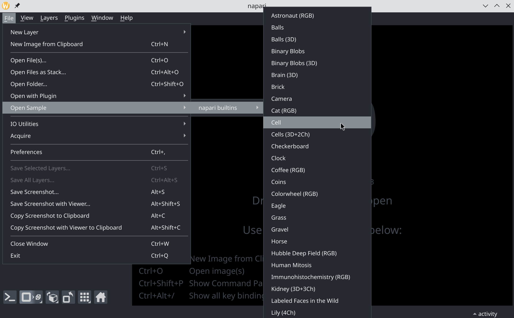

---
jupytext:
  text_representation:
    extension: .md
    format_name: myst
    format_version: 0.13
    jupytext_version: 1.18.1
kernelspec:
  display_name: napari-docs
  language: python
  name: python3
---

# Open images in napari

There are multiple ways to open images in napari, depending on the image format and the type of processing you intend to apply to the data. The simplest option is to use napari’s built-in file dialog or drag-and-drop functionality. To open certain specialized data types, such as images saved in custom microscopy formats, you may need to extend napari’s data-loading capabilities by using a specific type of napari plugin called reader plugins. Finally, for maximum flexibility, images can also be opened programmatically, for example via the napari console or in a Jupyter notebook.

## Builtin napari reader

napari natively supports tiff and many other standard formats like png, jpg etc. When drag-and-dropping files, using one of the `File -> Open File/Folder` menu options, or using the `File -> Open Sample` menu with such formats, images will be read via the [imageio](https://imageio.readthedocs.io/en/stable/) library and appear in the viewer.

For example you can try with with your own images or by downloading [this tif file](https://ftp.ebi.ac.uk/biostudies/fire/S-BIAD/582/S-BIAD582/Files/01_wt_Dprotein555-TL/raw_mps/5-2b_01_wt_Dprotein555-TL_003_rawmp.tif) (CC0, Clark et al. (2022). BioStudies, S-BIAD582. Retrieved from https://www.ebi.ac.uk/biostudies/bioimages/studies/S-BIAD582) and opening it in napari via drag-and-drop or the file dialog:

```{code-cell} ipython3
:tags: [remove-cell]

import pooch
import os
from pathlib import Path
import napari
from napari.utils import nbscreenshot
import imageio.v3 as iio

file_path_tiff = pooch.retrieve(
        url="https://ftp.ebi.ac.uk/biostudies/fire/S-BIAD/582/S-BIAD582/Files/01_wt_Dprotein555-TL/raw_mps/5-2b_01_wt_Dprotein555-TL_003_rawmp.tif",
        known_hash='5b43ed0269eaa1eebf4c48079270a30e6cc40e87f20cc36c1b3d5a07c51c7b20',
        fname = '5-2b_01_wt_Dprotein555-TL_003_rawmp.tif',
        path=Path(os.path.expanduser("~"))
        )
```

```{code-cell} ipython3
:tags: [remove-input]

# set the size of the viewer for the screenshot
height = 600
width = 1200
viewer = napari.Viewer()
viewer.open(file_path_tiff)
viewer.dims.point = [0,0,0]
viewer.window.resize(width, height)
nbscreenshot(viewer, alt_text="napari viewer showing a multi-channel tif microscopy image of a Drosophila embryo.")
```

As can be seen above, the builtin reader correctly interpreted the data to be multi-dimensional by adding a slider, allowing you to scroll through the data. This dataset is composed of three channels and you may prefer that those be shown as separate napari layers. However, the default reader is not capable of reading enough metadata to know this, so it just considers "channels" as an additional dimension. This can be fixed by spliting the layer (right-click on layer and `Split Stack)`:

```{code-cell} ipython3
:tags: [remove-input]

from napari.layers._layer_actions import _split_stack

_split_stack(viewer.layers)
nbscreenshot(viewer, alt_text="napari viewer showing a multi-channel tif microscopy image of a Drosophila embryo with channels split into layers.")
```

As mentioned above there are situations where the default import mechanism will not be sufficient as `imageio` typically does not support custom commercial formats such as those used in microscopy (e.g. czi, lif, nd2) or remote sensing (e.g. envi). In these cases, napari's reading capabilities need to be extended via reader plugins.

+++

## Using a plugin reader

Readers are a specific feature of napari plugins making it possible to open additional file formats via the `File -> Open` menu or drag-and-drop. They are installed in the same way as other napari plugins, either via the napari plugin manager or via pip/conda. Read more in our [guide to finding and installing plugins](https://napari.org/stable/plugins/start_using_plugins/finding_and_installing_plugins.html#finding-and-installing-plugins)). Once installed, they will be automatically discovered by napari and used for the appropriate files.

There are two possibilities for reader plugins: they can either be specialized in reading one single file format, or they can be more generic and bundle multiple readers. Using a generic reader plugin has the advantage of reducing the number of plugins and ensuring homogeneous behavior across formats. However, specialized readers may provide more advanced features for a given format.

+++

### General-purpose reader plugins

There are a few examples of plugins bundling multiple readers. One example is [ndevio](https://napari-hub.org/plugins/ndevio.html) which wraps the family of [bioio](https://bioio.readthedocs.io/en/latest/) packages to provide support for multiple microscopy file formats. Often such bundled reader plugins come with a set of formats supported by default, and allow the users to add optional formats, typically by installing additional dependencies. 

In the example below we illustrate how to use ndevio to open a Zeiss czi file. First we  need to install ndevio either via the Plugin manager or via pip:

```bash
pip install ndevio
```

This basic installation allows us to open ome-tiff, ome-zarr, imageio etc. via the plugin. Now we need to install the additional bioio reader for czi files:

```bash
pip install bioio-czi
```

After restarting napari, we are now allowed to just drag and drop a czi file in the viewer to open it. You can try with [this example](https://ftp.ebi.ac.uk/pub/databases/IDR/idr0077-valuchova-flowerlightsheet/20200428-ftp/2019-03-05%2007mm%20bud%20lobe%20in%20detail_Maximum%20intensity%20projection.czi) from the [IDR library](https://www.ebi.ac.uk/biostudies/BioImages/studies/S-BSST601?query=czi) ([CC BY 4.0](https://creativecommons.org/licenses/by/4.0/), Valuchova et al. https://doi.org/10.17867/10000144):

```{code-cell} ipython3
:tags: [remove-cell]

file_path_czi = pooch.retrieve(
        url="https://ftp.ebi.ac.uk/pub/databases/IDR/idr0077-valuchova-flowerlightsheet/20200428-ftp/2019-03-05%2007mm%20bud%20lobe%20in%20detail_Maximum%20intensity%20projection.czi",
        known_hash='aec7eeee335398b25f2185beaaa958afeb88c45853faac597cf034ac5d312c16',
        fname = 'Bud_projection.czi',
        path=Path(os.path.expanduser("~"))
        )
```

```{code-cell} ipython3
:tags: [remove-input]

viewer = napari.Viewer()
viewer.open(file_path_czi, plugin='ndevio')
viewer.window.resize(width, height)
nbscreenshot(viewer, alt_text="napari viewer showing a multi-channel CZI image opened via ndevio of a bud lobe of Arabidopsis.")
```

On top of just allowing to open file formats, some plugins also provide additional tools, for example to explore metadata, offer import options, etc. The ndevio plugin for example provides widgets to export data and explore basic metadata via the `Plugins -> ndevio -> I/O utilities` menu. Here we see that valuable information about pixel size was recovered from the czi file metadata:

```{code-cell} ipython3
:tags: [remove-input]

from qtpy.QtWidgets import QScrollArea

widget, plugin_widget = viewer.window.add_plugin_dock_widget('ndevio', 'I/O Utilities')
qwidget = widget.widget()
scroll_area = qwidget.findChild(QScrollArea)
scroll_area.verticalScrollBar().setValue(scroll_area.verticalScrollBar().maximum())
plugin_widget.update_metadata_from_layer()
nbscreenshot(viewer, alt_text="napari viewer showing the ndevio plugin dock widget with metadata.")
```

If multiple readers are available for a given format, when drag-and-dropping a file, or opening an image via the menu `File -> Open` you will be prompted to select which plugin to use. If you have set a default you can also adjust it in `Settings -> Preferences -> Plugins -> File Readers` by entering the desired extension (e.g. `.czi`, don't forget the `.`) and selecting the preferred plugin from the dropdown.



+++

### Single format reader

Some specific file formats have dedicated reader plugins. Here, we use the example of mesh formats that can be visualized in the surface layer. The [`napari-meshio`](https://napari-hub.org/plugins/napari-meshio.html) plugin provides a reader to open a mesh file such as this [example ply file](https://people.sc.fsu.edu/~jburkardt/data/ply/airplane.ply). Again it can be installed via the plugin manager or via pip:

```bash
pip install napari-meshio
```

```{code-cell} ipython3
:tags: [remove-cell]

file_path_ply = pooch.retrieve(
    url="https://people.sc.fsu.edu/~jburkardt/data/ply/airplane.ply",
    known_hash='370846416b2d0d9c574e356a5b43c7aac2db748761daab270fdd1331f97305a8', 
    fname="airplane.ply",
    path=Path(os.path.expanduser("~"))
)
```

```{code-cell} ipython3
:tags: [remove-input]

viewer = napari.Viewer()
viewer.open(file_path_ply, plugin='napari-meshio')
viewer.dims.ndisplay = 3
viewer.camera.angles = (92, -24, 15)
nbscreenshot(viewer, alt_text="napari viewer showing a 3D mesh of an airplane opened via napari-meshio.")
```

## Sample images

Sometimes you just need to open images to test some functionality of napari or a plugin. In that case you can use sample images that come bundled with napari. Here is an example of opening the "cell" sample image. In napari, go to `File -> Open Sample -> napari built-ins -> Cell`



+++

## Using the napari console to open an image

There are a few cases, where it is necessary to resort to some coding in the console (or notebook) to open an image. You can find the console in the bottom panel of napari:


First, there might be no plugin reader for your format, but only a library to read the data as Numpy arrays. In such a case, the images need to be first read as arrays and then added to the viewer. Second, there might be a reader plugin for your format, but the metadata could be missing or badly interpreted, leading to an incorrect loading of the data. In such cases, the data also need to be read manually and added to the viewer after reshaping them. In the following example, opening a multi-dimensional tiff file leads to an incorrect interpretation of the dimensions: the channels are interpreted as a standard dimension (first dimension of size 3) instead of being recognized as channels and assigned separate layers:

```{code-cell} ipython3
:tags: [remove-cell]

file_path_tiff2 = pooch.retrieve(
    url="https://github.com/guiwitz/microfilm/raw/refs/heads/master/demodata/coli_nucl_ori_ter.tif",
    known_hash="f37020f32fe3f8aa8ef44563646b51dc3517e372564939733181da65e13f0eda", 
    fname="coli_nucl_ori_ter.tif",
    path=Path(os.path.expanduser("~"))
)
```

```{code-cell} ipython3
:tags: [remove-input]

viewer = napari.Viewer()
viewer.open(file_path_tiff2)
nbscreenshot(viewer, alt_text="napari viewer showing a multi-channel TIFF image of E. coli cells.")
```

Instead we can now first read the data for example with `imageio`, and add it to the viewer by explicitly specifying the channel axis:

```{code-cell} ipython3
image = iio.imread(file_path_tiff2)
print(f'image dimensions: {image.shape}')
```

```{code-cell} ipython3
viewer = napari.Viewer()
viewer.add_image(image, channel_axis=0);
```

```{code-cell} ipython3
:tags: [remove-input]

nbscreenshot(viewer, alt_text="napari viewer showing a multi-channel TIFF image of E. coli cells with a layer per channel.")
```

Note that different reader plugins might interpret your data in different ways. With the same data as above where the default `imageio` reader failed to interpret the channels correctly, the `ndevio` plugin correctly identified the channels and assigned them separate layers:

```{code-cell} ipython3
viewer = napari.Viewer()
viewer.open(file_path_tiff2, plugin='ndevio')
nbscreenshot(viewer, alt_text="napari viewer showing a multi-channel TIFF image of E. coli cells opened via ndevio.")
```

In the case of badly interpreted dimensions, one can also reshape the data using certain plugins. For example the [napari-skimage](https://napari-hub.org/plugins/napari-skimage.html) plugin provides a tool to reshape layers via the `Plugins -> napari skimage -> Axis operations` menu. Here we use the `swap axes` function to exchange the X and Y axes:

```{code-cell} ipython3
:tags: [remove-cell]

viewer = napari.Viewer()
viewer.open(file_path_tiff2)
_, plugin_widget = viewer.window.add_plugin_dock_widget('napari-skimage', 'Axis operations')
plugin_widget.axis1.value = 2
plugin_widget.axis2.value = 3
plugin_widget.operation.value = 'swapaxes'
plugin_widget.btn_apply.native.click()
viewer.dims.set_current_step(axis=0, value=0)
viewer.grid.enabled = True
```

```{code-cell} ipython3
:tags: [remove-input]

viewer.reset_view()
nbscreenshot(viewer, alt_text="napari viewer showing twice the same multi-channel TIFF images in grid mode, the second with X and Y axes swapped via napari-skimage.")
```
