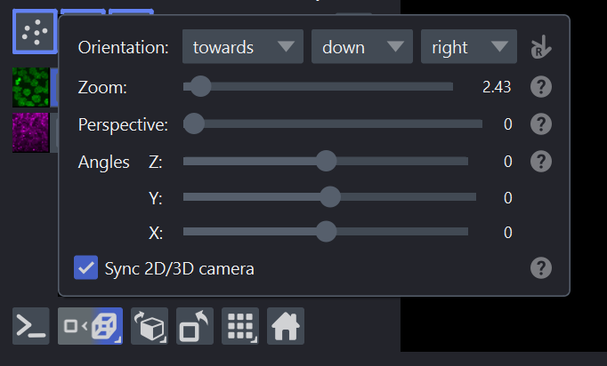

(camera-guide)=

# Camera

The camera in napari controls the view of the scene on the canvas.
You can think of it as a virtual camera positioned in the scene — its
{attr}`~napari.components.Camera.center` determines what point it looks at,
its {attr}`~napari.components.Camera.zoom` controls the magnification,
and its {attr}`~napari.components.Camera.angles` determine the viewing angle
in 3D mode.

When you pan, zoom, or rotate the view, you are interacting with the camera.

## Fitting the camera to the scene

There are two programmatic ways that the camera is fit to the scene
(i.e. the extent of all layers in the viewer):

```python
# Fit the camera to the scene and reset angles to default
viewer.reset_view() 

# Keep angles, but fit the camera to the scene
viewer.fit_to_view() 
```

These can also be accessed via the **View** menu.
The Home button in the viewer toolbar resets the view.

(camera-synced)=

## Synced vs separate camera modes

By default, the camera is **synced** between 2D and 3D views: when you switch
from 2D to 3D (or back), the camera center and zoom stay the same. In 2D, the 
depth (Z) component corresponds to the -3 dimension. You can also choose
**separate** (i.e. unsynced) mode, where each view remembers its own camera
state independently.

The current mode is controlled by {attr}`~napari.components.Camera.synced`:

```python
viewer.camera.synced = True   # synced mode (default)
viewer.camera.synced = False  # separate mode
```

(camera-synced-mode)=

### Synced mode (default)

When `synced=True`, camera center and zoom persist when toggling between 2D
and 3D views:

- **2D → 3D**: The last two dimensions of center (Y, X) come from the 2D view.
  The depth (Z) component is taken from the current position of the dimension
  slider, so the plane you were looking at in 2D becomes the depth position in 3D.
- **3D → 2D**: The depth position of the camera is written back to the
  dimension slider, so the depth you were viewing in 3D is preserved when
  you return to 2D. The Y and X center also persist.

```{note}
Camera angles are only meaningful in 3D mode; they are not synced when
switching to 2D. When you switch back to 3D, the angles maintain their
last 3D value (or default if unset).
```

(camera-separate-mode)=

### Separate mode

When `synced=False`, the 2D and 3D views each remember their own camera state
independently — center, zoom, and angles are cached separately for each mode.
Switching between them restores exactly the view you last had in that mode.

The first time you enter a mode in separate mode, the camera is positioned
using {meth}`~napari.components.ViewerModel.fit_to_view`, which centers the
view on all layers and adjusts the zoom to fit them in the canvas.

(camera-access)=

## Accessing camera controls

There are four ways to interact with the camera synced mode:

### GUI — Camera popup

Right-click the **2D/3D toggle button** in the viewer toolbar to open the
camera popup. This popup contains:

- Camera orientation settings (see {ref}`handedness-guide`).
- Zoom controls (in 2D and 3D modes).
- Perspective controls (in 3D mode).
- Camera angles (in 3D mode).
- The **"Sync 2D/3D camera"** checkbox to toggle between synced and separate
  modes.



### Menu — Toggle Synced Camera

From the **View** menu, select **Toggle Synced Camera**
(keybinding {kbd}`Ctrl+U`).

### API — Programmatic control

```python
# Switch to separate mode
viewer.camera.synced = False

# Switch back to default synced mode
viewer.camera.synced = True
```

### Settings — Persistent preference

You can change the default synced mode in **Preferences → Application →
Synced Camera**. This setting is persisted across sessions and applies to
all new viewers.

```python
from napari.settings import get_settings

get_settings().application.synced_camera = False
```

The setting can also be set via the environment variable
`NAPARI_APPLICATION_SYNCED_CAMERA`.

(camera-other)=

## Other camera properties

Beyond the synced mode, the camera has several properties you can adjust
programmatically:

```python
# Center of the view (in world coordinates)
viewer.camera.center = (0, 100, 200)

# Zoom level (pixels per world unit)
viewer.camera.zoom = 4.0

# Euler angles for 3D rotation (only used in 3D mode)
viewer.camera.angles = (30, 45, 0)

# Perspective (field of view) in 3D mode
viewer.camera.perspective = 30
```

For more on axis orientation and handedness, see {ref}`handedness-guide`.
For details on 3D interaction and ray casting, see {ref}`3d-interactivity`.
For a tour of the viewer interface, see {ref}`viewer-tutorial`.
