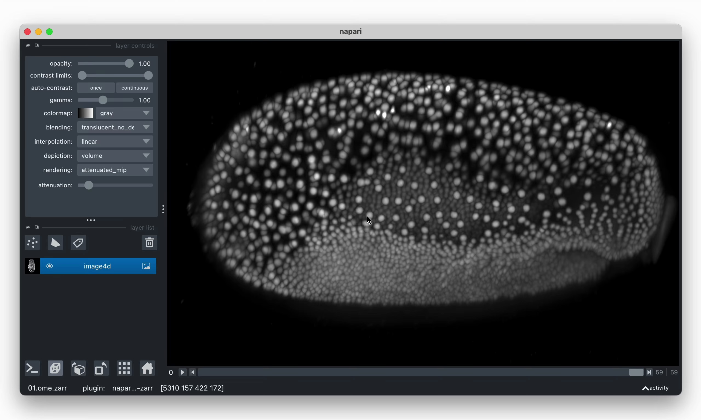
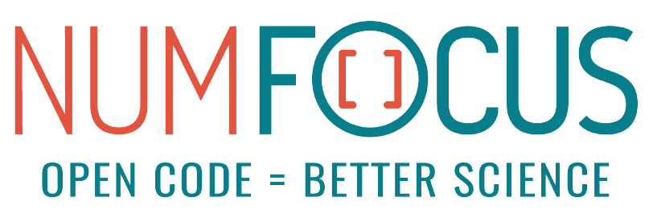

---
theme:
  metaDescription: napari is a fast multi-dimensional image viewer for Python. It can help you **explore** any image-like data, be it 2D, 3D, or even higher-dimensional. It can also help you **overlay** downstream or **associated data**, such as point coordinates or segmentations, which you can use to **annotate** and **proofread** your image data.
  quickLinks:
    - title: Community
      content: Meet the team, our mission, and our values
      url: /community/index.html

    - title: Tutorials
      content: Step by step guides for common napari workflows
      url: /tutorials/index.html

    - title: Plugins
      content: Learn how to create a plugin that works with the napari ecosystem
      url: /plugins/index.html

    - title: Release notes
      content: See what’s been updated in the latest releases
      url: /release/index.html

    - title: API reference
      content: Information on specific functions, classes, and methods
      url: /api/index.html

    - title: Roadmaps
      content: Find out what we plan to build next and into the near future
      url: /roadmaps/index.html

    - title: Developer guides
      content: Explanations about how napari works behind the screen
      url: /guides/index.html

    - title: Developer resources
      content: All you need to know to contribute to the napari codebase
      url: /developers/index.html

    - title: Source code
      content: Jump out to GitHub to take a look at the code that runs napari
      url: https://github.com/napari/napari

    - title: napari hub
      content: Discover, install, and share napari plugins
      url: https://www.napari-hub.org
---

# napari: a fast, interactive viewer for multi-dimensional images in Python

::::{grid} 1 1 3 3

:::{grid-item}
:columns: 12 12 4 4

- **view and explore** 2D, 3D, and higher-dimensional arrays on a canvas;
- **overlay** derived data such as *points*, *polygons*, *segmentations*, and
  more;
- **annotate** and **edit** derived datasets, using standard data structures
  such as NumPy or Zarr arrays, allowing you to
- **seamlessly weave** exploration, computation, and annotation together in
  imaging data analysis.
:::

:::{grid-item}
:columns: 12 12 8 8

```{raw} html
<figure>

  <video width="100%" controls autoplay loop muted playsinline>
    <source src="_static/images/tribolium.webm" type="video/webm" />
    <source src="_static/images/tribolium.mp4" type="video/mp4" />
    
  </video>

</figure>
```

:::

::::

::::{grid}

:::{grid-item-card} Examples
:link: gallery
:link-type: ref

See some of the things napari can do.
:::

:::{grid-item-card} Installation
:link: napari-installation
:link-type: ref

How to install napari.
:::

:::{grid-item-card} Getting started
:link: launch
:link-type: ref

Get started with napari.
:::

::::

::::{grid}

:::{grid-item-card} Community
:link: community
:link-type: ref

Forums, web chat, video chat, where to ask questions and more! Join us!
:::

:::{grid-item-card} Governance
:link: napari-governance
:link-type: ref

napari is developed by a global community. See how.
:::

:::{grid-item-card} Plugins
:link: plugins-index
:link-type: ref

napari is extensible! Find plugins, or develop your own!
:::

::::

## funding

napari is a fiscally sponsored project of [NumFOCUS], a US-based non-profit
supporting open science and open source scientific software.

We gratefully acknowledge funding support from the [Chan Zuckerberg
Initiative][CZI] (CZI) and [NumFOCUS].

::::{grid} 1 1 3 3

:::{grid-item-card}
:text-align: center
:class-body: d-flex align-items-center justify-content-center

[{width="200"}](https://chanzuckerberg.com)
:::

:::{grid-item-card}
:text-align: center
:class-body: d-flex align-items-center justify-content-center

[{width="200"}](https://numfocus.org)
:::

:::{grid-item-card} YOUR LOGO HERE
:text-align: center
:class-body: d-flex align-items-center justify-content-center
:link: funding
:link-type: ref
:::
  
::::

[NumFOCUS]: https://numfocus.org
[CZI]: https://chanzuckerberg.com
