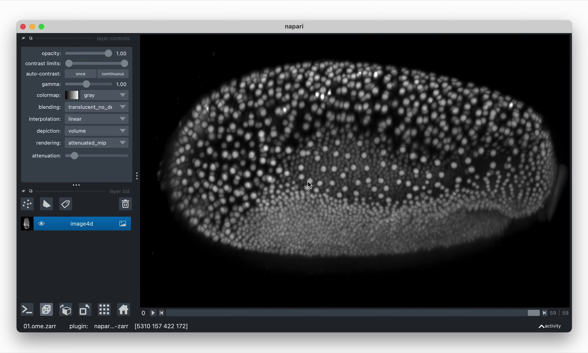
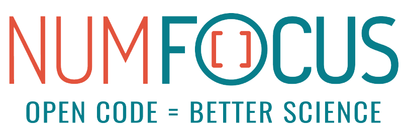

# napari: a fast, interactive viewer for multi-dimensional images in Python

`````{grid} 1 1 2 2

````{grid-item}
:columns: 12 12 5 5

- **view and explore** 2D, 3D, and higher-dimensional arrays on a canvas;
- **overlay** derived data such as *points*, *polygons*, *segmentations*, and
  more;
- **annotate** and **edit** derived datasets, using standard data structures
  such as NumPy or Zarr arrays, allowing you to
- **seamlessly weave** exploration, computation, and annotation together in
  imaging data analysis.


```{button-ref} napari-quick-start
:color: primary
:ref-type: myst
:shadow:
:class: start-button

{material-regular}`arrow_forward;1.2em` Get started
```
````

````{grid-item}
:columns: 12 12 7 7

```{raw} html
<figure>

  <video width="100%" controls autoplay loop muted playsinline>
    <source src="_static/images/tribolium.webm" type="video/webm" />
    <source src="_static/images/tribolium.mp4" type="video/mp4" />
    
  </video>

</figure>
```

````

`````

`````{grid} 1 2 2 2
:gutter: 3

::::{grid-item-card} {material-regular}`terminal;1.3em` Install with Python
:link: install-python-package
:link-type: ref
:class-card: homepage-card-accent

Install napari in a Python environment for the most customizable experience.
::::

::::{grid-item-card} {material-regular}`install_desktop;1.3em` Download napari app
:link: installation_bundle_conda
:link-type: ref
:class-card: homepage-card-accent

A standalone installer for when you want napari without setting up Python first.
::::
`````

```{raw} html
<div class="homepage-quicklinks">
  <a href="https://napari.zulipchat.com/"><i class="fa-solid fa-comments"></i><span>Community chat</span></a>
  <a href="community/meeting_schedule.html"><i class="fa-solid fa-calendar-days"></i><span>Calendar</span></a>
  <a href="release/index.html"><i class="fa-solid fa-newspaper"></i><span>Release notes</span></a>
  <a href="troubleshooting.html"><i class="fa-solid fa-circle-question"></i><span>Troubleshooting</span></a>
  <a href="roadmaps/index.html"><i class="fa-solid fa-map"></i><span>Roadmap</span></a>
  <a href="https://napari.org/island-dispatch"><i class="fa-solid fa-rss"></i><span>Blog</span></a>
</div>
```

```{raw} html
<section class="homepage-featured-example" aria-labelledby="homepage-featured-example-title">
  <div class="homepage-featured-example__copy">
    <h3 id="homepage-featured-example-title" class="homepage-featured-example__title">
      <a id="homepage-featured-example-link" href="gallery/add_image.html">Add image</a>
    </h3>
    <p id="homepage-featured-example-description" class="homepage-featured-example__description">
      Display an image in napari and explore the viewer with a minimal example.
    </p>
    <div class="homepage-featured-example__actions">
      <a class="sd-btn sd-btn-primary sd-shadow-sm" href="gallery.html">Examples gallery</a>
      <button class="sd-btn sd-btn-outline-primary sd-shadow-sm" id="homepage-featured-example-reroll" type="button">Show another example</button>
    </div>
  </div>
  <a class="homepage-featured-example__media" href="gallery/add_image.html" aria-label="View the featured napari example">
    
  </a>
</section>
```

## funding

If you like napari and want to support our [mission](mission-and-values),
please consider a [donation](https://numfocus.org/donate-to-napari) to our
efforts.

napari is a fiscally sponsored project of [NumFOCUS], a US-based non-profit
supporting open science and open source scientific software.

We gratefully acknowledge funding support from the [Chan Zuckerberg
Initiative][czi] (CZI) and [NumFOCUS].

`````{grid} 1 1 3 3

````{grid-item-card}
:text-align: center
:class-body: d-flex align-items-center justify-content-center

[](https://chanzuckerberg.com)
````

````{grid-item-card}
:text-align: center
:class-body: d-flex align-items-center justify-content-center

[](https://numfocus.org)
````

````{grid-item-card} ADD YOUR LOGO HERE
:text-align: center
:class-body: d-flex align-items-center justify-content-center
:link: funding
:link-type: ref
````

`````

[czi]: https://chanzuckerberg.com
[numfocus]: https://numfocus.org
