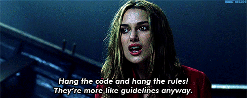

(nap-10-migration-event-system)=

# NAP-6 — Migration of the event system

```{eval-rst}
:Author: Wouter-Michiel Vierdag <michiel.vierdag@cellonautica.ai>
:Created: 2026-26-07
:Status: Draft
:Type: <Standards Track | Process>
```

## Purpose
The purpose of this document is to summarize previous discussions regarding 
moving the event system to use psygnal, to describe why we are doing the migration, 
the goals we are trying to achieve and to describe the migration strategy. By no 
means this document should be set in stone. Some of the things I wrote might be wrong 
to begin with. The document should be a living document, to be updated as we go through 
the migration, and we find out what works and what doesn’t work. We can then make changes 
and clearly describe why we made these changes, by having a central document to comment 
on and change.



## Previous discussions
There have been some discussions regarding the migration to another event system. Currently, 
no other candidate than _psygnal_ has been named and to the best of my knowledge there would not 
be really good other candidates (see section comparison to other candidates). What follows here 
is a brief overview of open issues / conversations:

Previous discussions about adopting **psygnal** in napari have focused on two complementary motivations. 
The first, arising from the magicgui migration [#3373](https://github.com/napari/napari/issues/3373), 
highlighted the usability and maintainability benefits of replacing the dynamic **Event** objects with 
typed signals, including improved type safety, IDE support, and a more familiar API.<br>
A second discussion, motivated by experiments replacing the _vispy_ canvas with a _pygfx_ backend 
[#7373](https://github.com/napari/napari/issues/7373), identified the event system as a key architectural 
obstacle to supporting multiple rendering backends. Currently, input events originate in _vispy_ before 
being propagated into napari, coupling the application closely to a specific rendering backend. The proposed 
long-term direction is for napari to own and dispatch its own events via a backend-agnostic event system 
(e.g. _psygnal_), with rendering backends acting as adapters rather than defining the application's event model.<br> 
@jacopoabramo investigated in an early prototype PR (https://github.com/napari/napari/pull/8387 after 
zulip discussion 
[here](https://napari.zulipchat.com/#narrow/channel/212875-general/topic/migrating.20to.20psygnal/with/547218759) 
what migrating napari's event system to psygnal might look like in practice, primarily 
motivated by improving static typing. The prototype found that the dynamic nature of _napari.utils.events_
(including dynamically generated _Event_ objects and _EmitterGroups_) makes comprehensive type checking difficult, 
particularly in GUI code. It demonstrated that _psygnal.SignalGroup_ could provide a more explicit, typed 
replacement for _EmitterGroup_, although supporting napari's inheritance hierarchy required additional typing 
protocols and highlighted several implementation challenges. The prototype also identified opportunities to 
simplify layer initialisation, property setters, and event definitions, but was intended primarily to inform 
future design rather than serve as a mergeable implementation.<br>
Lastly, [#8509](https://github.com/napari/napari/pull/8509) ultimately implemented the first migration changes 
by having overlays use the _psygnal EventedModel_ instead of the napari one.

## Rationale
The current event system has served napari well, but it has become a significant source of architectural 
complexity. Today, napari uses several event mechanisms simultaneously, including _Qt signals_ and _slots_, 
_vispy_ events, _napari.utils.events_, and, in some places, _psygnal_. This means contributors must understand 
multiple APIs with different semantics, callback signatures, and threading behaviour, and application logic 
is often coupled directly to the event systems of specific backend libraries.<br>
A primary goal of this migration is to establish a single, backend-agnostic event mechanism for internal 
communication. Rather than allowing _Qt_ or _vispy_ to dictate how events are represented and propagated 
throughout the application, napari should own its event model and treat GUI and rendering frameworks as adapters 
at the boundaries of the system. This is particularly important for supporting multiple rendering backends, 
where backend-specific events should be translated into a common abstraction before they are consumed by the 
rest of the application.<br>
Beyond the architectural benefits, the current _napari.utils.events_ implementation has several limitations. 
Events are represented by dynamically constructed _Event_ objects whose available attributes are determined at 
runtime, making them difficult to inspect, document, and type. Similarly, _EmitterGroups_ are created dynamically, 
limiting IDE autocompletion and static analysis. In practice, many events follow simple, well-defined signatures 
(for example, "opacity changed" or "layer inserted"), yet the current implementation obscures this information 
behind a generic event object.
_Psygnal_ provides a more explicit and familiar programming model. _Signals_ declare the values they emit, callback 
signatures are directly visible, and static type checkers and IDEs can infer the expected interfaces. Many 
contributors are already familiar with the _Qt signals_ and _slots_ model, and _psygnal_ provides a pure Python 
implementation with similar semantics while remaining independent of any particular GUI framework.
Finally, adopting a single signaling mechanism simplifies the internal architecture. A unified event system 
makes it easier to reason about event flow, establish consistent threading behavior, improve testability, 
and reduce the maintenance burden of supporting multiple overlapping event abstractions. While the migration 
represents a substantial effort, it also provides an opportunity to modernize one of napari's core infrastructure 
components and better position the project for future backend, typing, and architectural improvements.

Please see below for a more in depth description / discussion of the problems with the current state.

## The problem with the current event system
Napari currently uses several different event systems throughout the codebase:
- the custom _napari.utils.events_ framework (derived from _vispy_)
- _vispy's_ event system
- _Qt signals_ and _slots_
- _psygnal_ (used in overlays)

As a result, different parts of napari communicate using different abstractions and are not translated 
into one signal / event model.
This has a number of consequences:

__Tight coupling to backend libraries__<br>
Much of napari's internal code is coupled directly to _Qt_ or _vispy_ because events are represented 
using their native mechanisms. This makes it difficult to separate application logic from rendering 
or UI concerns.

__Multiple programming models__<br>
Developers currently need to understand several different event APIs:
- _Qt signals_ and _slots_
- _vispy_ events
- _napari.utils.events_
- _psygnal_ (in case of overlays)

Each has different semantics, callback signatures, and connection patterns. This increases the cognitive
load for contributors and makes it harder to write reusable infrastructure.
Moving towards a single internal event abstraction reduces this complexity and makes behaviour more
consistent across the codebase.

__Threading__<br>
Napari already contains components that execute across different threads, including computational workloads and 
GUI-related components. However, threading behaviour is currently influenced by the specific event system being 
used rather than being managed consistently at the napari application level.
Different frameworks involved in napari's event handling have different assumptions and mechanisms for thread 
communication. For example, _Qt_ imposes strict thread-affinity rules for GUI objects, while _vispy_ has its own event 
handling model. As a result, code that emits or responds to events may need to be aware of backend-specific threading 
constraints, making event flow harder to reason about and increasing coupling between application logic and external 
libraries.

## Requirements of the implementation
There are a couple of things we would like to see from the implementation. These are here defined 
as guiding principles. Ultimately, some of these are not set in stone, but are meant to be guiding principles. 
Also, in case the guiding principles cannot be followed everywhere, there should be one central document describing 
why this was the case. The guiding principles:

1. __One event system__
Napari should have a single event mechanism for communication between internal components. <br>
While external libraries such as _Qt_ and _vispy_ may continue to expose their own native event systems, 
these should be treated as implementation details at the application boundary. Internal napari components 
should communicate through a common abstraction based on _psygnal_. This reduces the number of event models 
contributors need to understand and avoids coupling application logic to specific GUI or rendering frameworks.
2. __Backend agnostic__
The napari event model should not depend on the choice of GUI or rendering backend.<br>
Backends should translate their native events into napari events, and consume napari events where required, 
through clearly defined adapter layers. For example, a mouse event originating from _Qt_, _vispy_, or another 
future backend should be converted into a napari-defined signal rather than directly propagating through 
backend-specific APIs. This allows future backends to be integrated without requiring changes throughout 
the application codebase.
3. __Explicit and typed interfaces__
Event definitions should be explicit, discoverable, and statically analysable.<br>
_Signals_ should declare the values they emit (_psygnal_):
    ```python
    data = Signal(DataType)
    opacity = Signal(float)
    layers_changed = Signal(Layer)
    ```
    rather than relying on dynamically populated event objects (current system):
    ```python
    event.value
    event.source
    event.type
    ```
    This would improve:
    - type checking 
    - IDE autocompletion 
    - generated documentation 
    - developer understanding of APIs

    Where events require complex information, the payload should be represented by a well-defined Python type rather 
    than a dynamically modified event object.

4. __Separate event dispatch from event payloads__
The migration should distinguish between the mechanism used to deliver notifications and the data 
carried by those notifications.<br>
_Psygnal_ should provide the dispatch mechanism, while payload objects should represent domain-specific information. 
For example: Comment: not wanna do this with mouse event
   ```python
   mouse_press = Signal(MouseEvent)
   ```
   where _MouseEvent_ is a typed object containing information such as position, button, and modifiers.
This allows rich events to remain expressive while avoiding the limitations of the current dynamic 
_Event_ implementation.

5. __Preserve behaviour before improving APIs__
The migration should prioritize behavioral compatibility over immediate API redesign.<br>
Existing event semantics, including ordering, connection behavior, and lifecycle management, should be 
preserved where practical. Improvements to API clarity and typing should be introduced gradually through 
deprecation cycles. This reduces risk for users and plugin developers while allowing the underlying 
implementation to evolve.
6. __Make threading behavior explicit (not certain how achievable this is)(change documentation wise mostly)__
Event delivery across threads should have clearly defined semantics.<br>
Currently, GUI frameworks impose their own threading requirements, which can make event behaviour difficult 
to reason about when application logic, computation, and rendering operate on different threads.
The new event architecture should establish consistent rules for:
- emitting signals from worker threads 
- forwarding events to the GUI thread 
- interacting with backend-specific thread restrictions.<br>

   <br>Threading behaviour should be handled deliberately by the event infrastructure rather than being an implicit 
property of the backend. 
[_Psygnal_ docs](https://psygnal.readthedocs.io/en/latest/usage/?h=threa#connecting-across-threads) would be good to read for this.
7. __Minimise custom event infrastructure__
The migration should favour standard _psygnal_ abstractions over napari-specific event infrastructure.<br>
Wherever possible, functionality should be expressed using _Signal_, _SignalGroup_, and typed payload objects rather 
than introducing additional event abstractions. This reduces maintenance burden, simplifies the architecture, and 
makes the event system more familiar to contributors already accustomed to Qt's signals and slots.
8. __Focus on long term stability__
The event system is fundamental infrastructure used throughout napari and its plugin ecosystem.<br> 
Changes should favour simple, well-defined abstractions with stable semantics. This migration should establish 
an event architecture that can evolve without requiring repeated ecosystem-wide API changes.

## Proposed architecture
The proposed architecture establishes psygnal as the single event dispatch mechanism used throughout napari. 
Rather than application logic interacting directly with _Qt_, _vispy_, or other backend-specific event systems, 
napari owns a backend integration layer / adapter that translates between native backend events and napari's 
internal event model.<br>
Application components, including models, viewer state, user interactions etc., communicate exclusively through 
psygnal signals. Backend-specific event systems are confined to well-defined integration points (it is clear where 
backend ends and napari begins), allowing the rest of napari to remain independent of the underlying GUI or rendering 
framework.

Conceptually, the architecture becomes:

Create schematic!!!

Under this architecture:
- _psygnal.Signal_ and _SignalGroup_ become the primary mechanisms for event dispatch throughout napari.
- _EmitterGroup_ is replaced by explicit _SignalGroup_ definitions.
- State changes emit typed values directly (for example, _Signal(float)_ for an opacity change).
- Rich interaction events, such as mouse and keyboard events, are represented by strongly typed payload objects 
(e.g. _MouseEvent_ and _KeyEvent_) carried by psygnal signals rather than dynamically constructed _Event_ instances.
- _Qt_, _vispy_, and future backends remain responsible for their native event systems, but napari translates those 
events into its own event model through backend integration layers maintained within the napari codebase.

This architecture clearly separates napari's application logic from backend implementation details. Supporting a new 
rendering or GUI backend becomes a matter of implementing a new backend integration layer, rather than introducing 
another event system throughout the application.<br>
By adopting a single internal event abstraction, napari gains a more consistent programming model, improved static 
typing, clearer ownership of event flow, and a simpler foundation for future maintenance and development.

## Migration strategy
The migration should be incremental, allowing napari to move towards a single event system based on _psygnal_ 
while maintaining compatibility with existing internal code and external users where possible.

A full replacement of _napari.utils.events_ in a single step would introduce a large and difficult-to-review change, 
with a high risk of breaking behaviour across models, GUI components, rendering, and plugins. Instead, the 
migration should proceed component-by-component, prioritising internal infrastructure first and delaying public 
API changes until the underlying architecture has stabilised. Lorenzo’s work on overlays could be used as an example 
(reemitting events: code [here](https://github.com/napari/napari/blob/1f5d993eb55c93c3bb56d73861cc1f09f481ccc5/src/napari/utils/events/containers/_evented_dict.py#L126-L135))

The migration should follow the principles outlined previously.

__Backward compatibility__<br>
During the transition period, a compatibility layer will likely be required to bridge between the existing 
event system and _psygnal_. The compatibility layer should allow existing callbacks and event consumers to 
continue functioning while new components adopt _psygnal_. This may include:
- translating legacy _Event_ objects into typed signal payloads
- providing temporary wrappers around existing event groups / reemitting events
- supporting deprecated callback signatures during a migration period
- emitting deprecation warnings when legacy APIs are used

The compatibility layer should be considered temporary infrastructure. Its purpose is to enable gradual migration, 
not to maintain two event systems indefinitely.

__Migration order__<br>
Migration should proceed from lower-level infrastructure towards higher-level components.
A possible order is (which I by no means claim is the right order):
 Comment: first provide psygnalmodel to psygnal

1. __Core event infrastructure__<br>
Replace or adapt the foundations of the current event system:
- _Event_
- _EventEmitter_
- _EmitterGroup_
- event-related utility classes

Define the preferred psygnal patterns, naming conventions, and backward compatibility mechanisms.

2. __Evented models and core state__<br>
Migrate model classes that are involved with communicating napari state:
- _EventedModel_
- _Layers_ (await refactor)
- _ViewerModel_
- _Dimensions_
- _Camera_
- _Selections_
- Other 

   <br>The main reason for starting here is because I think these are good candidates because they might 
be more predictable.

3. __GUI and plugin facing components__<br>
Update components that consume model events:
- _Qt_ widgets 
- menus and actions 
- plugin-facing APIs 
- commands and controllers

   <br>At this stage, the majority of napari's application logic should communicate through _psygnal_.

4. __Backend integration layers__ (need to do this completely different)<br>
Move backend-specific event handling behind napari-owned adapters.
This includes:
- translating _Qt_ input events into napari signals 
- translating _vispy_ interaction events into napari signals 
- supporting future rendering backends through the same mechanism.

   <br>The goal is that backend implementations no longer define the event flow used by the rest of napari. 
One important aspect here I believe should be that this really needs to be benchmarked. Given the high 
right of event firing I expect that aspect here to be more crucial than with changing the events for the 
other components.

5. __Legacy API deprecation and removal__<br>
Once internal usage has been migrated:
- document the new event API
- provide migration guidance for plugin authors
- Deprecate legacy code
- remove compatibility layers after an appropriate transition period

   <br>some of the documentation might be created and published earlier, particularly developer facing 
	documentation as they need to be aware of the changes at an earlier stage.

## Success criteria
The migration will be considered successful when:
- napari has one primary internal event system based on _psygnal_
- application logic no longer depends directly on _Qt_ or _vispy_ event mechanisms 
- backend-specific events are handled through napari-owned integration layers 
- event definitions are explicit, typed, and discoverable 
- plugin developers have a documented migration path 
- the legacy event infrastructure can be removed / will not break napari internals 
- threading and event delivery semantics are clearly documented 
- supporting additional GUI or rendering backends does not require introducing new event abstractions

## Open questions
Several open ended questions around design should be put here.

## Immediate action points
Add glossary for people to understand difference between events / signals

## Points of contention
Things we are not sure about and have different opinion on.


