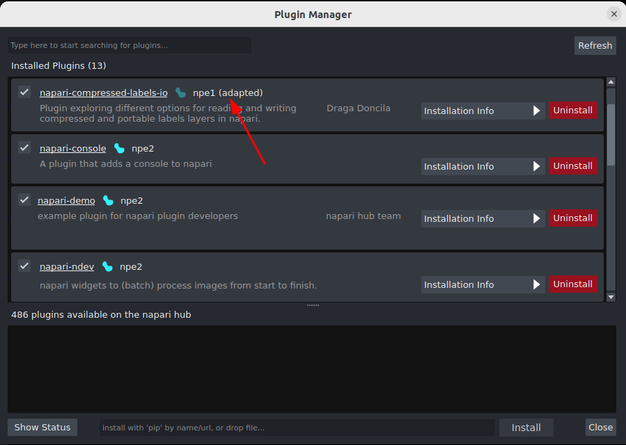
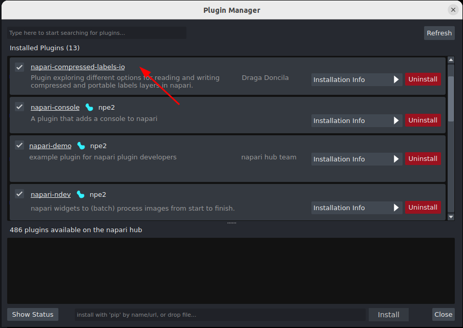

(adapted-plugin-guide)=

# Changes to the plugin engine in 0.6.0

In napari 0.6.0 we have made some changes to napari's default behaviour when validating legacy "npe1" plugins. This document explains those changes and how they may affect plugin users.

## Context

In mid-2022, we released npe2 - a new napari plugin engine. Mostly invisible to users, npe2 changed the way plugins are built, and how they declare contributions to napari. Because many plugins were already released using the original plugin engine, we continued maintaining all code relating to npe1 plugins, to give developers time to migrate. We also provided [guides and utilities](npe2-migration-guide) for auto-converting npe1 plugins to the new plugin engine.

Through these robust conversion utilities, the vast majority of npe1 plugins can be automatically loaded by napari in an npe2-compatible form, without any changes required from the plugin developer. By enabling the `Preferences -> Plugins -> Use npe2 adaptor` setting, users could also make their own napari installation auto-convert plugins to the new plugin engine. Before 0.6.0, this setting was off by default; in 0.6.0, this setting will be on by default.

In the intervening years, adoption of npe2 has improved, and currently, more than 80% of napari plugins are defined using the npe2 engine. As a result, we will deprecate the npe1 plugin infrastructure, so that we can simplify our codebase and improve maintainability.

## What is changing in 0.6.0?

In napari 0.6.0: 
- the `Use npe2 adaptor` setting will be turned on by default. 
- if a plugin is still declared using the npe1 engine, napari will auto-convert it to npe2 before loading it.
- users will be notified about any auto-converted plugins when launching napari.
- if there is a conflict with a plugin, the `Use npe2 adaptor` setting may be disabled. This will allow plugins to be loaded using the original npe1 plugin engine.

## How do I know if a plugin is npe1?

- It will show up in the plugin warning dialog.
- It will be listed in the plugin manager with an `npe2 (adapted)` tag, if `Use npe2 adaptor` is checked, or without any tag if `Use npe2 adaptor` is not checked (screenshots below)
- It is on this [list of plugins](https://gist.github.com/DragaDoncila/feb87fcbadc756269fdf99000a6ea77c). Please note that not all plugins may be listed here.

## How does this affect plugins?

The vast majority of plugins will be unaffected by changing the default behavior in 0.6.0, and users will see minimal, if any, changes. 

There are two known cases where autoconversion may be inadequate:

- Plugins that performed some action on napari start-up will not do so, as their code is no longer imported on start-up. Instead, the "start-up" behaviour will occur when the user first interacts with any of the plugin's contributions e.g. if they open a plugin widget, or open a file using the plugin.
- Plugin "multi-layer writers" cannot be auto-converted. Multi-layer writers are plugin contributions that allow multiple selected layers to be saved. If an adapted npe1 plugin declares a multi-layer writer, you will see a warning when loading the plugin.

In either of these cases, you can recover original plugin behaviour by going to `Preferences -> Plugins` and unchecking the `Use npe2 adaptor` setting, and restarting napari, as directed. Note that this setting is deprecated and will no longer be available in 0.7.0. In the 0.7.0 release only npe2-compatible plugins will be supported.

## When is 0.7.0 coming out?

While we don't yet have a set release date for 0.7.0, the `Use npe2 adaptor` setting **will not** be removed until the earliest, July 31, 2025. We will provide a further warning in the final minor release before 0.7.0.

## What can I do before 0.7.0?

**If you're a napari user,** reach out to the plugin developer and ask for the plugin to be updated to npe2. You can typically find the plugin's GitHub page by clicking on the plugin's title in the napari plugin manager, and open an issue there. If you're struggling to find the right place to ask, you can send a message in the [napari plugins zulip channel](https://napari.zulipchat.com/#narrow/channel/309872-plugins) and we will do our best to guide you.

**If you're a plugin developer,** you should convert your plugin to npe2. There is an [automated utility](./npe2_migration_guide.md#migrating-using-the-npe2-command-line-tool) for converting your plugin, or you can look at the [migration guide](./npe2_migration_guide.md#migration-reference) and [contribution guides](../building_a_plugin/guides) for more information on manually converting. You can also look at the [plugin template](https://github.com/napari/napari-plugin-template) for an example of a fully-working npe2 plugin. If your plugin is already npe2, consider adding an npe2 badge:  to your README using ``.