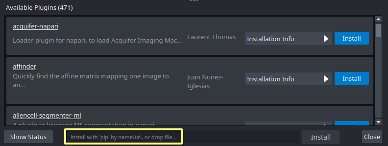
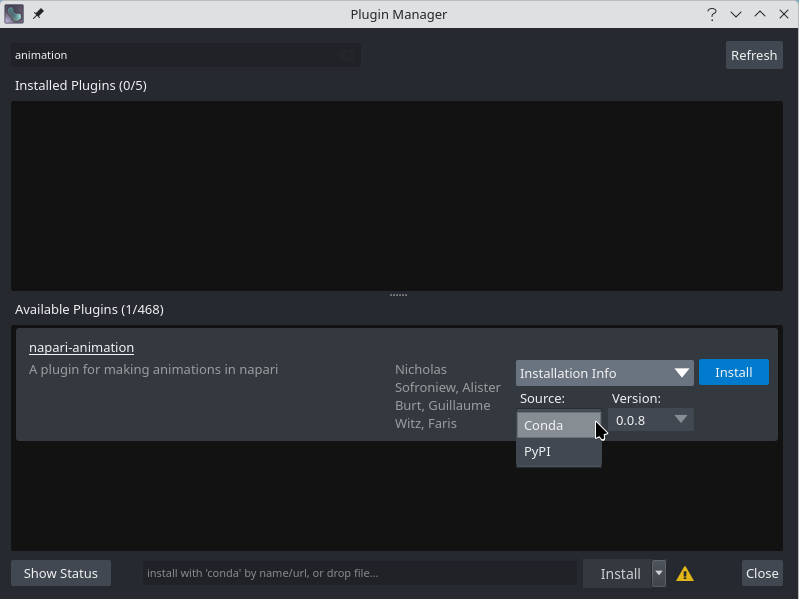

(find-and-install-plugins)=
# Finding and installing plugins

Plugins are Python packages which extend napari's functionality.
They can be used to add new features, such as file format support, new visualizations, or new tools.
This page will show you how to find and install plugins for napari.

## Finding plugins

Plugins can be discovered in the following places:

- **napari hub:** The [napari hub](https://napari-hub.org) offers a user-friendly
  way to find napari plugins.
- **PyPI:** The Python Package Index (PyPI) stores and distributes plugin packages.
  Search for plugins annotated with the classifier [`Framework :: napari`](https://pypi.org/search/?q=&o=&c=Framework+%3A%3A+napari).
- **conda-forge:** Many scientific packages are available on conda-forge.
  Use the conda-forge [package search page](https://conda-forge.org/packages/) to find napari plugins.

Users may also find plugins by searching on GitHub, napari's Zulip chat, and
the image.sc forum.

## Installing plugins with napari

The [napari plugin manager](https://napari.org/napari-plugin-manager/) is a tool
that allows users to install plugins directly from within napari.
This napari plugin manager offers users a convenient "Plugins" menu integrated
with the napari viewer.

From the "Plugins menu", select "Install/Uninstall Plugins..." to open the
a dialog that allows you to search for and install plugins.


From the dialog, you can install plugins in the following ways:

- **Using search:** Start typing in the text box at the top of the dialog to dynamically search
  and filter plugins. Install a desired plugin by clicking the `Install` button found in the chosen plugin's tile.

- **Via manual input** Manual input offer additional flexibility when installing plugins.
  Depending on how you installed the napari application, a text box at the bottom
  of the napari plugin manager window will display either:
  - "install with 'pip' by name/url, or drop file..."
  - "install with 'conda' by name/url, or drop file..."

  In this text box, enter:
  - the plugin name to install
  - *any* valid pip or conda [requirement specifier](https://pip.pypa.io/en/stable/reference/requirement-specifiers/)
  - a valid [VCS scheme](https://pip.pypa.io/en/stable/topics/vcs-support).

  Then, click the "Install" button next to the input bar.

   

  ```{admonition} Installing the Current Release
  To install `napari-svg`, enter `napari-svg` in the text field and press {kbd}`Enter` or click "Install". This is equivalent to running `pip install napari-svg`.
  ```
  ```{admonition} Installing from a Github Branch
  If you want to install `napari-svg` directly from the development branch on the [github repository](https://github.com/napari/napari-svg), enter `git+https://github.com/napari/napari-svg.git` in the text field.
  ```
  ```{admonition} Installing a Specific Release
  If you want to install `napari-svg` from a specific release, enter `napari-svg==0.1.0` in the text field.
  ```
```{admonition} Installing with Optional Dependency Groups
To install a plugin with a group of option dependencies, use the optional group in brackets. If you want to install `napari-svg` with the optional testing group, enter `napari-svg[testing]` in the text field. 
```
```{admonition} Installing with Optional Dependency Groups
To install a plugin with a group of option dependencies, use the optional group in brackets. If you want to install `napari-svg` with the optional testing group, enter `napari-svg[testing]` in the text field. 
```

- **Advanced installation:** After searching for the plugin you wish to install, click on the
  "Installation Info" button to open choices for installation source (conda or pip) and version selection. After choosing the desired options, you can click the "Install" button to install the plugin.

  

The [napari-plugin-manager's documentation](https://napari.org/napari-plugin-manager/) provides more
detail on installing plugins.

## Uninstalling and updating plugins

Like installation, the plugin dialog can also be used to uninstall or update plugins in a similar way.
