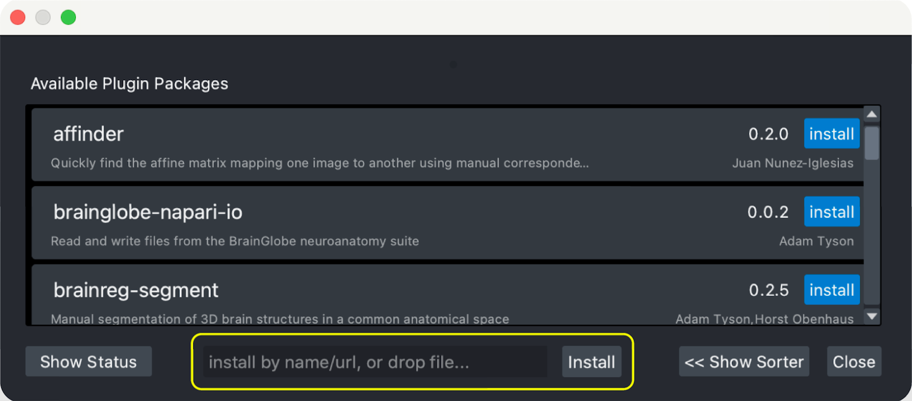

(find-and-install-plugins)=
# Finding and installing plugins

Information about available plugins can be found in the following places:
- **PyPI:** napari plugins are Python packages distributed on the Python Package Index
  (PyPI), and annotated with the
  tag [`Framework :: napari`](https://pypi.org/search/?q=&o=&c=Framework+%3A%3A+napari) 
- **conda-forge:** You can search for napari plugins from
  the conda-forge [package search page](https://conda-forge.org/packages/).
- **napari hub:** The [napari hub](https://napari-hub.org) uses this data, together with additional
  metadata, to produce a more user-friendly way to find napari plugins.

Similarly, the napari application lists plugins, annotated on PyPI with `Framework :: napari`,
in the `Plugins > Install/Uninstall Plugins` menu.

## Installing plugins with napari

All PyPI packages annotated with the `Framework :: napari` tag can be installed
directly from within napari, using the [napari plugin manager](https://napari.org/napari-plugin-manager/).
To install a new plugin, click the "Plugins" menu and select "Install/Uninstall Plugins...".
Then, in the plugin installer menu that opens, you can either:


1. Install plugins by searching: you can start typing in the text box at the top of the dialog to filter plugins. From
   the resulting list, you can then install a plugin by clicking the `Install` button in the tile of the plugin you want
   to install. You can also uninstall or update plugins from this dialog in a similar way under the "Installed Plugins"
   section.

2. Install plugins via manual input: at the bottom of the napari plugin manager window, there is a text box that will
   say either "install with 'pip' by name/url, or drop file...", or "install with 'pip' by name/url, or drop file..."
   (depending on how you installed napari). Enter the name of the plugin you want to install (or *any* valid pip or conda
    [requirement specifier](https://pip.pypa.io/en/stable/reference/requirement-specifiers/) or
    [VCS scheme](https://pip.pypa.io/en/stable/topics/vcs-support)). Then, click the "Install" button next to the input
    bar. This method allows for more flexibility in the plugins you can install, but it is also a bit more advanced.

   

   ```{admonition} Example
   To install `napari-svg`, enter `napari-svg` in the text field and press {kbd}`Enter` or click "Install". This is equivalent to running `pip install napari-svg`.
   ```
   ```{admonition} Example
   If you want to install `napari-svg` directly from the development branch on the [github repository](https://github.com/napari/napari-svg), enter `git+https://github.com/napari/napari-svg.git` in the text field.
   ```
   ```{admonition} Example
   If you want to install `napari-svg` from a specific release, enter `napari-svg==0.1.0` in the text field.
   ```

3. Advanced installation: after you have searched for the plugin you with to install, clicking on "Installation Info"
   button will open choices for installation source (conda or pip) and version selection. After choosing the desired
   options, you can click the "Install" button to install the plugin.

   

For more comprehensive documentation on the napari-plugin-manager, see https://napari.org/napari-plugin-manager/.