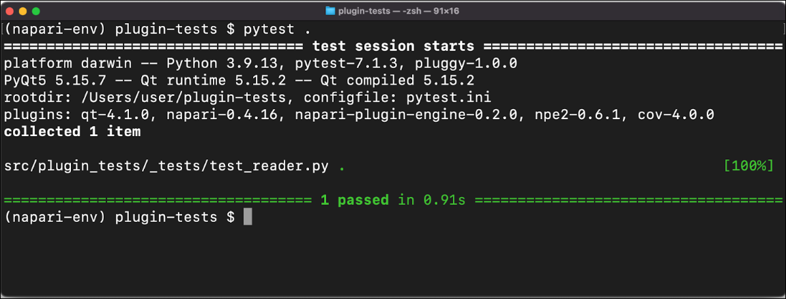
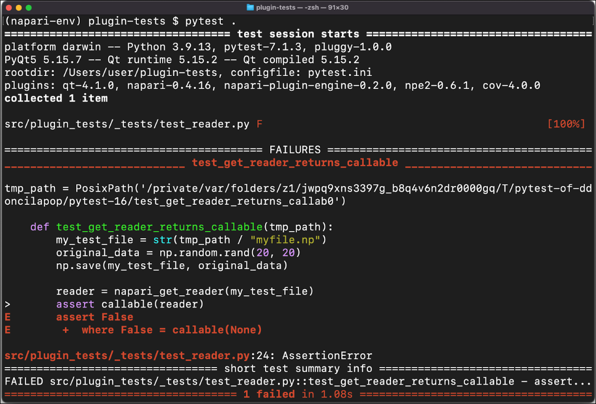
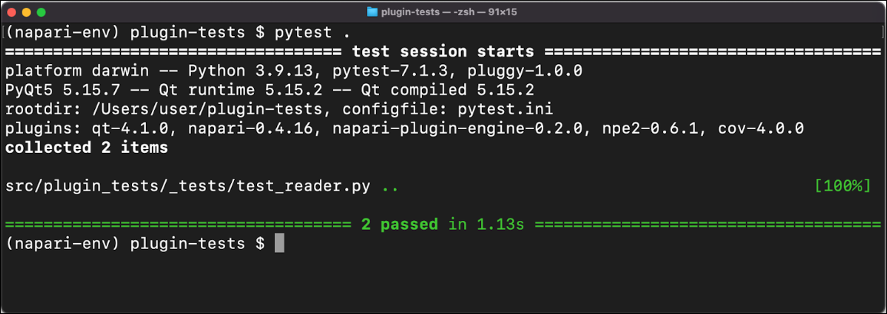

(plugin-testing-workshop-reader-fixtures)=

# 3: Readers and fixtures

This lesson explains how to use and test a plugin's reader function, built-in fixtures, custom fixtures, and enclosed testing.

## Other lessons in this tutorial:

* 1: [Python’s assert keyword](plugin-testing-workshop-assert)
* 2: [Pytest testing framework](plugin-testing-workshop-pytest)
* 3: This lesson (Readers and fixtures)
* 4: [Test coverage](plugin-testing-workshop-coverage)
* Resource links: [Testing resources](plugin-testing-resources)

### This lesson covers:
* [Readers](#reader)
* [Built-in fixtures](#built-in-fixtures)
* [Custom fixtures and round-trip tests](#custom-fixtures-and-round-trip-tests)
* [Enclosed testing](#enclosed-testing)

### Resources
The example plugin and all the tests discussed in this lesson are available in [this GitHub repository](https://github.com/DragaDoncila/plugin-tests).

## Introduction
In this lesson, we discuss a napari plugin called [plugin_tests](https://github.com/DragaDoncila/plugin-tests/tree/main/src/plugin_tests), generated using the [cookiecutter](https://github.com/napari/cookiecutter-napari-plugin), which has a reader and a widget. The reader is the cookiecutter [NumPy `.npy` file](https://numpy.org/doc/stable/reference/generated/numpy.lib.format.html#npy-format) reader, `napari_get_reader`. It checks whether a path ends in `.npy`. If it doesn't, it returns `None`, and if it does, it returns the `reader_function`, which loads the data.


## Reader
The `napari_get_reader` function is the first thing to test. In the top-level directory under `src`, we have the `plugin_tests` module. Inside `plugin_tests` is the `_tests` directory. This is a typical structure when writing tests. There is also a `test_reader.py` file, which is empty. We will populate it with tests.


We are focused on testing the `napari_get_reader` function. Sometimes it returns `None`; sometimes it returns the `reader_function`. We want to ensure that if we pass in a path that ends with `.npy`, it gives us back a function we can call.  We import `numpy` and `napari_get_reader`. `numpy` will be used later.

```{tip}
Test as much as possible and focus on writing small tests that look at one indivisible unit. Give tests meaningful names that describe what they're doing.
```

## Built-in fixtures
We use [tmp_path](https://docs.pytest.org/en/7.1.x/how-to/tmp_path.html#the-tmp-path-fixture) to manage the writing and reading of files during test execution. `tmp_path` is a `pytest` fixture; it is not imported, it comes with `pytest`. We pass `tmp_path` as a parameter to our test function, and `pytest` will inject it when the tests run. `tmp_path` provides a temporary path used to save and manipulate files. Temporary paths, files, and directories created in this way during the testing process are automatically removed by `pytest` when the tests are completed.

We create a file to read. First, we’ll build a file path, then generate a small amount of data. We’re just testing to see if the function returns a `callable` as expected, so we don't need a large array.

There are no specific requirements for the contents of the array in this case. We just need some sort of file to save to this temporary directory. The test file will not appear anywhere unless there is a pause during test execution.


Using `napari_get_reader` with this path, we assert that the reader is callable. A function should be returned. If it isn’t, we could put an error message here.

```python
# tmp_path is a pytest fixture
def test_get_reader_returns_callable(tmp_path):
    """Calling get_reader on numpy file returns callable"""

    # write some fake data
    my_test_file = str(tmp_path / "myfile.npy")
    original_data = np.random.rand(20, 20)
    np.save(my_test_file, original_data)

    # try to read it back in
    reader = napari_get_reader(my_test_file)
    assert callable(reader)
```

Running the command `pytest .` in the root directory of the plugin, we discover all the functions recognized as tests. It should recognize `test_reader.py` because it's a test file, prefixed with the word test. `test_reader.py` was found and passed the test.



If the file did not end in `.npy` the test would fail because what was returned wasn't callable. This code has been modified to produce an error:
```python
# tmp_path is a pytest fixture
def test_get_reader_returns_callable(tmp_path):
    """Calling get_reader on numpy file returns callable"""

    # write some fake data
    my_test_file = str(tmp_path / "myfile.np") # note ends in .np
    original_data = np.random.rand(20, 20)
    np.save(my_test_file, original_data)

    # try to read it back in
    reader = napari_get_reader(my_test_file)
    assert callable(reader)
```
Once we run `pytest` we can see that it traced back that the callable of `reader` is `False` and it has filled in the fact that `reader` at the time of the assertion was `None`. This is useful in debugging.



## Custom fixtures and round-trip tests
Next, we test to see if this function reads the data. This is a round-trip test. We will create a fixture to write the data to make things easier for ourselves. This fixture will be called [test_reader_round_trip](https://github.com/DragaDoncila/plugin-tests/blob/effb32d6e3b191ad83e69813b26ae8695210f5ad/src/plugin_tests/_tests/test_reader.py#L39).

Whatever is returned out of a `@pytest.fixture` decorated function is passed as an argument with the name of the fixture, to the test. We are going to call this `pytest.fixture` decorated function `write_im_to_file`. We’re going to give this fixture the `tmp_path` fixture - fixtures can use fixtures!

`write_im_to_file` returns a function we will call `write_func` that we can pass a path to and have it write the numpy file to that path. `write_func` is defined inside `write_im_to_file` because it’s not needed anywhere else. When we use `write_im_to_file` inside this test it will run `write_func`.

We will have access to what `write_func` returns once it’s been called inside the test. It returns both the path where the data has been written and the original data.

The benefit of creating this fixture is that whenever we want to write our own test data we don't have to copy three lines of code, we can just use the fixture. This is useful in testing data with different structures like integers or a specific layer type. Those arguments could be passed to further customize your fixture.

We still want to make sure we get a reader when we call `napari_get_reader` with the file. We call that `reader` function with the file we created to see if it returns what we expect. Based on the [reader spec](https://napari.org/stable/plugins/contributions.html#contributions-readers), it should return a layer data list. Here is the full test, with the fixture:
```python
@pytest.fixture
def write_im_to_file(tmp_path):

    def write_func(filename):
        my_test_file = str(tmp_path / filename)
        original_data = np.random.rand(20, 20)
        np.save(my_test_file, original_data)

        return my_test_file, original_data

    return write_func

def test_reader_round_trip(write_im_to_file):
    my_test_file, original_data = write_im_to_file("myfile.npy")

    reader = napari_get_reader(my_test_file)
    assert callable(reader)

    layer_data_list = reader(my_test_file)
    assert isinstance(layer_data_list, List) and len(layer_data_list) > 0

    layer_data_tuple = layer_data_list[0]
    layer_data = layer_data_tuple[0]
    np.testing.assert_allclose(layer_data, original_data)
```
We’re going to assert a list length greater than zero. There must be a layer in there; otherwise, we didn't read it correctly. We also assert that it is a list.

We will test that inside that list is what we expected - layer data tuples. The first item of a layer data tuple is the actual data. We’re going to test that explicitly.

Then we assert, using `numpy`’s asserting mechanism, `np.testing.assert_allclose` that they are all close, even though they should be exactly the same. This is standard practice when working with floating point precision. NumPy also has [other assertion options](https://numpy.org/doc/stable/reference/routines.testing.html) you may find useful. The layer data we read back with the reader function should be the same as the original data. If that's true, then we made the entire round trip. We saved the file and we used the reader to read the file.
```python
def test_reader_round_trip(write_im_to_file):
    my_test_file, original_data = write_im_to_file("myfile.npy")

    reader = napari_get_reader(my_test_file)
    assert callable(reader)

    layer_data_list = reader(my_test_file)
    assert isinstance(layer_data_list, List) and len(layer_data_list) > 0

    layer_data_tuple = layer_data_list[0]
    layer_data = layer_data_tuple[0]
    np.testing.assert_allclose(layer_data, original_data)
```
We run our tests again, and now two are collected, both passing.




## Enclosed testing
Note that although we're testing a `napari` plugin, we did not need a viewer or napari to test this. It's important that we didn't need those because napari and the napari viewer are out of our control. What we can control is the code _we_ wrote. We wrote that data by simply mocking up an array and getting a temporary path to it. We could thoroughly test our functions in an enclosed way without relying on other people's code or mocking up many complicated objects.

The next lesson in this series on testing is [Test coverage](plugin-testing-workshop-coverage).
