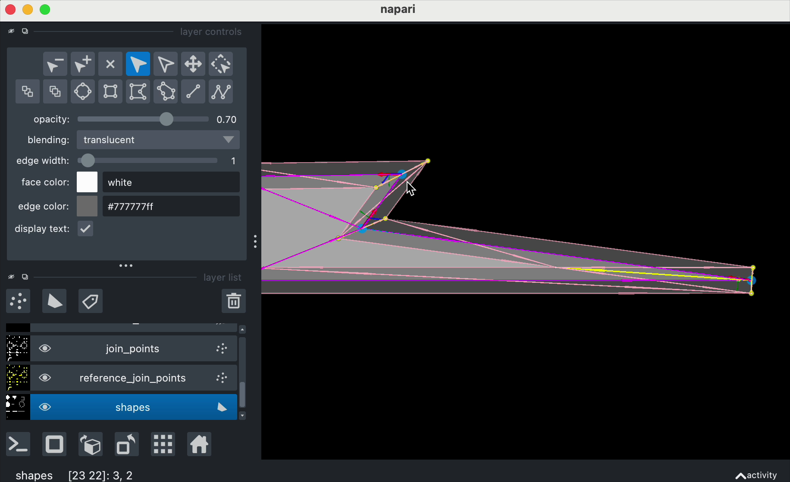

# napari 0.5.5

*Thu, Dec 12, 2024*

We’re happy to announce the release of napari 0.5.5! (You might have noticed it's been a hot minute since our last release — the team has been busy on the conference circuit (watch [our talk at PyConAU](https://youtu.be/EYmTLGwScBI?si=5SUqxVYuhyAmlD6H)!), defending their PhDs, and more! We are now back to our regularly-scheduled programming. 😂

napari is a fast, interactive, multi-dimensional image viewer for Python. It’s designed for exploring, annotating, and analyzing multi-dimensional images. It’s built on Qt (for the GUI), VisPy (for performant GPU-based rendering), and the scientific Python stack (NumPy, SciPy, and friends).

For more information, examples, and documentation, please visit our website: https://napari.org/

## Highlights

This release continues the 0.5 tradition of churning out the bug fixes and
enhancements, with 24 pull requests total in that category. If you are a user
of oblique plane rendering, you'll appreciate
[#7422](https://github.com/napari/napari/pull/7422), which fixes the plane
calculation when data is anisotropic.

And, did you have a hole in your heart where high-quality 3D labels rendering
should have been? Check out
[#7431](https://github.com/napari/napari/pull/7431), in which [Ashley
Anderson](https://github.com/aganders3) has (again) improved the quality of 3D
labels by filling the (apparent, but fictional) holes in labels at the borders
of a volume. Before/after gif:


Additionally, [Grzegorz Bokota](https://github.com/Czaki) has again sped up
launch time for Shapes layers by porting all the edge triangulation code to
numba ([#7268](https://github.com/napari/napari/pull/7268)). As part of that
work he also created a fantastic developer example explaining how the edge
triangulation works, which you can find at
[examples/dev/triangle_edge.py](https://github.com/napari/napari/blob/b2edccd6e40e04467ccfeec0257c2160783f7187/examples/dev/triangle_edge.py).
Give it a read and a play if you want to peek under the hood of the Shapes
layer!

```{raw} html
<figure>
  <video width="100%" controls autoplay loop muted playsinline>
    <source src="../_static/images/triangle-edge.webm" type="video/webm" />
    <source src="../_static/images/triangle-edge.mp4" type="video/mp4" />
    
  </video>
</figure>
```

Did you miss a napari error or warning while reading these notes? We don't
blame you! Those missed notifications will be a thing of the past with
[#7220](https://github.com/napari/napari/pull/7220), which will keep
notifications open if the napari window is not in focus. Whew!

Finally, for the zarrventurous among you, napari 0.5.5 is ready for zarr v3,
coming soon to a PyPI near you!
([#7215](https://github.com/napari/napari/pull/7215)) If you are using or
testing the zarr 3.0.0 betas, try them with napari! We hope you'll be
pleasantly surprised. 😊

As always, we thank all the contributors to this napari release and all the
previous ones! We welcome [Carol Willing](https://github.com/willingc) and
[Tim Monko](https://github.com/TimMonko) to the list of contributors. Read on
for all the changes in this version!

Read on for all the changes in this version!

## Improvements

- Do not start notification timer if window is not active. ([#7220](https://github.com/napari/napari/pull/7220))
- Speedup triangulation of edges ([#7268](https://github.com/napari/napari/pull/7268))
- [Enh] Double-click to zoom in on the clicked location (alt to zoom out) ([#7286](https://github.com/napari/napari/pull/7286))
- Highlight Shapes and Points layer data only when active ([#7289](https://github.com/napari/napari/pull/7289))
- Remove keybinding full stops ([#7304](https://github.com/napari/napari/pull/7304))
- Add example doc comparing `screenshot` and `export_figure` ([#7319](https://github.com/napari/napari/pull/7319))
- [Enh] Add a `Merge to RGB` contextual menu item ([#7322](https://github.com/napari/napari/pull/7322))
- Enable mouse pan and zoom when no active layer is available ([#7408](https://github.com/napari/napari/pull/7408))
- Add metadata event to Layer class ([#7416](https://github.com/napari/napari/pull/7416))
- Update normal calculation for labels isosurface rendering ([#7431](https://github.com/napari/napari/pull/7431))

## Bug Fixes

- Use `font_size` setting to control `napari-console` font-size ([#6753](https://github.com/napari/napari/pull/6753))
- Add from maximized to fullscreen mode interactions handling and allow using `Alt-Tab` while on fullscreen on Windows ([#7308](https://github.com/napari/napari/pull/7308))
- Fix bounding box to not contain only shape interior but also edges ([#7332](https://github.com/napari/napari/pull/7332))
- Clean selected data in Shapes layer when setting data ([#7336](https://github.com/napari/napari/pull/7336))
- fix `iso_gradient_mode` in constructor call ([#7340](https://github.com/napari/napari/pull/7340))
- Fix using transform mode when having layers with a different number of dimensions ([#7342](https://github.com/napari/napari/pull/7342))
- fix: change highlight only on zoom and mouse press ([#7386](https://github.com/napari/napari/pull/7386))
- Don't show plane normal controls unless layer has 3 or more dimensions and change controls order (plane controls under depiction combobox) ([#7395](https://github.com/napari/napari/pull/7395))
- Enable mouse pan and zoom when no active layer is available ([#7408](https://github.com/napari/napari/pull/7408))
- bug fix: have layerlist consume return, not pass to viewer ([#7417](https://github.com/napari/napari/pull/7417))
- Prevent errors when interacting with selected non-visible layers ([#7418](https://github.com/napari/napari/pull/7418))
- [bugfix] implement proper world to data normal transformation ([#7422](https://github.com/napari/napari/pull/7422))
- Turn off 'flash' in `screenshot`/`export_figure` examples ([#7427](https://github.com/napari/napari/pull/7427))
- Update surface shading control combobox when value is set programatically ([#7432](https://github.com/napari/napari/pull/7432))

## Documentation

- update scale_bar example to include new attributes ([#7309](https://github.com/napari/napari/pull/7309))
- Add example doc comparing `screenshot` and `export_figure` ([#7319](https://github.com/napari/napari/pull/7319))
- Add reminder about version added directive in PR template ([#7359](https://github.com/napari/napari/pull/7359))
- Update the docstrings and comments for status checker thread ([#7381](https://github.com/napari/napari/pull/7381))
- Update `to_screenshot` and `export_figure` example docstrings ([#7426](https://github.com/napari/napari/pull/7426))
- Turn off 'flash' in `screenshot`/`export_figure` examples ([#7427](https://github.com/napari/napari/pull/7427))
- Add draft release notes for 0.5.5 ([docs#536](https://github.com/napari/docs/pull/536))
- Add linkcheck step to be run once a week ([docs#474](https://github.com/napari/docs/pull/474))
- Fix broken links detected by make linkcheck-files ([docs#484](https://github.com/napari/docs/pull/484))
- Add 0.5.4 to the version switcher ([docs#500](https://github.com/napari/docs/pull/500))
- Document the SPEC-0 rule for bundled Python ([docs#501](https://github.com/napari/docs/pull/501))
- Update docs to remove flake8, isort mentions and add ruff ([docs#502](https://github.com/napari/docs/pull/502))
- Highlight Jupyter option in gallery examples ([docs#503](https://github.com/napari/docs/pull/503))
- Add community calendar link to landing page ([docs#504](https://github.com/napari/docs/pull/504))
- Add information about `qt_viewer` fixture ([docs#505](https://github.com/napari/docs/pull/505))
- Add information that `qt_viewer` fixture `hide` the viewer ([docs#506](https://github.com/napari/docs/pull/506))
- Update release guide anchor ([docs#507](https://github.com/napari/docs/pull/507))
- Minor improvement to provider annotations ([docs#510](https://github.com/napari/docs/pull/510))
- Add notes about versionadded/versionchanged directives to dev guide ([docs#512](https://github.com/napari/docs/pull/512))
- Update Step 4 of development set up to clarify qt backends ([docs#516](https://github.com/napari/docs/pull/516))
- Update benchmarks.md to use conda napari-env ([docs#518](https://github.com/napari/docs/pull/518))
- Add contributing text and link about CI ([docs#519](https://github.com/napari/docs/pull/519))
- Update finding_and_installing_plugins.md ([docs#521](https://github.com/napari/docs/pull/521))
- [Labels] Add more prominent info about the next label keybind and fix n_dimensional (deprecated) ([docs#522](https://github.com/napari/docs/pull/522))
- Update NAP-6 to remove mention of context menu ([docs#525](https://github.com/napari/docs/pull/525))
- Move Andy Sweet from core-devs to emeritus core-devs ([docs#530](https://github.com/napari/docs/pull/530))

## Other Pull Requests

- Add testing for drag and drop events/behavior on `QtLayerList` ([#6699](https://github.com/napari/napari/pull/6699))
- Fix zarr 3.0 compatibility ([#7215](https://github.com/napari/napari/pull/7215))
- Add more tests for Qt processors ([#7280](https://github.com/napari/napari/pull/7280))
- Update `coverage`, `dask`, `fsspec`, `hypothesis`, `imageio`, `ipython`, `napari-console`, `pillow`, `psutil`, `qtconsole`, `qtpy`, `rich`, `tensorstore`, `toolz`, `tqdm`, `virtualenv`, `xarray` ([#7287](https://github.com/napari/napari/pull/7287))
- Block zarr 3.0.0a5, 3.0.0a6 ([#7305](https://github.com/napari/napari/pull/7305))
- [pre-commit.ci] pre-commit autoupdate ([#7307](https://github.com/napari/napari/pull/7307))
- ci(dependabot): bump peter-evans/create-pull-request from 6 to 7 in the actions group ([#7311](https://github.com/napari/napari/pull/7311))
- Change `Layer.create` type annotation to accept any Mapping ([#7317](https://github.com/napari/napari/pull/7317))
- [pre-commit.ci] pre-commit autoupdate ([#7324](https://github.com/napari/napari/pull/7324))
- Fix double reporting of leaked widgets ([#7326](https://github.com/napari/napari/pull/7326))
- Improve docstrings and code flow of `ShapeList.outline` add missed return in thread status ([#7337](https://github.com/napari/napari/pull/7337))
- Add screenshot test for highlights visibility when layer selection/active layer changes ([#7339](https://github.com/napari/napari/pull/7339))
- [miant] update binder to use conda nightly and jupyter-remote-desktop-proxy ([#7352](https://github.com/napari/napari/pull/7352))
- Update `dask`, `hypothesis`, `pint` ([#7358](https://github.com/napari/napari/pull/7358))
- Add setting Windows resolution step for prereleases testing workflow and some tests fixes ([#7360](https://github.com/napari/napari/pull/7360))
- [pre-commit.ci] pre-commit autoupdate ([#7361](https://github.com/napari/napari/pull/7361))
- Add maintainer and contributor documentation about workflow automation near the configuration ([#7365](https://github.com/napari/napari/pull/7365))
- Stop testing PySide6 on python 3.9 ([#7368](https://github.com/napari/napari/pull/7368))
- fix: remove "openblas_set_num_threads not found" warning by add missed break ([#7369](https://github.com/napari/napari/pull/7369))
- Isolate keybinding tests using pytest.mark ([#7375](https://github.com/napari/napari/pull/7375))
- Add python-dotenv to dev dependencies ([#7377](https://github.com/napari/napari/pull/7377))
- mark slow local tests ([#7383](https://github.com/napari/napari/pull/7383))
- Speed up bigtiff test using `np.empty` and smaller data ([#7384](https://github.com/napari/napari/pull/7384))
- Update `coverage`, `dask`, `hypothesis`, `tensorstore` ([#7385](https://github.com/napari/napari/pull/7385))
- [pre-commit.ci] pre-commit autoupdate ([#7388](https://github.com/napari/napari/pull/7388))
- [Maint] drop unused `n_dimensional` property of Labels ([#7389](https://github.com/napari/napari/pull/7389))
- [pre-commit.ci] pre-commit autoupdate ([#7424](https://github.com/napari/napari/pull/7424))
- [tests] add tests for Layer._world_to_displayed_data_normal ([#7435](https://github.com/napari/napari/pull/7435))
- [pre-commit.ci] pre-commit autoupdate ([#7439](https://github.com/napari/napari/pull/7439))
- Remove lucyleeow from qt/ codeowners ([#7441](https://github.com/napari/napari/pull/7441))
- [Maint] Fix labeler action by using proper syntax ([docs#523](https://github.com/napari/docs/pull/523))
- Update labeler.yml to check subfolders ([docs#526](https://github.com/napari/docs/pull/526))
- Fix linkchecker ([docs#528](https://github.com/napari/docs/pull/528))


## 12 authors added to this release (alphabetical)

(+) denotes first-time contributors 🥳

- [andrew sweet](https://github.com/napari/docs/commits?author=andy-sweet) - @andy-sweet
- [Ashley Anderson](https://github.com/napari/napari/commits?author=aganders3) - @aganders3
- [Carol Willing](https://github.com/napari/napari/commits?author=willingc) ([docs](https://github.com/napari/docs/commits?author=willingc))  - @willingc +
- [clement caporal](https://github.com/napari/napari/commits?author=ClementCaporal) - @ClementCaporal
- [Daniel Althviz Moré](https://github.com/napari/napari/commits?author=dalthviz) - @dalthviz
- [Grzegorz Bokota](https://github.com/napari/napari/commits?author=Czaki) ([docs](https://github.com/napari/docs/commits?author=Czaki))  - @Czaki
- [jaime rodriguez-guerra](https://github.com/napari/docs/commits?author=jaimergp) - @jaimergp
- [Juan Nunez-Iglesias](https://github.com/napari/napari/commits?author=jni) ([docs](https://github.com/napari/docs/commits?author=jni))  - @jni
- [Lucy Liu](https://github.com/napari/napari/commits?author=lucyleeow) ([docs](https://github.com/napari/docs/commits?author=lucyleeow))  - @lucyleeow
- [Melissa Weber Mendonça](https://github.com/napari/napari/commits?author=melissawm) ([docs](https://github.com/napari/docs/commits?author=melissawm))  - @melissawm
- [Peter Sobolewski](https://github.com/napari/napari/commits?author=psobolewskiPhD) ([docs](https://github.com/napari/docs/commits?author=psobolewskiPhD))  - @psobolewskiPhD
- [Tim Monko](https://github.com/napari/napari/commits?author=TimMonko) - @TimMonko +


## 14 reviewers added to this release (alphabetical)

(+) denotes first-time contributors 🥳

- [Ashley Anderson](https://github.com/napari/napari/commits?author=aganders3) - @aganders3
- [Carol Willing](https://github.com/napari/napari/commits?author=willingc) ([docs](https://github.com/napari/docs/commits?author=willingc))  - @willingc +
- [Daniel Althviz Moré](https://github.com/napari/napari/commits?author=dalthviz) - @dalthviz
- [Davis Bennett](https://github.com/napari/docs/commits?author=d-v-b) - @d-v-b
- [Draga Doncila Pop](https://github.com/napari/docs/commits?author=DragaDoncila) - @DragaDoncila
- [Genevieve Buckley](https://github.com/napari/docs/commits?author=GenevieveBuckley) - @GenevieveBuckley
- [Grzegorz Bokota](https://github.com/napari/napari/commits?author=Czaki) ([docs](https://github.com/napari/docs/commits?author=Czaki))  - @Czaki
- [Juan Nunez-Iglesias](https://github.com/napari/napari/commits?author=jni) ([docs](https://github.com/napari/docs/commits?author=jni))  - @jni
- [Lorenzo Gaifas](https://github.com/napari/docs/commits?author=brisvag) - @brisvag
- [Lucy Liu](https://github.com/napari/napari/commits?author=lucyleeow) ([docs](https://github.com/napari/docs/commits?author=lucyleeow))  - @lucyleeow
- [Melissa Weber Mendonça](https://github.com/napari/napari/commits?author=melissawm) ([docs](https://github.com/napari/docs/commits?author=melissawm))  - @melissawm
- [Peter Sobolewski](https://github.com/napari/napari/commits?author=psobolewskiPhD) ([docs](https://github.com/napari/docs/commits?author=psobolewskiPhD))  - @psobolewskiPhD
- [Tim Monko](https://github.com/napari/napari/commits?author=TimMonko) - @TimMonko +
- [Wouter-Michiel Vierdag](https://github.com/napari/docs/commits?author=melonora) - @melonora

