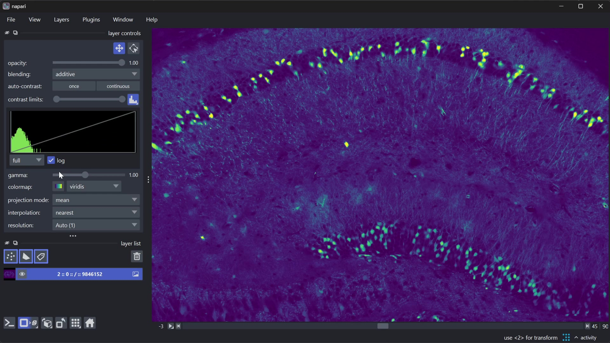
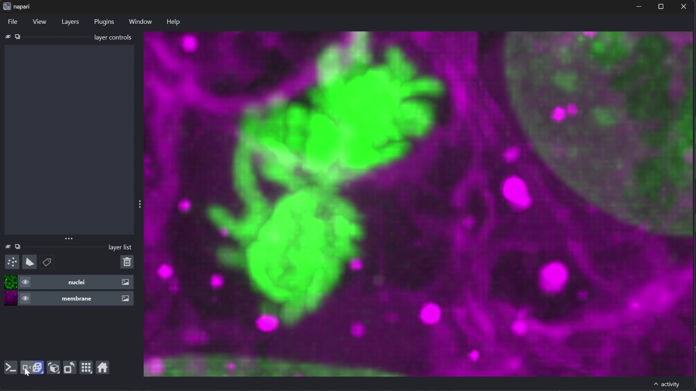

# napari 0.8.0

*Sun, Jul 12, 2026*

We're happy to announce the release of napari 0.8.0!
napari is a fast, interactive, multi-dimensional image viewer for Python.
It's designed for browsing, annotating, and analyzing large multi-dimensional
images. It's built on top of Qt (for the GUI), vispy (for performant GPU-based
rendering), and the scientific Python stack (numpy, scipy).

For more information, examples, and documentation, please visit our website,
https://napari.org.

napari follows [EffVer (Intended Effort Versioning)](https://effver.org/); this
is a **Macro** release containing awesome new features, but may require
dedication of some significant time when upgrading projects to use this
version.

## Highlights

### Dropping Python 3.10 and PyQt5

napari 0.8.0 drops support for Python 3.10
([#9104](https://github.com/napari/napari/pull/9104)) and deprecates PyQt5
support ([#9079](https://github.com/napari/napari/pull/9079)).

These changes are being made to help maintenance of napari. Python 3.10 will
reach end-of-life support in October 2026, while PyQt5 has already reached
end-of-life, and is becoming increasingly difficult to maintain as a
dependency. PyQt6, in contrast, has been the daily driver for the napari core
team for many months. As we recognise that PyQt5 has extensive usage in the
community, we have decided to deprecate it in this release and drop support
in Q4 2026. If your project still depends on Qt5, consider migrating to PySide6
or PyQt6. As always, feel free to get in touch
[on our Zulip](https://napari.zulipchat.com) if you encounter any issues!

### Histogram for Image layer

It's been a heckuva long time coming, but napari Image layers *finally* gain a
[built-in histogram (#8391)](https://github.com/napari/napari/pull/8391)!
Wonder no more about why your image looks black or totally washed out — you can
now see the distribution of your pixels' brightness right there in the layer
controls, or within the larger contrast limits widget (which, as a reminder,
you can access by right clicking on the contrast limits slider).

You can access the brightness of the current slice (default), or the full
layer, *and* it will sample progressively from remote chunks if you are looking
at large remote data. Try it out!

```{raw} html
<figure>
  <video width="100%" controls autoplay loop muted playsinline>
    <source src="../_static/images/histogram.webm" type="video/webm" />
    <source src="../_static/images/histogram.mp4" type="video/mp4" />
    
  </video>
</figure>
```

### Synced cameras between 2D and 3D views

Ever switched between 2D and 3D views to check out your data, only to be
frustrated that the zoom and center has been reset? Now, by default, the
cameras are
[synced between views (#9151)](https://github.com/napari/napari/pull/9151)!
The synced camera's zoom and center persists when switching between 2D and 3D,
with the depth (Z) component synced through the dimension slider to complete
the round-trip.

To unlock the cameras from each other for completely separate views, you can
toggle `viewer.camera.synced = False` from the Camera popup (right-click 2D/3D
button) or **Toggle Synced Camera** (Ctrl/Cmd+U) in the **View** menu. Set your
preferred default in **Preferences** -> **Application** -> **Synced Camera**.

```{raw} html
<figure>
  <video width="100%" controls autoplay loop muted playsinline>
    <source src="../_static/images/synced-cameras.webm" type="video/webm" />
    <source src="../_static/images/synced-cameras.mp4" type="video/mp4" />
    
  </video>
</figure>
```

### Paint into more arrays faster!

Labels painting is now much faster for zarr arrays, and you can now paint into
other array types such as dask and tensorstore! Painting with very large brush
sizes (e.g. 1,000) is now possible where it used to be extremely choppy. Give
it a whirl! ([#8636](https://github.com/napari/napari/pull/8636))

### Floating axes overlay

Ever feel disoriented looking at your data? You're not alone. Until
[#8262](https://github.com/napari/napari/pull/8262), the axes overlay would
live in the same space as your data, and would be out of view if you didn't
have the top left corner of your data on the canvas. Now you can have a little
2- or 3-axis compass always on in a corner of the canvas. Find it in the View
menu!

### Improving the napari theme

Like many things in community-run open source, napari's theme grew organically
as we added features and UI elements.
[#8927](https://github.com/napari/napari/pull/8927) unified the look of many of
those elements, while [#9078](https://github.com/napari/napari/pull/9078)
improved the default light and dark themes by increasing contrast to meet
[Web Content Accessibility Guidelines][WCAG]. Want to build your own
WCAG-compliant theme? Try out the new WCAG table in
[`examples/theme_sample.py`][theme-sample]
([#9175](https://github.com/napari/napari/pull/9175))!


[WCAG]: https://en.wikipedia.org/wiki/Web_Content_Accessibility_Guidelines
[theme-sample]: https://github.com/napari/napari/blob/700a36f148dc073d281b5a9e42bb28cd18ed6a32/examples/theme_sample.py


## New Features

- Add floating axes canvas overlay ([#8262](https://github.com/napari/napari/pull/8262))
- Histogram for the Image layer controls and contrast limits popup ([#8391](https://github.com/napari/napari/pull/8391))
- Toggleable `synced` (default) and separated camera views across ndisplay ([#9151](https://github.com/napari/napari/pull/9151))

## Improvements

- Add example driving computation from gui ([#8658](https://github.com/napari/napari/pull/8658))
- UX: Add viewer mouse binding (alt) to the scroll wheel to scroll layers ([#8731](https://github.com/napari/napari/pull/8731))
- Make tips more generally usable ([#8762](https://github.com/napari/napari/pull/8762))
- Add handler to show message when napari fails to import ([#8803](https://github.com/napari/napari/pull/8803))
- Unify use of theme colors ([#8927](https://github.com/napari/napari/pull/8927))
- Make multiscale level labels static to avoid delayed updates ([#9006](https://github.com/napari/napari/pull/9006))
- Accept `pathlib.Path` in reader and writer plugin utilities ([#9042](https://github.com/napari/napari/pull/9042))
- Fix: adapt frame box upper bound to data size (allow >6-digit indices) ([#9064](https://github.com/napari/napari/pull/9064))
- Theme colors adjustments ([#9078](https://github.com/napari/napari/pull/9078))
- feat: add metadata submenu to the layers menu ([#9107](https://github.com/napari/napari/pull/9107))
- Enable clickable links for tips that have URLs ([#9114](https://github.com/napari/napari/pull/9114))
- Use level-0 extent for multiscale bounding box overlay ([#9142](https://github.com/napari/napari/pull/9142))
- Show active level in Auto entry of multiscale combobox ([#9143](https://github.com/napari/napari/pull/9143))
- Add WCAG contrast table to Theme Sample example ([#9175](https://github.com/napari/napari/pull/9175))

## Performance

- [Labels, Perf] Refactor painting to use masks and bounding boxes ([#8636](https://github.com/napari/napari/pull/8636))

## Bug Fixes

- Fix: napari script runner with multiprocessing ([#8936](https://github.com/napari/napari/pull/8936))
- Make multiscale level labels static to avoid delayed updates ([#9006](https://github.com/napari/napari/pull/9006))
- Gate drag_to_zoom to pan/zoom mode or no layers selected ([#9016](https://github.com/napari/napari/pull/9016))
- [Shapes] When using Shift to draw circle/square, allow shape to grow in direction of mouse drag ([#9018](https://github.com/napari/napari/pull/9018))
- Fix: adapt frame box upper bound to data size (allow >6-digit indices) ([#9064](https://github.com/napari/napari/pull/9064))
- Fix half-voxel offset ([#9065](https://github.com/napari/napari/pull/9065))
- make LabelColorMapBase deep-copyable ([#9069](https://github.com/napari/napari/pull/9069))
- Make Wayland XCB/GLX workaround modular for non-NVIDIA GPUs ([#9070](https://github.com/napari/napari/pull/9070))
- Fix colorbar box ([#9071](https://github.com/napari/napari/pull/9071))
- Remove stretch from features table widget layout ([#9099](https://github.com/napari/napari/pull/9099))
- Limit dims scroll to 1 step at a time ([#9117](https://github.com/napari/napari/pull/9117))
- Fix get_status for RGB images in 3D display mode ([#9135](https://github.com/napari/napari/pull/9135))
- Fix problem with ignoring annotation when drag and drop ([#9136](https://github.com/napari/napari/pull/9136))
- Fix multiscale _set_view_slice when switching to 3D ([#9141](https://github.com/napari/napari/pull/9141))
- Use level-0 extent for multiscale bounding box overlay ([#9142](https://github.com/napari/napari/pull/9142))
- Guard against stale index for layer paint methods ([#9149](https://github.com/napari/napari/pull/9149))
- Fix: Restore tooltip symbol QSS after #9003 ([#9161](https://github.com/napari/napari/pull/9161))
- Fix: update cached unit scale when layer data dimensionality changes (#9164) ([#9181](https://github.com/napari/napari/pull/9181))

## API Changes

- Remove `compat.py` (and `StrEnum` export), update imports, and remove case-insens lookup ([#9133](https://github.com/napari/napari/pull/9133))

## Deprecations

- Next round of deprecation for scale_bar.unit ([#9029](https://github.com/napari/napari/pull/9029))

## Documentation

- Update Theme contribution guidance ([docs#1002](https://github.com/napari/docs/pull/1002))
- Up-to-date compile constraints instructions ([docs#1043](https://github.com/napari/docs/pull/1043))
- Update version_switcher for 0.7.1 ([docs#1044](https://github.com/napari/docs/pull/1044))
- Fix formatting in version_switcher.json (remove spurious comma) ([docs#1045](https://github.com/napari/docs/pull/1045))
- Update pre-commit config, apply rules ([docs#1046](https://github.com/napari/docs/pull/1046))
- python >=3.11 for all docs references ([docs#1052](https://github.com/napari/docs/pull/1052))
- Add tip to use `-h` or `--help` flags with the `compile_constraints.sh` script ([docs#1053](https://github.com/napari/docs/pull/1053))
- Remove `github-advanced-security[bot]` from list of reviewers of 0.7.1 ([docs#1055](https://github.com/napari/docs/pull/1055))
- Add initial release notes for 0.8.0 ([docs#1056](https://github.com/napari/docs/pull/1056))
- Update README with links for the dev and published docs ([docs#1058](https://github.com/napari/docs/pull/1058))
- Feature documentation for image layer histogram ([docs#1059](https://github.com/napari/docs/pull/1059))
- Update organization ownership policy ([docs#1061](https://github.com/napari/docs/pull/1061))
- Update 0.8.0 release notes, add highlight ([docs#1062](https://github.com/napari/docs/pull/1062))
- Add video and fallback image for histogram highlight ([docs#1063](https://github.com/napari/docs/pull/1063))
- Fix video relative paths which had extra '..' ([docs#1064](https://github.com/napari/docs/pull/1064))
- Add Camera Guide to explain synced/separate camera modes ([docs#1065](https://github.com/napari/docs/pull/1065))
- Final update of release notes for 0.8.0 ([docs#1066](https://github.com/napari/docs/pull/1066))
- examples: remove deprecated `scale_bar.unit`  and enable `viewer.scale_bar.visible = True`  ([#9012](https://github.com/napari/napari/pull/9012))

## Other Pull Requests

- Fix linkchecker action constraints to file for py312 ([docs#1048](https://github.com/napari/docs/pull/1048))
- [pre-commit.ci] pre-commit autoupdate ([docs#1050](https://github.com/napari/docs/pull/1050))
- Use shared workflow for remove ready to merge label ([docs#1054](https://github.com/napari/docs/pull/1054))
- ci(dependabot): bump the github-actions group across 1 directory with 5 updates ([docs#1057](https://github.com/napari/docs/pull/1057))
- Use Qt6 colorScheme to detect system theme ([#8904](https://github.com/napari/napari/pull/8904))
- Remove check of Qt version that disable gradient in themes ([#8961](https://github.com/napari/napari/pull/8961))
- QSS cleanup: remove plugin manager qss and some even older plugin sorter qss ([#9003](https://github.com/napari/napari/pull/9003))
- typing: add type annotations to _tracebacks.py ([#9011](https://github.com/napari/napari/pull/9011))
- Update `dask`, `hypothesis`, `ipython`, `matplotlib`, `pytest`, `tqdm`, `virtualenv` ([#9036](https://github.com/napari/napari/pull/9036))
- [pre-commit.ci] pre-commit autoupdate ([#9040](https://github.com/napari/napari/pull/9040))
- [Maint] Remove unneeded _set_highlight calls in Shapes key and mouse binds ([#9060](https://github.com/napari/napari/pull/9060))
- Fix flaky fullscreen test: skip on all Qt >= 6.9.0 ([#9074](https://github.com/napari/napari/pull/9074))
- [pre-commit.ci] pre-commit autoupdate ([#9080](https://github.com/napari/napari/pull/9080))
- ci: trigger dependency check on PR edits ([#9084](https://github.com/napari/napari/pull/9084))
- Add `-h | --help` arguments to `compile_constraints.sh` ([#9090](https://github.com/napari/napari/pull/9090))
- Actually use pride logo ([#9091](https://github.com/napari/napari/pull/9091))
- fix(typing): fix mypy error in `qt_list_view.py` ([#9093](https://github.com/napari/napari/pull/9093))
- fix(typing):  add typing and fix mypy error in `qt_tree_view.py` ([#9094](https://github.com/napari/napari/pull/9094))
- fix(typing): add typing and fix mypy error in `screenshot_dialog.py` ([#9095](https://github.com/napari/napari/pull/9095))
- fix(typing): add typing and fix mypy errors in `tree/group.py` ([#9096](https://github.com/napari/napari/pull/9096))
- fix(typing): add typing and fix mypy errors in `debugging.py` ([#9097](https://github.com/napari/napari/pull/9097))
- fix(typing): add typing and fix mypy errors in `custom_types.py` ([#9098](https://github.com/napari/napari/pull/9098))
- fix(typing): add typing and fix mypy error in `qt_tooltip.py` ([#9101](https://github.com/napari/napari/pull/9101))
- fix(typing): add typing and fix mypy error in `qt_spinbox.py` ([#9102](https://github.com/napari/napari/pull/9102))
- fix(typing): add typing and fix mypy error in `qt_scrollbar.py` ([#9103](https://github.com/napari/napari/pull/9103))
- bump numpy to 2.5.0 in mypy constraints to fix `[unused-ignore]` errors ([#9106](https://github.com/napari/napari/pull/9106))
- fix(typing): add typing and fix mypy errors in `qt_range_slider_popup.py` ([#9108](https://github.com/napari/napari/pull/9108))
- fix(typing) : add typing and fix mypy error in `qt_progress_bar.py` ([#9109](https://github.com/napari/napari/pull/9109))
- fix(typing): add typing and fix mypy error in `qt_message_popup.py` ([#9111](https://github.com/napari/napari/pull/9111))
- fix(typing): add typing and fix mypy error in `qt_font_size.py` ([#9112](https://github.com/napari/napari/pull/9112))
- fix(typing): add typing and fix error in `qt_dims_sorter.py` ([#9113](https://github.com/napari/napari/pull/9113))
- [pre-commit.ci] pre-commit autoupdate ([#9122](https://github.com/napari/napari/pull/9122))
- fix(typing): add typing and fix mypy error in `qt_about.py` ([#9125](https://github.com/napari/napari/pull/9125))
- Minimum support for zarr>=3 for builtins ([#9134](https://github.com/napari/napari/pull/9134))
- Stop using pickle when copying/pasting spatial features of layer ([#9146](https://github.com/napari/napari/pull/9146))
- Remove `image_reader_to_layerdata_reader` ([#9147](https://github.com/napari/napari/pull/9147))
- Remove `color_dict_to_colormap` ([#9148](https://github.com/napari/napari/pull/9148))
- `QApplication` mouse event to trigger event filter of `test_toggle_menubar` ([#9152](https://github.com/napari/napari/pull/9152))
- Remove `pyautogui` and update failing tests on Windows-Qt6 ([#9153](https://github.com/napari/napari/pull/9153))
- gitignore various agent related file names ([#9154](https://github.com/napari/napari/pull/9154))
- Update `certifi`, `coverage`, `fsspec`, `hypothesis`, `ipython`, `npe2`, `pillow`, `pydantic-settings`, `pytest`, `pytest-rerunfailures`, `scipy`, `tqdm`, `virtualenv`, `wrapt` ([#9158](https://github.com/napari/napari/pull/9158))
- `macos-15` runner instead of `macos-latest` (now `macos-26`) to prevent segfaults ([#9162](https://github.com/napari/napari/pull/9162))
- Remove method and functions marked for removal in 0.8.0 ([#9177](https://github.com/napari/napari/pull/9177))
- Clean rest of elements  marked as "to remove in 0.8.0"  ([#9191](https://github.com/napari/napari/pull/9191))


## 18 authors added to this release (alphabetical)

(+) denotes first-time contributors 🥳

- [Aniket](https://github.com/napari/napari/commits?author=Aniketsy) - @Aniketsy
- [Anwai Archit](https://github.com/napari/napari/commits?author=anwai98) - @anwai98 +
- [Carlos Mario Rodriguez Reza](https://github.com/napari/napari/commits?author=carlosmariorr) ([docs](https://github.com/napari/docs/commits?author=carlosmariorr))  - @carlosmariorr
- [Caroline Malin-Mayor](https://github.com/napari/napari/commits?author=cmalinmayor) - @cmalinmayor
- [Davin Potts](https://github.com/napari/napari/commits?author=applio) - @applio +
- [Grzegorz Bokota](https://github.com/napari/napari/commits?author=Czaki) ([docs](https://github.com/napari/docs/commits?author=Czaki))  - @Czaki
- [Imaduddin Sheikh](https://github.com/napari/napari/commits?author=isheikh8492) - @isheikh8492 +
- [Juan Nunez-Iglesias](https://github.com/napari/docs/commits?author=jni) - @jni
- [Kabilar Gunalan](https://github.com/napari/docs/commits?author=kabilar) - @kabilar
- [Kyle I. S. Harrington](https://github.com/napari/napari/commits?author=kephale) - @kephale
- [Lorenzo Gaifas](https://github.com/napari/napari/commits?author=brisvag) - @brisvag
- [Mikkel Roald-Arbøl](https://github.com/napari/napari/commits?author=roaldarbol) - @roaldarbol +
- [Omkar Kabde](https://github.com/napari/napari/commits?author=omkar-334) - @omkar-334 +
- [Peter Sobolewski](https://github.com/napari/napari/commits?author=psobolewskiPhD) ([docs](https://github.com/napari/docs/commits?author=psobolewskiPhD))  - @psobolewskiPhD
- [Rupesh](https://github.com/napari/napari/commits?author=Rupeshhsharma) - @Rupeshhsharma +
- [Teun Huijben](https://github.com/napari/napari/commits?author=TeunHuijben) - @TeunHuijben +
- [Tim Monko](https://github.com/napari/napari/commits?author=TimMonko) ([docs](https://github.com/napari/docs/commits?author=TimMonko))  - @TimMonko
- [Tony Reksoatmodjo](https://github.com/napari/napari/commits?author=Modjular) - @Modjular +

## 17 reviewers added to this release (alphabetical)

(+) denotes first-time contributors 🥳

- [Aniket](https://github.com/napari/napari/commits?author=Aniketsy) - @Aniketsy
- [Carlos Mario Rodriguez Reza](https://github.com/napari/napari/commits?author=carlosmariorr) ([docs](https://github.com/napari/docs/commits?author=carlosmariorr))  - @carlosmariorr
- [Carol Willing](https://github.com/napari/docs/commits?author=willingc) - @willingc
- [Caroline Malin-Mayor](https://github.com/napari/napari/commits?author=cmalinmayor) - @cmalinmayor
- [Davin Potts](https://github.com/napari/napari/commits?author=applio) - @applio +
- [Draga Doncila Pop](https://github.com/napari/docs/commits?author=DragaDoncila) - @DragaDoncila
- [Gabriel Selzer](https://github.com/napari/docs/commits?author=gselzer) - @gselzer
- [Grzegorz Bokota](https://github.com/napari/napari/commits?author=Czaki) ([docs](https://github.com/napari/docs/commits?author=Czaki))  - @Czaki
- [Imaduddin Sheikh](https://github.com/napari/napari/commits?author=isheikh8492) - @isheikh8492 +
- [Jacopo Abramo](https://github.com/napari/docs/commits?author=jacopoabramo) - @jacopoabramo
- [Juan Nunez-Iglesias](https://github.com/napari/docs/commits?author=jni) - @jni
- [Kyle I. S. Harrington](https://github.com/napari/napari/commits?author=kephale) - @kephale
- [Lorenzo Gaifas](https://github.com/napari/napari/commits?author=brisvag) - @brisvag
- [Mikkel Roald-Arbøl](https://github.com/napari/napari/commits?author=roaldarbol) - @roaldarbol +
- [Peter Sobolewski](https://github.com/napari/napari/commits?author=psobolewskiPhD) ([docs](https://github.com/napari/docs/commits?author=psobolewskiPhD))  - @psobolewskiPhD
- [Teun Huijben](https://github.com/napari/napari/commits?author=TeunHuijben) - @TeunHuijben +
- [Tim Monko](https://github.com/napari/napari/commits?author=TimMonko) ([docs](https://github.com/napari/docs/commits?author=TimMonko))  - @TimMonko
