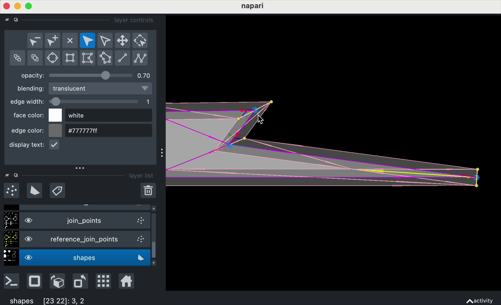

(whats-new)=

# What's New

```{admonition} How to use this page
:class: tip

- Browse releases organized by time periods below
- Each section shows highlights from recent releases
- Click on version links to view complete release notes
```

*Last updated: September 12, 2025*


## Recent Releases (Last 3 Months)

Latest features and improvements:

````{dropdown} napari 0.6.4 (August 2025)
:open:

### Run scripts with napari from the command line

As a follow-up to the ability to drag-n-drop scripts into the napari window from 0.6.3, you can now run scripts directly from the command line using the `napari` command and the path to the script ([#8185](https://github.com/napari/napari/pull/8185) and [#8187](https://github.com/napari/napari/pull/8187)).
To open a local napari and run a local script, enter: `napari examples/magic_immage_arithmetic.py`.
You can also run scripts from a remote location ([#8208](https://github.com/napari/napari/pull/8208)), including Github, Gist, Gitlab, and the napari gallery.
To run a remote script, for example, enter: `napari https://github.com/napari/napari/blob/main/examples/grid_mode.py`.
If you have `uv` you can even run a script without installing napari by using `uvx --with "napari[gallery,all]" napari https://napari.org/stable/_downloads/55f878f7d41dc4c7c2e28483653273cb/affine_coffee_cup.py`, serving as a clever way to trial napari or share your script. As always with remote connections, only use this feature with scripts you trust.

### Toggling the napari console now places focus on the console

Toggling the napari console (with the keyboard (`Cmd/Ctrl+Shift+C`), GUI, or command palette) will now transfer focus on the console, allowing you to immediately start typing commands without needing to click into the console first ([#8182](https://github.com/napari/napari/pull/8182)). We have found this to be a very useful feature for a keyboard-centric workflow combining the power of the command palette and console together.

[View full release notes →](release_0_6_4)

````

````{dropdown} napari 0.6.3 (July 2025)
:open:

### A Zoom with a View 🔍

Pardon the play on words, but you can now zoom directly to a region of interest in the viewer by holding `Alt` and dragging with the mouse [(#8004)](https://github.com/napari/napari/pull/8004). The camera will pan and zoom to fit the selected region, making it much easier to focus on specific areas of your data. This feature works in both 2D and 3D views.


### Fine Tuning Thick Slicing from the GUI 📏

Thick slicing controls are now available in the GUI [(#6146)](https://github.com/napari/napari/pull/6146)! This allows you to project multiple slices together using different modes (sum, mean, max, and min) for better visualization of your multidimensional data. You can access the thickness controls by right-clicking on the dimension sliders to open a popup to change the margins either symmetrically or asymmetrical and projection mode settings are now available per layer in the layer controls widget.


### Run Scripts by Dragging and Dropping into the Viewer 🖱️

Scripts can now be run by dragging and dropping them into the viewer [(#8135)](https://github.com/napari/napari/pull/8135)! This is particularly useful for running [napari examples](https://napari.org/stable/gallery.html#gallery) without having to use the command line; you can even run these scripts from the bundled install! This works by adding a `.py` reader to napari's builtins.


### Windows: Access ~~Denied~~ Fixed 🪟

A critical Windows-specific bug that caused Access Violation errors has been resolved [(#8122)](https://github.com/napari/napari/pull/8122)! This longstanding issue would cause napari to stop displaying layers due to various events and often occurred at seemingly non-reproducible times, and required a full restart of napari. The fix ensures proper cleanup and syncing of GPU resources, also reducing memory usage on all platforms. If you were an effected user, you may recall it as `Access Violation`, `0x000000000000001C` if triggered without a plugin, or `0x000000000000034C` if triggered with a plugin.

### Improved PySide6 Support 🛠️

Napari now has improved support for PySide6 [(#7887)](https://github.com/napari/napari/pull/7887). We encourage plugin developers to test against PySide6, as a fully supported backend going forward. Additionally, this change will enable us to drop PySide2 along side Python 3.10, in the near future. If you are a plugin developer or otherwise depend on napari and PySide2, please reach out on Zulip or Github.

[View full release notes →](release_0_6_3)

````

````{dropdown} napari 0.6.2 (July 2025)
:open:

### The amazing new Grid mode! 🗺️

The visualization of Grid mode has been redone from the ground up! This new Grid mode [(#7870)](https://github.com/napari/napari/pull/7870) now puts each layer into its own view (a VisPy Viewbox) with cameras linked together. Now, you can pan and zoom one view, and all other views in the grid will follow along. Layers are no longer awkwardly transformed into the same world space and displayed in a grid, only to make comparing the details of each a challenge.

Grid based exploration is now fluid, fast, and intuitive, especially when working with large images and 3D+ data! The mouse can even be used over one View, while updating the data, such as a label or shape annotation, in the selected layer of a different view. The usual napari overlays can now also be added to each grid, instead of just the canvas (eg. `viewer.scale_bar.gridded = True`).

Grid mode spacing now works proportionally to the layer extents (i.e. [0,1), as in 0.6.0) or as a pixel value [1,1500) and will automatically adjust if needed.


To coincide with this new Grid mode, we have chosen to reverse the ordering of layers in the grid [(#8053)](https://github.com/napari/napari/pull/8053). The first layer added to the viewer will now be at the top left of the grid, and the last layer added will be at the bottom right; new layers will be added to the bottom right of the grid. If you prefer the previous behavior, you can set the Grid Stride to `-1` in the Preferences dialog. 


### The Features Table Widget is now a napari builtin! 📊

The features table from [napari-properties-viewer](https://github.com/kevinyamauchi/napari-properties-viewer) is now a builtin widget in napari [(#7877)](https://github.com/napari/napari/pull/7877) *and* greatly improved! This widget allows you to view and edit the properties of Points, Shapes, and Labels layers in a table widget.

The widget can be opened from the `Layers` menu -> `Visualize` -> `Features table widget (napari builtins)` or from the command palette.  You can also save the properties table to a CSV file. Check out the [Features table widget](https://napari.org/dev/gallery/features_table_widget.html) example to learn more.


### Community developments! 📅

We are excited to share our new [active roadmap](https://napari.org/stable/roadmaps/active_roadmap.html) which is a living document that will be updated as we continue to develop napari. This document is intended to help the community understand the priorities of the napari team and to help us all work together to make napari better. 

We are also now including all napari related events in the [community calendar](https://napari.org/stable/community/meeting_schedule.html) and as an [image.sc post](https://forum.image.sc/t/napari-community-meetings-and-events/113689), including conferences, tutorials, sprints, virtual seminars, and more. If you have an event you would like to add, please reach out to us!

### Some great features for contributors! 🛠️

1. **Contributing documentation is now a much smoother experience!** By default, new documentation will build in around 3 minutes, instead of the previous 20 minutes. This speed is thanks to new, slimmer `make` commands (`slimfast` by default) that can also be triggered in PRs with a bot (eg. `@napari-bot make docs`). Read our updated [docs contribution guide](https://napari.org/dev/developers/contributing/documentation/index.html) and reach out for help.
2. **The organization of the napari repo has been updated by moving into a `src/` directory [(#7952)](https://github.com/napari/napari/pull/7952).** This is modern best practice in Python projects (and what has long been standard in our [napari-plugin-template](https://github.com/napari/napari-plugin-template)) to avoid issues with relative imports and *should* now always result in importing the napari version installed in the current environment. For developers, especially of pull requests prior to this release, you may have many merge conflicts to resolve. Please ping the napari team if you would like help resolving these conflicts.
3. **There is now public API to access widgets docked in the viewer [(#7965)](https://github.com/napari/napari/pull/7965).** Check out the new documentation on the napari website to learn more about using this API to [communicate between widgets](https://napari.org/dev/plugins/advanced_topics/widget_communication.html). If you previously used `viewer.window._dock_widgets`, you should now use `viewer.window.dock_widgets`.

[View full release notes →](release_0_6_2)

````


## Releases from 3-6 Months Ago

````{dropdown} napari 0.6.1 (May 2025)
:open:

### The HiLo👋 Colormap!

Introducing the HiLo colormap to napari! 🎨 This much-loved colormap (LUT) is like grayscale, except it displays values at or above the maximum contrast limit as red 🔴 and values at or below the minimum contrast limit as blue 🔵. In the scientific imaging world, the HiLo colormap is often used to assess overexposed (saturated) ☀️ and underexposed (dark) 🌑 regions in images.
Enjoy this animation of the HiLo colormap in action! 👇


The HiLo colormap is now available as a result of the dependency bump to VisPy 0.15.0 [(#7846)](https://github.com/napari/napari/pull/7846), which will soon unlock even more great new features in the coming napari releases.

### The `dims` widget shines brighter! ✨

Have you ever tried to use the `dims` pop-up widget (accessed by right clicking on the third viewer button) and found it to not work as expected? As part of our bugfixes [#7937](https://github.com/napari/napari/pull/7937) , the `dims` widget will continue to interact as expected. The widget is now available in 3D view!
❓Did you know that the `dims` widget allows you to rename the axis labels of your data?


[View full release notes →](release_0_6_1)

````

````{dropdown} napari 0.6.0 (May 2025)
:open:

### Summary

- Updated viewer handedness ✋
- Command palette 🎨
- Display polygons with holes ⛳️
- Transition to npe2 plugin engine by default 🔌
- Many other GUI improvements 🖥️

### Updated viewer handedness ✋

So. Funny story. 😅

For (checks notes) 5 years or so, napari has had a 3D view, and for those 5
years, for almost all datasets, that view has been a *mirror image* of the 3D
object they were trying to represent. Any biologists among you might have
noticed that loading 3D molecular coordinates of DNA would result in a
left-handed helix, while anatomists among you might have been surprised by how
many of your samples suffered from [situs inversus
totalis](https://en.wikipedia.org/wiki/Situs_inversus)!

By and large, many things that people care about work exactly the same in the
mirror world — volume measurements, forces, tracking, speed, ... — so this bug
has gone mostly unnoticed, or noticed and shrugged off and unfixed for all this
time. But it's important for some things!  Your heart is on the left side of
your body, but the right side of your mirror image's. This can be critical, for
example, when using software to plan surgery! Thankfully, we are not aware of
any cases of napari being used in this way. 😅

napari uses zyx coordinates instead of xyz because it is the most natural way
to work with NumPy arrays and the rest of the scientific Python imaging
ecosystem. Flipping the axes in this way also changes the *handedness* of the
space, *unless* you also flip the direction of one of the dimensions. The
simplest way to illustrate this is [this 3D model of a right
shoe](https://grabcad.com/library/anatomic-shoe-sole-euro-right-41-1), which looks
like this in previous versions of napari:


and in 0.6.0, thanks to [#7554](https://github.com/napari/napari/pull/7554):


Most users won't notice. But if you were among the users that noticed and you
implemented workarounds in your code (such as setting the z-scale to a negative
number), now is a good time to undo the workarounds for newer versions of
napari! If you run into any issues please get in touch [on GitHub
issues](https://github.com/napari/napari) or on our [Zulip chat room](https://napari.zulipchat.com)!

On the user space, we now offer several options to orient the axes any way you
like:

1. **Through the camera API:** the `Viewer.camera` instance gains two new
  attributes: `orientation`, and `orientation2d`, which is just the last two
  dimensions of `orientation`. You can set the direction that the *depth*,
  *vertical*, and *horizontal* axes point to, respectively in that order, as
  follows ([#7663](https://github.com/napari/napari/pull/7663)):

  ```python
  # 2D
  viewer.camera.orientation2d = ('up', 'right')
  # 3D
  viewer.camera.orientation = ('away', 'up', 'right')
  ```

  See an example of this in action in
  {ref}`sphx_glr_gallery_xarray-latlon-timeseries.py`.

2. **Through the UI:** By right clicking on the dimension toggle in the viewer,
  and setting the axis orientations using the drop-down menus
  ([#7686](https://github.com/napari/napari/pull/7686)), which in 3D will
  further indicate whether the resulting coordinate frame is [right-handed or
  left-handed](https://en.wikipedia.org/wiki/Right-hand_rule)
  ([#7770](https://github.com/napari/napari/pull/7770)):

  

3. **Through the startup settings:** If you want to use a specific axis
  orientation consistently, you can set the default orientation on startup by
  changing the relevant settings
  ([#7787](https://github.com/napari/napari/pull/7787):

  

  To restore the orientation from napari 0.5.6 and earlier, change the Depth
  axis setting to "away" (i.e. depth axis points away from you).

### Command palette 🎨

Tired of mousing around? Thanks to
[#5483](https://github.com/napari/napari/pull/5483), napari gains a command
palette! Press {kbd}`Ctrl/Command+Shift+P` and start typing the name of the
action you want to use, and press {kbd}`Enter` when you've highlighted it. It
even works with plugins! This is the culmination of many months of work porting
napari's actions to Talley Lambert's
[app-model](https://github.com/pyapp-kit/app-model). 🥳


There's still lots of work to be done here, but in the meantime, give it a try!
We on the team have found it very hard to go back to using napari without the
palette!

### Feature improvements to Shapes layers ⛳️

⚠️  *When using numba for triangulation, some shapes will still not be drawn
correctly, due to a bug in VisPy. We recommend installing `bermuda`, our new
fast triangulation package, for the best performance.* ⚠️

Finally, napari Shapes layers can now display polygons with holes in them,
which starts to open it up for use with mapping data, among other things!
([#7566](https://github.com/napari/napari/pull/7566),
[#6654](https://github.com/napari/napari/pull/6654)]) Implementing this feature
also eliminated a lot of bugs in our polygon drawing code, which could cause
crashes. If you've had issues with Shapes layers before, now might be a good
time to give them another try!

As part of this work, napari gained the ability to select between different
backends for triangulation, which means breaking up polygons into collections
of triangles, which is what GPUs are good at drawing.
([#7747](https://github.com/napari/napari/pull/7747)) To use the new backends,
install the relevant package (for example, `bermuda`,
`partsegcore-compiled-backend`, or `numba`), then go to Settings > Experimental
\> triangulation backend. (If you use `napari[all]`, you will have bermuda
installed and it will be used automatically, as the default option is "fastest
available".)

### Transition to npe2 plugin engine 🔌

npe2 was introduced over four years ago, with napari 0.4.12. npe2 has paved the
way for new plugin functionality, such as [adding menu
items](nap-6-contributable-menus) and the command palette. We are now beginning
the process of deprecating npe1 (napari-plugin-engine) plugins, which we need
to do to continue to improve npe2 functionality, for example in file readers,
which is currently very entangled with npe1 code.

To aid this migration, npe1 plugins will now be automatically converted to npe2
by default. This may break some features if the plugins relied on import-time
behavior. ([#7627](https://github.com/napari/napari/pull/7627))

During the 0.6.x series, if some plugin functionality is broken by the
automatic conversion, you can turn off this conversion in the plugin
preferences. However, the option to not convert npe1 plugins will be
removed in 0.7.0, and npe1 plugins will *only* work through automatic
conversion. We anticipate 0.7.0 will be released in the second half of 2025.

If you encounter conversion issues in a plugin you rely on, please contact the
plugin authors to encourage them to migrate their plugin to the npe2 system.

For more details on this change and how it affects plugins, see the [detailed
guide](adapted-plugin-guide). If you are a plugin author and your plugin is not
yet npe2-compatible, please see our [npe2 migration
guide](npe2-migration-guide), and, if you encounter any issues, get in touch in
our [Plugins Zulip chat
channel](https://napari.zulipchat.com/#narrow/channel/309872-plugins) or by
coming to one of our [community meetings](meeting-schedule).

### GUI improvements 🖥️

You'll notice the main napari GUI is subtly (or not so subtly) different in
0.6.0. Here are some of the improvements:

- Buttons now have an indicator to show whether they contain an extra menu when
  right-clicking. ([#7556](https://github.com/napari/napari/pull/7556))
- The button to change between 2D and 3D views much more clearly shows
  what it does. ([#7608](https://github.com/napari/napari/pull/7608))
- … And it has an extra menu with lots of options to control the camera!
  ([#7626](https://github.com/napari/napari/pull/7626))
- You can now add a bit of spacing between layers in grid mode (and control it
  in the grid mode right-click menu!)
  ([#7597](https://github.com/napari/napari/pull/7597))
- The colormap indicator in image layers is now a button, allowing you to
  create a linear colormap with any color!
  ([#7600](https://github.com/napari/napari/pull/7600))
- If you select multiple layers in the layer list, you can now see the status
  display of all the selected layers in the status bar
  ([#7673](https://github.com/napari/napari/pull/7673))
- If you switch from 2D to 3D view and back again, your 3D viewing angle will
  be preserved ([#7765](https://github.com/napari/napari/pull/7765))
- Notice some weird behavior? Our new log handler and viewer might help! Access
  it with Help > Show logs. ([#6900](https://github.com/napari/napari/pull/6900))

### Other stuff

For developers: napari now depends on Python 3.10+
([#7603](https://github.com/napari/napari/pull/7603) and Pydantic v2.2
([#7589](https://github.com/napari/napari/pull/7589)).

We've supported both pydantic 1 and 2 since 0.4.19, but we're now ready to take
advantage of performance and API improvements in Pydantic 2. If your library
depends on Pydantic 1.x, now would be a good time to upgrade, or it will not be
compatible with napari going forward.

If you were dreading 0.6.0 because you were relying on `_qt_viewer` features,
worry not: we have again postponed that deprecation while we add the required
APIs. 😅 ([#7730](https://github.com/napari/napari/pull/7730))

Also, if you've been wanting to contribute that doc fix but found the process
daunting, it's now easier than ever, because our default documentation preview
build is now much faster! You can propose changes from the GitHub UI and see
the rendered results in only two minutes!
([napari/docs#669](https://github.com/napari/docs/pull/669))

[View full release notes →](release_0_6_0)

````


## Releases from 6-12 Months Ago

````{dropdown} napari 0.5.6 (January 2025)
:open:

### Faster shapes 🚀

For its whole history, napari has been a pure Python package. As we go deeper
into its performance bottlenecks, though, we're finding that we need some
compiled code. This is a big change to the napari installation story, though,
so we are rolling it out slowly. But if you've been waiting forever to load
your shapes data, this release has some enhancements for you (>2x speedup)!
([#7346](https://github.com/napari/napari/pull/7346))

To use this speedup, you'll need to:
- install napari core developer Grzegorz Bokota's collection of performant
  algorithms,
  [PartSegCore-compiled-backend](https://pypi.org/project/PartSegCore-compiled-backend/).
  You can install it automatically by pip installing `"napari[optional,pyqt]"`
  (or a GUI backend of your choice among pyqt, pyqt6, pyside, pyside6) or
  `"napari[all]"`.
- *and*, in the napari advanced settings, tick the "Use C++ code to speed up
  creation and updates of Shapes layers" box.

Please give it a try and let us know if you encounter any issues! This is the
beginning of a new era of performance improvements in napari, to help it live
up to its promise of a *fast* viewer for n-dimensional data in Python!

### New path drawing tool

Drawing paths is easier and smoother with the open-line equilavent of the
lasso tool. If you want to draw a curve through your data, whether with a
mouse or a tablet+stylus, it is now much easier to freehand rather than
clicking on individual points. Try it out!
([#7099](https://github.com/napari/napari/pull/7099))

```{raw} html
<figure>
  <video width="100%" controls autoplay loop muted playsinline>
    <source src="https://github.com/user-attachments/assets/978584f7-f707-4085-840f-a2f8fee12e21" type="video/mp4" />
    
  </video>
</figure>
```

### Other improvements

Often, the important information in a layer name is at the *end* of the name
rather than the beginning. We've improved the eliding (…) of long names by
placing the ellipsis in the *middle* of the name rather than the end
([#7461](https://github.com/napari/napari/pull/7461)).

The default value of "flash" has been changed to `False` in
`viewer.screenshot`, so that taking many screenshots in a script will not
result in rapid flickering
([#7476](https://github.com/napari/napari/pull/7476)). This is part of a
broader accessibility initiative by recent contributor [Tim
Monko](https://github.com/TimMonko) to improve napari for light-sensitive
users ([#7433](https://github.com/napari/napari/issues/7433), and we are so
grateful! 🙏

Read on for the full list of changes since 0.5.5.

[View full release notes →](release_0_5_6)

````

````{dropdown} napari 0.5.5 (December 2024)
:open:

This release continues the 0.5 tradition of churning out the bug fixes and
enhancements, with 24 pull requests total in that category. If you are a user
of oblique plane rendering, you'll appreciate
[#7422](https://github.com/napari/napari/pull/7422), which fixes the plane
calculation when data is anisotropic.

And, did you have a hole in your heart where high-quality 3D labels rendering
should have been? Check out
[#7431](https://github.com/napari/napari/pull/7431), in which [Ashley
Anderson](https://github.com/aganders3) has (again) improved the quality of 3D
labels by filling the (apparent, but fictional) holes in labels at the borders
of a volume. Before/after gif:


Additionally, [Grzegorz Bokota](https://github.com/Czaki) has again sped up
launch time for Shapes layers by porting all the edge triangulation code to
numba ([#7268](https://github.com/napari/napari/pull/7268)). As part of that
work he also created a fantastic developer example explaining how the edge
triangulation works, which you can find at
[examples/dev/triangle_edge.py](https://github.com/napari/napari/blob/b2edccd6e40e04467ccfeec0257c2160783f7187/examples/dev/triangle_edge.py).
Give it a read and a play if you want to peek under the hood of the Shapes
layer!

```{raw} html
<figure>
  <video width="100%" controls autoplay loop muted playsinline>
    <source src="../_static/images/triangle-edge.webm" type="video/webm" />
    <source src="../_static/images/triangle-edge.mp4" type="video/mp4" />
    
  </video>
</figure>
```

Did you miss a napari error or warning while reading these notes? We don't
blame you! Those missed notifications will be a thing of the past with
[#7220](https://github.com/napari/napari/pull/7220), which will keep
notifications open if the napari window is not in focus. Whew!

Finally, for the zarrventurous among you, napari 0.5.5 is ready for zarr v3,
coming soon to a PyPI near you!
([#7215](https://github.com/napari/napari/pull/7215)) If you are using or
testing the zarr 3.0.0 betas, try them with napari! We hope you'll be
pleasantly surprised. 😊

As always, we thank all the contributors to this napari release and all the
previous ones! We welcome [Carol Willing](https://github.com/willingc) and
[Tim Monko](https://github.com/TimMonko) to the list of contributors. Read on
for all the changes in this version!

Read on for all the changes in this version!

[View full release notes →](release_0_5_5)

````

````{dropdown} napari 0.5.4 (September 2024)
:open:

Another release with a lot of bug fixes, but also some (more!) improvements to
Shapes layer performance ([#7144](https://github.com/napari/napari/pull/7144),
[#7256](https://github.com/napari/napari/pull/7256)), and a few nice
usability/quality of life features!

- you can now follow the value under the cursor around in images in 3D view as
  well as 2D ([#7126](https://github.com/napari/napari/pull/7126))
- Use standard keyboard shortcuts to zoom in and out ({kbd}`Command/Ctrl+=`,
  {kbd}`Command/Ctrl+-`) and to zoom-to-fit ({kbd}`Command/Ctrl+0`)
  ([#7200](https://github.com/napari/napari/pull/7200))
- you can now save tiff files larger than 4GB
  ([#7242](https://github.com/napari/napari/pull/7242))

Finally, we're starting some work on tweaking the UI to make it more
self-consistent, with the ultimate goal of adding functionality such as showing
common controls when multiple layers are selected, so that, for example, you
can select multiple layers and adjust all their opacity settings together. As
the first step for this, the *layer blending* controls have been moved directly
under the opacity control, so that all per-layer controls are next to each
other in the UI ([#7202](https://github.com/napari/napari/pull/7202))

Read on for all the changes in this version!

[View full release notes →](release_0_5_4)

````


## Older Releases

- **[napari 0.5.3](release_0_5_3)** (August 2024) - This is primarily a bug-fix release, including fixes for a couple of nasty regressions in 0.5.0 ([#7184](https://github.com/napari/napari/pull/7184)) ...
- **[napari 0.5.2](release_0_5_2)** (August 2024) - This is primarily a bug-fix release, but we snuck a couple of new features in there, including smoother, prettier, better rendering of Labels volumes ...
- **[napari 0.5.1](release_0_5_1)** (July 2024) - napari 0.5.1 is a bugfix release hot on the heels of [napari 0.5.0](release_0_5_0). It fixes a critical bug with creating viewers
- **[napari 0.5.0](release_0_5_0)** (July 2024) - napari 0.5.0 is the beginning of an architectural overhaul of napari. The architecture improvements, which are still ongoing, enable more responsive
- **[napari 0.4.19](release_0_4_19)** - This release mostly contains a lot of bug fixes and performance improvements. But look out for 0.5.0, coming to a software repository near you — we ex...
- **[napari 0.4.18](release_0_4_18)** - - Drawing polygons in the Shapes layer can now be done much faster with   the new lasso tool ([napari/napari/#5555](https://github.com/napari/napari/p...
- **[napari 0.4.17](release_0_4_17)** - This release is focused on documentation improvements and bug fixes, with few changes to napari’s API. We picked out a few highlights, but keep readin...
- **[napari 0.4.16](release_0_4_16)** - - Added sphinx-gallery (#4288) - Add NAP process for major proposals (#4299)
- **[napari 0.4.15](release_0_4_15)** - This release is focused on documentation improvements and bug fixes, with few changes to napari's API. The napari documentation is now entirely contai...
- **[napari 0.4.14](release_0_4_14)** - - Enable shapes layer (right click) > convert to labels (#3978) - Out-of-slice rendering for Vectors (#2902)
- **[napari 0.4.13](release_0_4_13)** - - Spherical Points (#3430) - Point selection in 3d (#3508)
- **[napari 0.4.12](release_0_4_12)** - This is a bug fix release with many minor improvements and bug fixes. The user experience for users of dask arrays might be significantly improved by ...
- **[napari 0.4.11](release_0_4_11)** - This release introduces ways to interact with data in 3D (#3037). Features like label picking (#3074) and label painting/erasing (#3108) now work in 3...
- **[napari 0.4.10](release_0_4_10)** - This is a fairly small release, that follows on quickly from 0.4.9 to fix a regression in our ability to save layer data (fixed in #2876). It also con...
- **[napari 0.4.9](release_0_4_9)** - This release adds a couple nice new features like additional shading modes for our surface layer (#2972) and the ability to copy a screenshot directly...
- **[napari 0.4.8](release_0_4_8)** - This release adds a new plugin type (i.e. a hook specification) for plugins to provide sample data (#2483). No more demos with `np.random`! 🎉 We've ad...
- **[napari 0.4.7](release_0_4_7)** - After nearly a year of planning, thanks to help from the fine folks at [Quansight](https://labs.quansight.org/), napari now has a preferences dialog!
- **[napari 0.4.6](release_0_4_6)** - This release is the first that adds support for persistent settings in napari (#2212). Right now we just store the current theme and window geometry b...
- **[napari 0.4.5](release_0_4_5)** - This release is our first release using Jupyter Book to build our documentation (#2187) which can be seen at https://napari.org/docs/dev/, or
- **[napari 0.4.4](release_0_4_4)** - This release is a quick follow on from our `0.4.3` release and contains some nice improvements to the GUI and analysis function hookspecs we experimen...
- **[napari 0.4.3](release_0_4_3)** - In this release we've added two new analysis and GUI focused [hook specifications](https://github.com/napari/napari/blob/87961d0554b2bb1574553e23bf223...
- **[napari 0.4.2](release_0_4_2)** - This is an emergency patch release to fix a regression in `0.4.1` that broke magicgui generated dockwidgets which accepted layers as input (#1962). Th...
- **[napari 0.4.1](release_0_4_1)** - This release follows our recent 0.4.0 release with a number of bug fixes and small improvements. We fixed a regression that caused the status bar to a...
- **[napari 0.4.0](release_0_4_0)** - napari 0.4.0 is the culmination of months of improvements to our data models. It finally brings the data from all layers into a consistent, global coo...
- **[napari 0.3.8](release_0_3_8)** - This release is mainly a bug fix release, with a number of small improvements including around our contrast limits updates (#1622) and points coloring...
- **[napari 0.3.7](release_0_3_7)** - With this release, we are launching an experimental standalone app (#1289). You can find it on our [GitHub releases
- **[napari 0.3.6](release_0_3_6)** - This release contains the long awaited addition of text to both the points and shapes layers (#1374). Checkout our `examples/*_with_text.py` for simpl...
- **[napari 0.3.5](release_0_3_5)** - This release contains a number of bug fixes on various platforms. For those interested in napari performance, we have added a new performance monitori...
- **[napari 0.3.0](release_0_3_0)** - ### Community and governance
- **[napari 0.2.11](release_0_2_11)** - - Point face color and edge color are now settable as a property in a columnar   data table, mapped using a colormap (continuous values) or a color cy...
- **[napari 0.2.9](release_0_2_9)** - - better support for surface timeseries (#831) - contrast limits slider popup on right click (#837)
- **[napari 0.2.7](release_0_2_7)** - - Play button for animating axes now in the GUI - Threshold slider for much improved isosurface rendering

