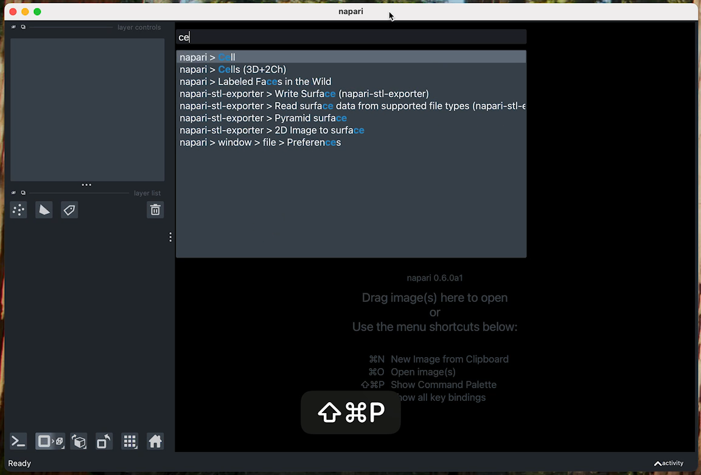
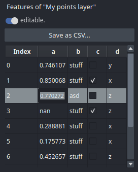

---
jupytext:
  formats: ipynb,md:myst
  text_representation:
    extension: .md
    format_name: myst
    format_version: 0.13
    jupytext_version: 1.11.5
kernelspec:
  display_name: Python 3 (ipykernel)
  language: python
  name: python3
---
(feature-highlights)=
# Feature highlights

This page highlights a few napari features that are useful in many scenarios and might be easily overlooked.
The [command palette](command-palette) is great to avoid clicking around menus to find _that_ specific command.
The [measurement tool](measure-tool) allows for quick distance and area measurements.
For layers with `features`, the [features table widge](features-table-widget) provides a simple graphical interface for editing and interaction with the feature table.

(command-palette)=
## Command Palette

napari has a **command palette** that can be opened with
the keyboard shortcut {kbd}`Command/Ctrl+Shift+P`. As you type
the action's name, the command palette will dynamically suggest matching actions.
You can continue typing to refine suggestions or use the arrow
keys to make a selection. Once you have the action you want highlighted, press
{kbd}`Enter` to run the action. *Added in version 0.6.0.*

```{raw} html
<figure>
  <video width="100%" controls autoplay loop muted playsinline>
    <source src="../../_static/images/command-palette.webm" type="video/webm" />
    <source src="../../_static/images/command-palette.mp4" type="video/mp4" />
    
  </video>

</figure>
```
...

(measure-tool)=
## Measure distances and areas

When using a `Shapes` layer to annotate features of interest, the **Shape Measurement Tool** is used to obtain a live measurement of the available shapes, including perimeter and area. You can also measure distances by tracing a `Line` between two points.

This tool can be enabled by clicking on `Layers->Measure->Toggle shape dimensions measurement (napari builltins)` while a `Shapes` layer is selected. As with all other commands, this can also be enabled using the [command palette](command-palette) by searching for "shape measurement".

.

The measurements are displayed on the canvas and updated live, and they are also accessible through the layer's features table via `layer.features['_area']` and `layer.features['_perimeter']`.

(features-table-widget)=
## Features table widget

The **Features Table Widget** can be used to visualize, edit, select, or save the contents of the `features` table of any layer that supports features (e.g., `Points.features`).

.

To open it, go to `Layer -> Visualize -> Features Table Widget` or press
{kbd}`Command/Ctrl+Shift+P` to open the [command palette](command-palette) and search for "features".
To see it in action, see the {ref}`sphx_glr_gallery_features_table_widget.py` gallery example.

## Running python scripts with napari

Images and other data files are not the only thing that napari can read! You can also run any python script in napari by [drag'n'dropping](https://github.com/napari/napari/blob/main/examples/drag_and_drop_python_code.py) the script onto the viewer, or by passing the script as an argument to napari. When a script is opened with napari, the first viewer instance created by the script will be replaced with the current existing viewer, if any.

It even works with remote files!

```bash
napari https://github.com/napari/napari/blob/main/examples/add_3D_image.py
```

This feature is especially useful for quickly testing or distributing code snippets without needing to leave the viewer or touch the console.

## Startup script

Since napari 0.6.5 it is possible to provide a script that will be run every time napari starts.
This can be done by providing a script path in Settings » Application » Startup script.
This can be useful, for example, for adding a 
[custom colormap](https://github.com/napari/napari/blob/main/examples/dev/settings_startup_script.py)
or loading a specific plugin every time napari starts.

```{note}
This feature is intended only for users. Plugin are not allowed to modify this setting.
```

As with other settings, the value of this field can be overridden by setting the
`NAPARI_APPLICATION_STARTUP_SCRIPT` environment variable to the path of the script to run at startup.
Setting it to an empty string will disable the startup script.


 