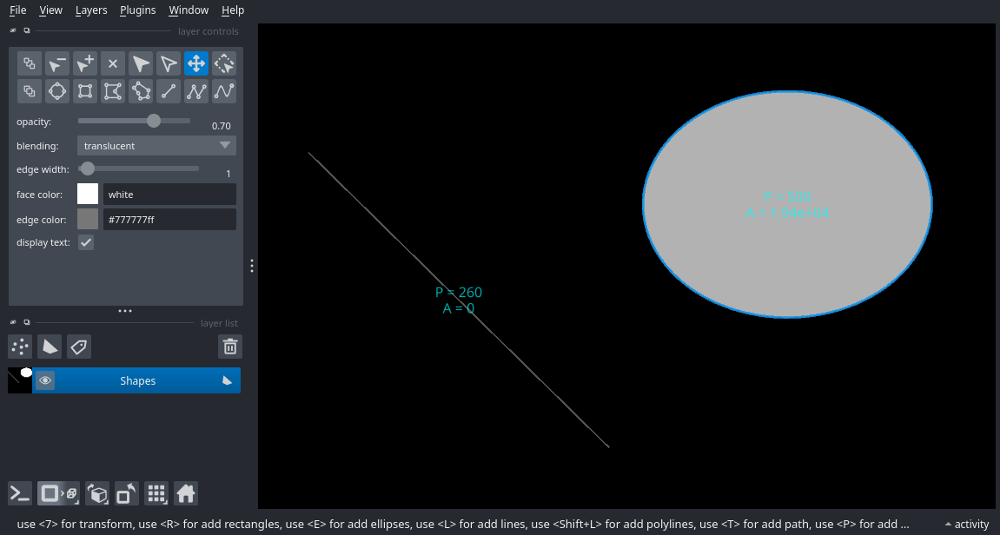

---
jupytext:
  formats: ipynb,md:myst
  text_representation:
    extension: .md
    format_name: myst
    format_version: 0.13
    jupytext_version: 1.11.5
kernelspec:
  display_name: Python 3 (ipykernel)
  language: python
  name: python3
---
(features)=
# Useful features

+++

(command-palette)=
## Command Palette

Starting from version 0.6.0, napari has a command palette that can be opened with
the keyboard shortcut {kbd}`Command/Ctrl+Shift+P`. Once open, start typing part of the
name of the action you want to use. You can keep typing to refine or use the arrow
keys to change the selection. Once you have the action you want highlighted, press
{kbd}`Enter` to run the action.

```{raw} html
<figure>
  <video width="100%" controls autoplay loop muted playsinline>
    <source src="../../_static/images/command-palette.webm" type="video/webm" />
    <source src="../../_static/images/command-palette.mp4" type="video/mp4" />
    
  </video>

</figure>
```
...

## Measure distances and areas

When using a `Shapes` layer to annotate features of interest, we can enable the `shape measurement` tool to obtain a live measurement of the perimeters and areas of the available shapes. This can be used also to measure distances, by tracing a `Line` between two points.

This feature can be enabled by clicking on `Layers->Measure->Toggle shape dimensions measurement (napari builltins)` while a `Shapes` layer is selected. As with all other commands, this can also be toggled via the [command palette](command-palette) by searching for the above command name.

.

The measurements are displayed on the canvas and updated live, but they are also accessible through the layer's features table via `layer.features['_area']` and `layer.features['_perimeter']`.

(features-table-widget)=
## Features table widget

The features table widget can be used to visualize, edit, select or save the contents of the `features` table of any layer that supports features (e.g: `Points.features`).

.

To open it, go to `Layer -> Visualize -> Features Table Widget` or press
{kbd}`Command/Ctrl+Shift+P` to open the [command palette](command-palette) and search for "features".
To see it in action, see the {ref}`sphx_glr_gallery_features_table_widget.py` gallery example.
