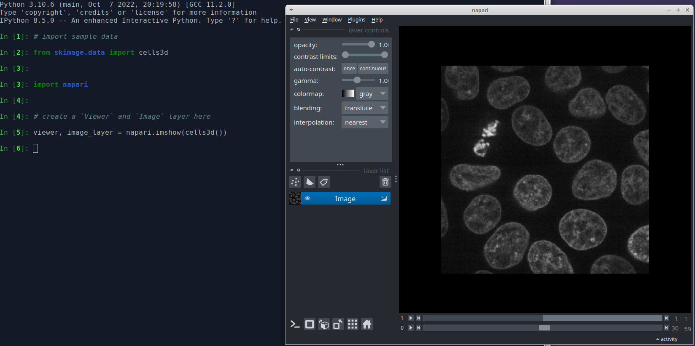

(getting_started)=
# How to launch napari

This tutorial assumes you have already installed napari.
For help with installation see our [installation tutorial](./installation).

This tutorial will teach you all the different ways to launch napari.
At the end of the tutorial you should be able to launch napari and see the viewer your favorite way.

## Launching napari

There are four ways to launch the **napari** viewer:

- command line
- python script
- IPython console
- jupyter notebook

All four of these methods will launch the same napari viewer
but depending on your use-case different ones may be preferable.

### Command line usage

To launch napari from the command line simply run

```sh
napari
```

This command will launch an empty viewer:


Once you have the viewer open you can add images through the `File -> Open` dropdown menu
or by dragging and dropping images directly on the viewer. We currently only support files that can be read with [`skimage.io.imread`](https://scikit-image.org/docs/dev/api/skimage.io.html#skimage.io.imread),
such as `tif`, `png`, and `jpg`.  We plan on adding support for more exotic file types shortly - see [issue #379](https://github.com/napari/napari/issues/379) for discussion. Finally, you can use the `File` menu to make a new `Image` layer from an image in your Clipboard (keybinding {kbd}`Command/Ctrl+N`).

You can also directly load an image into the viewer from the command line by passing the path to the image as an argument as follows

```sh
napari my_image.png
```

If the image is `RGB` or `RGBA` use the `-r` or `--rgb` flag.


Launching napari directly from the command line is the simplest and fastest way to open the viewer,
but it doesn't allow you to preprocess your images before opening them.
It is also currently not possible to save images or other layer types directly from the viewer,
but we'll be adding support for this functionality soon as discussed in [#379](https://github.com/napari/napari/issues/379).

### Python script usage

To launch napari from a python script, inside your script you can import `napari`,
then create a {class}`Viewer<napari.Viewer>` and {class}`Image<napari.layers.Image>`
layer by adding some image data, using {func}`imshow<napari.imshow>`.
The {class}`Viewer<napari.Viewer>` is representative of the napari viewer GUI
you launch and stores all the data you add to napari. The
{class}`Image<napari.layers.Image>` will store information about the image data
you added.

For example, to add an image and print the shape of the image layer data,
you can use:

```python
# import sample data
from skimage.data import cells3d

import napari

# create a `Viewer` and `Image` layer here
viewer, image_layer = napari.imshow(cells3d())

# print shape of image datas
print(image_layer.data.shape)

# start the event loop and show the viewer
napari.run()
```

Note that {func}`imshow<napari.imshow>` is a convenience function that is
equivalent to:

```python
# import sample data
from skimage.data import cells3d

import napari

viewer = napari.Viewer()
image_layer = viewer.add_image(cells3d())
```

You can now run your script from the command line to launch the viewer with your data:

```sh
python my_example_script.py
```

The [examples gallery](../../gallery) consists of code examples which can be
downloaded as `.py` (and `.ipynb` files) and run as above.


An advantage of launching napari from a python script
is that you can preprocess your images and add multiple layers before displaying the viewer.

### IPython console usage

To launch napari from an IPython console import `napari` and create a
{class}`Viewer<napari.Viewer>` and {class}`Image<napari.layers.Image>` object.

```python
# import sample data
from skimage.data import cells3d

import napari

# create a `Viewer` and `Image` layer here
viewer, image_layer = napari.imshow(cells3d())
```

Napari will automatically use the interactive [`%gui qt` event
loop](https://ipython.readthedocs.io/en/stable/config/eventloops.html#integrating-with-gui-event-loops)
from IPython



An advantage of launching napari from an IPython console
is that the you can continue to programmatically interact with the viewer from the IPython console,
including bidirectional communication, where code run in the console will update the current viewer
and where data changed in the GUI will be accessible in the console.

### Jupyter notebook usage

You can also launch napari from a Jupyter notebook. The
[examples gallery](../../gallery), as mentioned above, can also be downloaded as
`.ipynb` which can be run from a Jupyter notebook.

Below, we launch the [notebook example](https://github.com/napari/napari/tree/main/examples/notebook.ipynb) from a Jupyter notebook.


Similar to launching from the IPython console,
an advantage of launching napari from a Jupyter notebook
is that you can continue to programmatically interact with the viewer from Jupyter notebook,
including bidirectional communication, where code run in the notebook will update the current viewer
and where data changed in the GUI will be accessible in the notebook.

## Next steps

To learn more about:

* how to use the napari viewer graphical user interface (GUI),
  checkout the [viewer tutorial](./viewer)
* how to use the napari viewer with different types of napari layers, see
  [layers at a glance](../../guides/layers)
