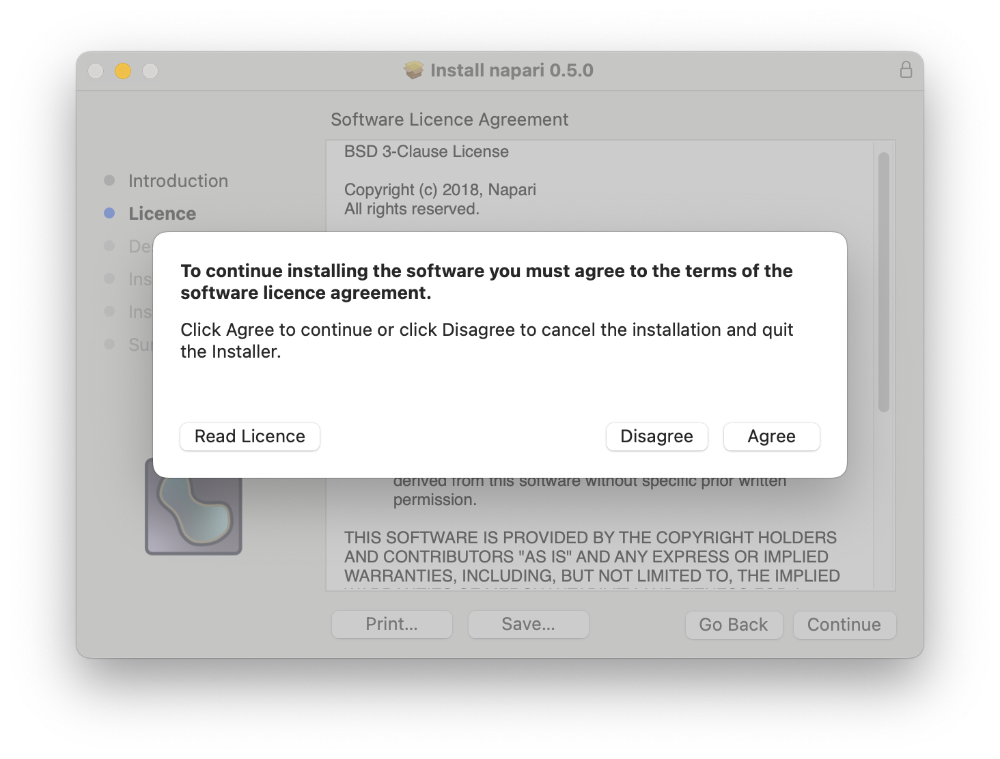
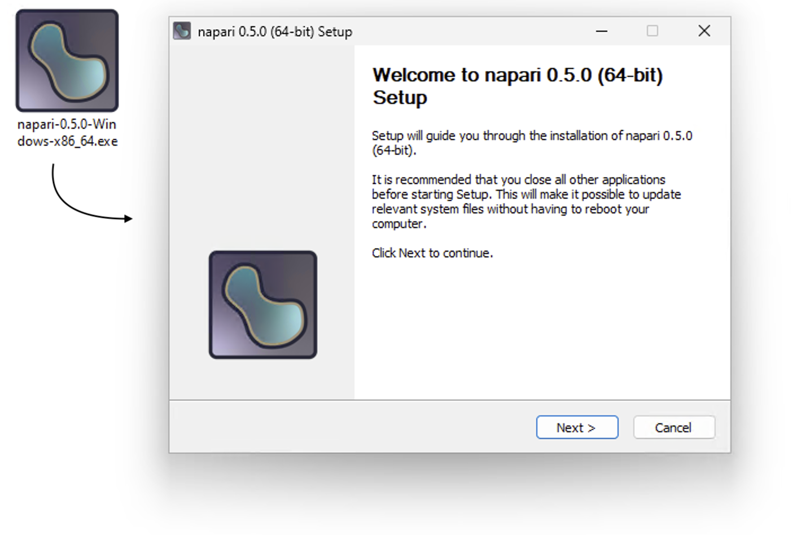
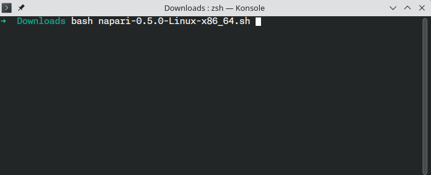
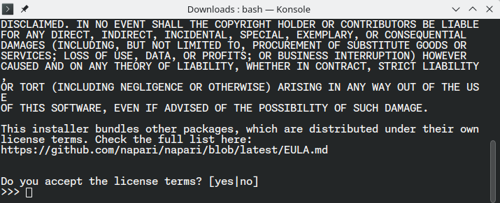

---
jupyter:
  jupytext:
    formats: ipynb,md
    text_representation:
      extension: .md
      format_name: markdown
      format_version: '1.3'
      jupytext_version: 1.13.0
  kernelspec:
    display_name: Python 3 (ipykernel)
    language: python
    name: python3
---

# How to install the napari app

napari can be installed as a bundled app on [MacOS](#how-to-install-the-macos-bundle), [Windows](#how-to-install-the-windows-bundle), and [Linux](#how-to-install-the-linux-bundle) with a simple one click download and guided installation process. This installation method is best if you mainly want to use napari as a standalone GUI app. However, certain plugins may not be supported.

```{note}
* If you want to use napari within a Python project, please follow the [Python package installation guide](installation.md#install-as-python-package-recommended).
* If you want to contribute code back into napari, please follow the [development installation instructions in the contributing guide](napari-contributing).
```

## Prerequisites

This installation method does not have any prerequisites.

## Download and install the napari app ({{ napari_version }}) for your operating system

Click the tile below to jump to the installation instructions for your operating system.

::::{grid}

:::{grid-item-card} macOS
:link: macos-bundle
:link-type: ref
:::

:::{grid-item-card} Windows
:link: windows-bundle
:link-type: ref
:::

:::{grid-item-card} Linux
:link: linux-bundle
:link-type: ref
:::

::::


```{note}
If you are interested in an earlier version of the napari app, you may access those files by scrolling below the latest release on the [napari GitHub release page](https://github.com/napari/napari/releases). Each release (0.4.15 and above) will have an "Assets" section with the installers for Windows, macOS, and Linux.
```

(macos-bundle)=

## How to install the macOS app

Download the napari app ({{ napari_version }}) for your platform:

```{admonition} macOS Apple Silicon (arm64)
:class: admonition
{{ '# [Download from GitHub](https://github.com/napari/napari/releases/tag/vNAPARI_VER/napari-NAPARI_VER-macOS-arm64.pkg)'.replace('NAPARI_VER', napari_version) }}
```

```{admonition} macOS Intel (x86)
:class: admonition
{{ '# [Download from GitHub](https://github.com/napari/napari/releases/tag/vNAPARI_VER/napari-NAPARI_VER-macOS-x86_64.pkg)'.replace('NAPARI_VER', napari_version) }}
```

Once you have downloaded the appropriate macOS package file, you will have a file with a name like `napari-0.5.0-macOS-x86_64.pkg`, but the version number will be {{ napari_version }}.
Double click this file to open the installer.


Click 'Continue' to open the Software License Agreement.


After reading this agreement, click 'Continue' to be prompted to agree to the Software License Agreement in order to proceed with installation.



Click on 'Agree'. On the following page, you will be shown how much space the installation will use and can begin the standard installation by clicking 'Install.'


However, if you would like to change the default location for the installation, you may specify a different location by clicking 'Change Install Location…' and following the subsequent prompts before starting the installation.

You can also optionally click on 'Customize' to disable or enable some aspects of the installation process.

The installation progress can be monitored on the following window. Some notifications will appear in the top right corner of your display with further details.


```{note}
If an error occurred during the installation, do not close the installer immediately. Before doing so, please inspect the logs by clicking on Window > Installer log or pressing {kbd}`⌘+L`. In the Detail Level dropdown, choose 'Show All Logs' and click on Save to keep a copy of the contents in a text file. This will be useful if you want to [submit an issue](https://github.com/napari/napari/issues/new/choose).
```

After finishing with no errors, a new page with the text "The installation was successful" will appear, as shown below.


Click Close to finish. You can now get started using napari like any macOS application! You can use Launchpad to open it or find it using the Finder, under 🏠 [User directory] > Applications.


napari comes installed with sample images from scikit-image. Use the dropdown menu File > Open Sample > napari to open a sample image, or open one of your own images using File > Open or dragging and dropping your image onto the canvas.

Next check out our [tutorial on the viewer](viewer.md) or explore any of the pages under the [Usage tab](../../usage.md).

(windows-bundle)=

## How to install the Windows app

Download the napari app ({{ napari_version }}) for your platform:

```{admonition} Windows (x86_64)
:class: admonition
{{ '# [Download from GitHub](https://github.com/napari/napari/releases/tag/vNAPARI_VER/napari-NAPARI_VER-Windows-x86_64.exe)'.replace('NAPARI_VER', napari_version) }}
```

Once you have downloaded the Windows executable file, you will have a file with a name like `napari-0.5.0-Windows-x86_64.exe`, but the version number will be {{ napari_version }}.
Double click this file to open the napari Setup.



Click Next to continue and go to the License page. Read the contents and, if you agree, continue by clicking 'I Agree'.


The recommended installation method is to install napari just for the current user ("Just Me"):


On the next page you will be shown how much space will be used by the installation and the default destination folder, which can be changed by using the 'Browse' button. Click 'Next' to continue.


On the next page, click 'Install' to start the installation process. Installation progress can be monitored on the following page. By clicking on 'Show details', you can obtain more information on the ongoing tasks. You can right-click on this new text area to copy the contents to the clipboard if needed.


Once installation is complete, you will see the page below. Click 'Finish' to close the installation wizard.


You can now get started using napari! A shortcut to launch napari can be found in the Windows Start menu.

napari comes installed with sample images from scikit-image. Use the dropdown menu File > Open Sample > napari to open a sample image, or open one of your own images using File > Open or dragging and dropping your image onto the canvas.

Next check out our [tutorial on the viewer](viewer.md) or explore any of the pages under the [Usage tab](../../usage.md).

(linux-bundle)=

## How to install the Linux app

Download the napari app ({{ napari_version }}) for your platform:

```{admonition} Linux (x86_64)
:class: admonition
{{ '# [Download from GitHub](https://github.com/napari/napari/releases/tag/vNAPARI_VER/napari-NAPARI_VER-Linux-x86_64.sh)'.replace('NAPARI_VER', napari_version) }}
```

Once you have downloaded the Linux SH file, you will have a file with a name like `napari-0.5.0-Linux-x86_64.sh`, but the version number will be {{ napari_version }}.
Open a new terminal window, navigate to the downloads folder (usually `cd ~/Downloads`) and run the command `bash napari-*-Linux-x86_64.sh`.



Press {kbd}`Enter` to display the License Agreement.


Read through the agreement shown below. You must agree to the terms by typing out `yes` and pressing {kbd}`Enter` to continue.




Next you will be shown the default location for the installation. You may confirm this location by pressing {kbd}`Enter`. Alternatively, specify a different location by typing out its absolute path. If it does not exist, it will be created. The terminal will then begin the installation process.


If the installation is successful, the terminal will display a message with the text 'Installation finished'.


You can now get started using napari! A shortcut to launch napari should appear on your desktop or application menu. Under some Linux desktop environments, you can also search for 'napari' using the desktop search bar.


napari comes installed with sample images from scikit-image. Use the dropdown menu File > Open Sample > napari to open a sample image, or open one of your own images using File > Open or dragging and dropping your image onto the canvas.

Next check out our [tutorial on the viewer](viewer.md) or explore any of the pages under the [Usage tab](../../usage.md).
