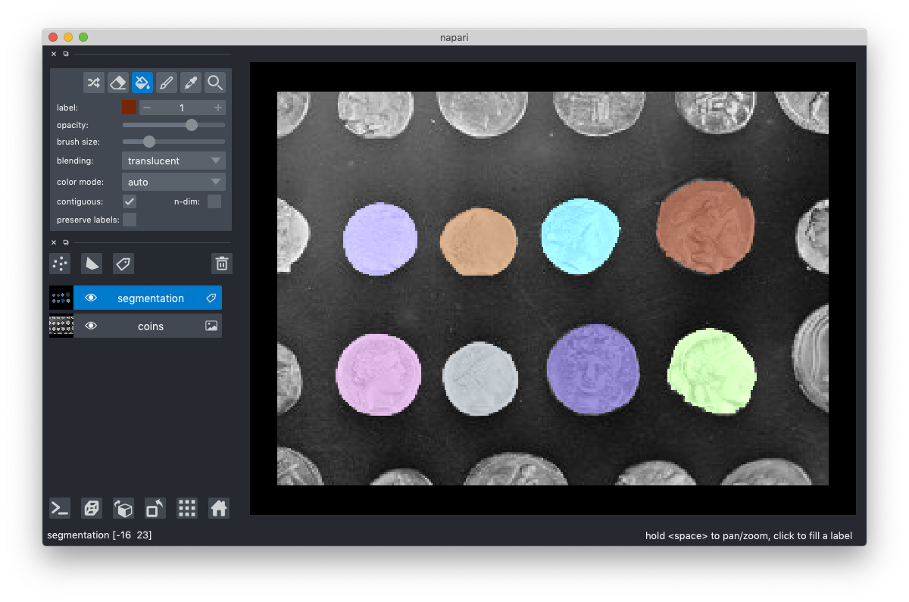
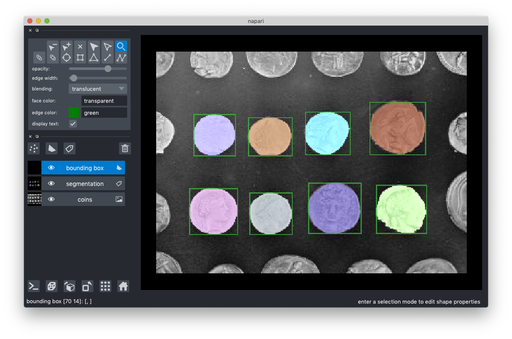

# Annotating segmentation with text and bounding boxes

In this tutorial, we will use napari to view and annotate a segmentation with bounding boxes and text labels. Here we perform a segmentation by setting an intensity threshold with Otsu's method, but this same approach could also be used to visualize the results of other image processing algorithms such as [object detection with neural networks](https://www.tensorflow.org/lite/examples/object_detection/overview).


The completed code is shown below and also can be found in the napari examples directory ([`annotate_segmentation_with_text.py`](https://github.com/napari/napari/blob/main/examples/annotate_segmentation_with_text.py)).

```python
"""
Perform a segmentation and annotate the results with
bounding boxes and text
"""

import numpy as np
from skimage import data
from skimage.filters import threshold_otsu
from skimage.segmentation import clear_border
from skimage.measure import label, regionprops_table
from skimage.morphology import closing, square, remove_small_objects
import napari


def segment(image):
    """Segment an image using an intensity threshold determined via
    Otsu's method.

    Parameters
    ----------
    image : np.ndarray
        The image to be segmented

    Returns
    -------
    label_image : np.ndarray
        The resulting image where each detected object labeled with a unique integer.
    """
    # apply threshold
    thresh = threshold_otsu(image)
    bw = closing(image > thresh, square(4))

    # remove artifacts connected to image border
    cleared = remove_small_objects(clear_border(bw), 20)

    # label image regions
    label_image = label(cleared)

    return label_image


def make_bbox(bbox_extents):
    """Get the coordinates of the corners of a
    bounding box from the extents

    Parameters
    ----------
    bbox_extents : list (4xN)
        List of the extents of the bounding boxes for each of the N regions.
        Should be ordered: [min_row, min_column, max_row, max_column]

    Returns
    -------
    bbox_rect : np.ndarray
        The corners of the bounding box. Can be input directly into a
        napari Shapes layer.
    """
    minr = bbox_extents[0]
    minc = bbox_extents[1]
    maxr = bbox_extents[2]
    maxc = bbox_extents[3]

    bbox_rect = np.array([[minr, minc], [maxr, minc], [maxr, maxc], [minr, maxc]])
    bbox_rect = np.moveaxis(bbox_rect, 2, 0)

    return bbox_rect


def circularity(perimeter, area):
    """Calculate the circularity of the region

    Parameters
    ----------
    perimeter : float
        the perimeter of the region
    area : float
        the area of the region

    Returns
    -------
    circularity : float
        The circularity of the region as defined by 4*pi*area / perimeter^2
    """
    circularity = 4 * np.pi * area / (perimeter**2)

    return circularity


# load the image and segment it
image = data.coins()[50:-50, 50:-50]
label_image = segment(image)

# create the features dictionary
feature = regionprops_table(
    label_image, properties=('label', 'bbox', 'perimeter', 'area')
)
features['circularity'] = circularity(features['perimeter'], features['area'])

# create the bounding box rectangles
bbox_rects = make_bbox([features[f'bbox-{i}'] for i in range(4)])

# specify the display parameters for the text
text_parameters = {
    'string': 'label: {label}\ncirc: {circularity:.2f}',
    'size': 12,
    'color': 'green',
    'anchor': 'upper_left',
    'translation': [-3, 0],
}

# initialise viewer with coins image
viewer, _ = napari.imshow(image, name='coins', rgb=False)

# add the labels
label_layer = viewer.add_labels(label_image, name='segmentation')

shapes_layer = viewer.add_shapes(
    bbox_rects,
    face_color='transparent',
    edge_color='green',
    features=features,
    text=text_parameters,
    name='bounding box',
)
napari.run()
```

## Segmentation

We start by defining a function to perform segmentation of an image based on intensity. Based on the [skimage segmentation example](https://scikit-image.org/docs/stable/auto_examples/applications/plot_thresholding_guide.html), we determine the threshold intensity that separates the foreground and background pixels using [Otsu's method](https://en.wikipedia.org/wiki/Otsu%27s_method). We then perform some cleanup and generate a label image where each discrete region is given a unique integer index.

```python
def segment(image):
    """Segment an image using an intensity threshold
    determined via Otsu's method.

    Parameters
    ----------
    image : np.ndarray
        The image to be segmented

    Returns
    -------
    label_image : np.ndarray
        The resulting image where each detected object
        is labeled with a unique integer.
    """
    # apply threshold
    thresh = threshold_otsu(image)
    bw = closing(image > thresh, square(4))

    # remove artifacts connected to image border
    cleared = remove_small_objects(clear_border(bw), 20)

    # label image regions
    label_image = label(cleared)

    return label_image
```

We can test the segmentation and view it in napari.

```python
# load the image and segment it
image = data.coins()[50:-50, 50:-50]
label_image = segment(image)

# initialize viewer with coins image
viewer, _ = napari.imshow(image, name='coins', rgb=False)

# add the labels
label_layer = viewer.add_labels(label_image, name='segmentation')

napari.run()
```



## Analyzing the segmentation

Next, we use [`regionprops_table`](https://scikit-image.org/docs/dev/api/skimage.measure.html#skimage.measure.regionprops_table) from skimage to quantify some parameters of each detection object (e.g., area and perimeter).

```python
# create the features dictionary
features = regionprops_table(
    label_image, properties=('label', 'bbox', 'perimeter', 'area')
)
```

Conveniently, `regionprops_table()` returns a dictionary that can be used as input for a napari layer's features table, so we will be able to use it directly. If we inspect the values of features, we see each key is the name of the feature and the values are arrays with an element containing the feature value for each shape. Note that the bounding boxes have been output as `bbox-0`, `bbox-1`, `bbox-1`, `bbox-2`, `bbox-3` which correspond with the `min_row`, `min_column`, `max_row`, and `max_column` of each bounding box, respectively.

```python
{
    'label': array([1, 2, 3, 4, 5, 6, 7, 8]),
    'bbox-0': array([46, 55, 57, 60, 120, 122, 125, 129]),
    'bbox-1': array([195, 136, 34, 84, 139, 201, 30, 85]),
    'bbox-2': array([94, 94, 95, 95, 166, 166, 167, 167]),
    'bbox-3': array([246, 177, 72, 124, 187, 247, 74, 124]),
    'perimeter': array(
        [
            165.88225099,
            129.05382387,
            123.98275606,
            121.98275606,
            155.88225099,
            149.05382387,
            140.46803743,
            125.39696962,
        ]
    ),
    'area': array([1895, 1212, 1124, 1102, 1720, 1519, 1475, 1155]),
}
```

Since we know the coins are circular, we want to calculate the circularity of each detected region. We define a function `circularity()` to determine the circularity of each region.

```python
def circularity(perimeter, area):
    """Calculate the circularity of the region

    Parameters
    ----------
    perimeter : float
        the perimeter of the region
    area : float
        the area of the region

    Returns
    -------
    circularity : float
        The circularity of the region as defined by 4*pi*area / perimeter^2
    """
    circularity = 4 * np.pi * area / (perimeter**2)

    return circularity
```

We can then calculate the circularity of each region and save it as a feature.

```python
features['circularity'] = circularity(features['perimeter'], features['area'])
```

We will use a napari shapes layer to visualize the bounding box of the segmentation. The napari shapes layer requires each shape to be defined by the coordinates of corner. Since regionprops returns the bounding box as a tuple of `(min_row, min_column, max_row, max_column)` we define a function `make_bbox()` to convert the regionprops bounding box to the napari shapes format.

```python
def make_bbox(bbox_extents):
    """Get the coordinates of the corners of a
    bounding box from the extents

    Parameters
    ----------
    bbox_extents : list (4xN)
        List of the extents of the bounding boxes for each of the N regions.
        Should be ordered: [min_row, min_column, max_row, max_column]

    Returns
    -------
    bbox_rect : np.ndarray
        The corners of the bounding box. Can be input directly into a
        napari Shapes layer.
    """
    minr = bbox_extents[0]
    minc = bbox_extents[1]
    maxr = bbox_extents[2]
    maxc = bbox_extents[3]

    bbox_rect = np.array([[minr, minc], [maxr, minc], [maxr, maxc], [minr, maxc]])
    bbox_rect = np.moveaxis(bbox_rect, 2, 0)

    return bbox_rect
```

Finally, we can use an list comprehension to pass the bounding box extents to `make_bbox()` and calculate the bounding box corners required by the `Shapes` layer.

```python
# create the bounding box rectangles
bbox_rects = make_bbox([features[f'bbox-{i}'] for i in range(4)])
```

## Visualizing the segmentation results

Now that we have performed out analysis, we can visualize the results in napari. To do so, we will utilize 3 napari layer types: (1) Image, (2) Labels, and (3) Shapes.

As we saw above in the segmentation section, we can visualize the original image and the resulting label images as follows:

```python
# initialise viewer with coins image
viewer, _ = napari.imshow(image, name='coins', rgb=False)

# add the labels
label_layer = viewer.add_labels(label_image, name='segmentation')

napari.run()
```

Next, we will use the Shapes layer to overlay the bounding boxes for each detected object as well as display the calculated circularity. The code for creating the Shapes layer is listed here and each keyword argument is explained below.

```python
    shapes_layer = viewer.add_shapes(
        bbox_rects,
        face_color='transparent',
        edge_color='green',
        name='bounding box'
    )
```



The first positional argument (`bbox_rects`) contains the bounding boxes we created above. We specified that the face of each bounding box has no color (`face_color='transparent'`) and the edges of the bounding box are green (`edge_color='green'`). Finally, the name of the layer displayed in the layer list in the napari GUI is `bounding box` (`name='bounding box'`).

## Annotating shapes with text

We can further annotate our analysis by using text to display features of each segmentation. The code to create a shapes layer with text is pasted here and explained below.

```python
    shapes_layer = viewer.add_shapes(
        bbox_rects,
        face_color='transparent',
        edge_color='green',
        features=features,
        text=text_parameters,
        name='bounding box'
    )
```

We will use `Shapes.features` to store the annotations for each bounding box. The features are defined as a table where each column is the name of the feature (i.e., label, circularity) and the values are rows where each element contains the value for the corresponding shape (i.e., index matched to the Shape data). As a reminder, we created `labels` and `circularity` above and each is a list containing where each element is feature value for the corresponding (i.e., index matched) shape.

```python
# create the features table
features = {
    'label': labels,
    'circularity': circularity,
}
```

Each bounding box can be annotated with text drawn from the layer `features`. To specify the text and display properties of the text, we pass a dictionary with the text parameters (`text_parameters`). We define `text_parameters` as:

```python
text_parameters = {
    'string': 'label: {label}\ncirc: {circularity:.2f}',
    'size': 12,
    'color': 'green',
    'anchor': 'upper_left',
    'translation': [-3, 0],
}
```

The `string` key specifies pattern for the text to be displayed. If `string` is set to the name of a `feature` column, the value for that feature will be displayed. napari text also accepts f-string-like syntax, as used here. napari will substitute each pair of curly braces(`{}`) with the values from the feature specified inside of the curly braces. For numbers, the precision can be specified in the same style as f-strings. Additionally, napari recognizes standard special characters such as `\n` for new line.

As an example, if a given object has a `label=1` and `circularity=0.8322940`, the resulting text string would be:

```
label: 1
circ: 0.83
```

We set the text to green (`'color': 'green'`) with a font size of 12 (`'size': 12`). We specify that the text will be anchored in the upper left hand corner of the bounding box (`'anchor': 'upper_left'`). The valid anchors are: `'upper_right'`, `'upper_left'`, `'lower_right'`, `'lower_left'`, and `'center'`. We then offset the text from the anchor in order to make sure it does not overlap with the bounding box edge (`'translation': [-3, 0]`). The translation is relative to the anchor point. The first dimension is the vertical axis on the canvas (negative is "up") and the second dimension is along the horizontal axis of the canvas.

All together, the visualization code is:

```python
# create the features table
features = {
    'label': labels,
    'circularity': circularity,
}

# specify the display parameters for the text
text_kwargs = {
    'string': 'label: {label}\ncirc: {circularity:.2f}',
    'size': 12,
    'color': 'green',
    'anchor': 'upper_left',
    'translation': [-3, 0],
}

# initialise viewer with coins image
viewer, _ = napari.imshow(image, name='coins', rgb=False)

# add the labels
label_layer = viewer.add_labels(label_image, name='segmentation')

shapes_layer = viewer.add_shapes(
    bbox_rects,
    face_color='transparent',
    edge_color='green',
    features=features,
    text=text_parameters,
    name='bounding box',
)

napari.run()
```

## Summary

In this tutorial, we have used napari to view and annotate segmentation results.


